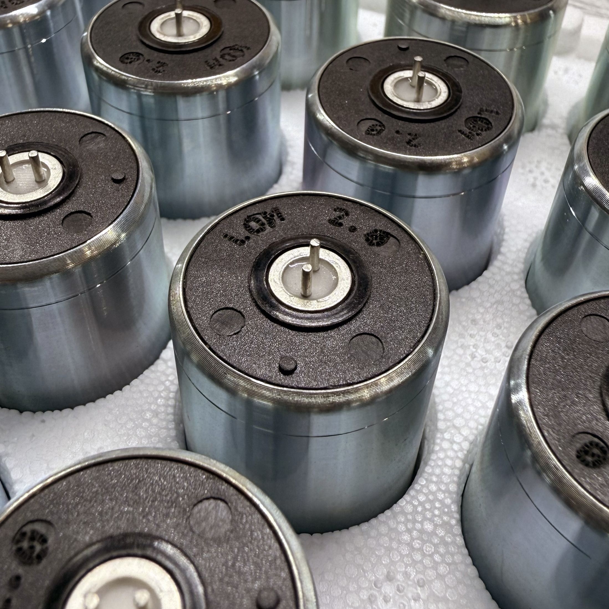

# Geofón FAQ

What the Geofón is, how it sounds, and how to use it. Having a problem — a boom, ringing, or a rattle inside? See [Troubleshooting](troubleshooting.md). To flatten the low-frequency resonance, see the [damping compensation article](../guides/geofon-damping-mod.md).

## The basics

### What is the Geofón? { #what-is-the-geofon }

Geofón is a sensitive geophone adapted for field recording. A geophone is a transducer originally developed for seismic exploration: it captures the vibration of solid surfaces — ground, walls, trees, structures, machinery — and converts that vibration into an electrical signal you can record.

Unlike a regular microphone, which responds to airborne sound (pressure waves in air), a geophone responds only to motion of the surface it is mechanically coupled to. Air-borne sounds reach it indirectly, through whatever the geophone is touching.

### Does it need power?

No. Geofón is a fully passive transducer — a coil suspended in a magnetic field. Surface motion moves the coil, which generates a voltage directly. No phantom power, no batteries, no internal electronics. Plug it into a balanced microphone input and it works.

Phantom power will not damage the Geofón, but it provides no benefit and is not required.

### Does the orientation matter?

No. Geofón uses an omni-tilt geophone element with a symmetric dual-spring suspension, designed to work in any orientation — vertical, horizontal, upside-down, or any angle in between. You can stick it to a vertical wall, the underside of a bridge, an angled tree trunk, or hold it freely; it will perform consistently in all cases.

### What's in the signal path?

The geophone element is connected directly to pins 2 and 3 of the XLR connector for fully balanced output. Nothing else — no resistors, no capacitors, no electronics. The signal you record is exactly what the coil generates.

### Do I need any other accessories?

You need a **balanced XLR cable** to connect Geofón to your recorder. A standard microphone cable works. That's it — no phantom power, no preamp, no special interface required.

## How it sounds

### Why does it sound darker than my piezo contact mic?

This is the most common question, and the answer is: because piezo and geophone transducers measure different physical quantities of the same vibration, and they have very different mechanical characteristics.

A piezo crystal responds to **strain** (deformation of the surface) and effectively functions as a high-frequency-emphasizing sensor in the audible range.

Geofón is a **velocity** sensor. It responds to how fast the surface is moving, not how much it is deformed. The moving mass of the coil (10.3 g) and the spider suspension have parasitic resonances starting around 400 Hz and increasing in influence above 1 kHz, which gradually attenuate the high end. The housing also has inertia: at high frequencies, the housing can no longer perfectly follow the surface motion, especially on light or stiff surfaces.

The result: piezo sounds bright, crispy, near-surface. If using circular piezo disc, it can sound "metallic" due to its low resonant frequency. Geofón sounds dark, weighty, structural. Neither is wrong — they are recording different things.

### What does it sound best on?

Surfaces and sources where structural resonance, low-frequency body, and slow propagating motion are interesting:

- Large structures (bridges, walls, scaffolding, fences, metal poles)
- Trees, especially large trunks and root systems
- Ice on lakes and rivers (the long bell-tone resonances are spectacular)
- The ground itself — footsteps, vehicle traffic, distant machinery felt through soil
- Heavy machinery (motors, pumps, compressors, refrigeration)
- Doors, windows, and the resonant bodies of large rooms
- Tunnels, drainage pipes, ventilation shafts

Less well-suited:

- Small, light objects (the geophone's mass loads them too much)
- Very stiff, high-frequency surfaces like glass, where you want the brightness of a piezo
- Anything where you want to capture surface texture rather than structural body

### Can I use it for stereo recording?

Yes. Two Geofóns placed on the same large structure (or paired structures) make a compelling stereo pair. The resulting recording is not "stereo" in the traditional binaural sense — it captures the spatial distribution of vibration *within* the structure rather than directional acoustic information — but the result can be deeply immersive.

A few practical notes for stereo:

- For repeatable spectral matching across units, consider applying the optional [damping compensation](../guides/geofon-damping-mod.md) to both Geofóns. Without compensation, the resonance peak at the element's natural frequency (20 Hz on current elements, 14 Hz on older ones) is sensitive to small variations between units and to recorder input impedance.
- Spacing matters less than placement. Two Geofóns on opposite sides of the same wall, or on the two endpoints of a beam, often produce more dramatic results than two Geofóns inches apart.
- Phase matters for low-frequency content. If both Geofóns receive correlated low-frequency vibration but with phase differences, you may hear comb filtering or rumble cancellation.

### How does it compare to LOM's Elektrosluch?

Different physical principle entirely. Elektrosluch detects **electromagnetic fields** — the invisible signals around electronics, power lines, displays, motors, communications gear. It uses a coil but listens for radiated EM, not mechanical vibration.

Geofón detects **mechanical vibration** of surfaces. The two instruments are completely complementary. Many recordists own both.

## Connecting to a recorder

### What preamp or recorder works best? { #recorder }

The Geofón element is designed for flat response when connected to a recorder of a specific input impedance — **2 kΩ** for current elements and **3.4 kΩ** for older ones. If your recorder matches the design target, you get flat response with no modification.

Recorders close to the **2 kΩ** target (for current elements):

- Zoom H4n, H6, and F8/F8n (~1.8–2 kΩ)
- Tascam FR-AV2 (2.0 kΩ) and Portacapture X8 (2.2 kΩ)

Recorders typically **above** the target — flat response will require compensation if you want it:

- Zoom F3, F6, F8n Pro (spec'd "3 kΩ or more")
- Sound Devices MixPre, 7-series, Scorpio (typically ~4 kΩ)
- Sonosax SX-R4+ (~5 kΩ)

You don't *have* to compensate — the unmodified character is part of the appeal for many recordists. But if you want flat response on a higher-impedance recorder, see the [damping compensation article](../guides/geofon-damping-mod.md).

### Can I use it with a portable recorder's mic input directly?

Yes, with an XLR cable. Geofón's output level (88 V/(m/s) sensitivity) is comparable to a sensitive dynamic microphone — typically below condenser-mic levels but well above contact-mic levels. Most field recorders' built-in preamps handle it without difficulty.

If your recorder requires a high-pass filter to clean up infrasonic content from handling or wind, enable it. Geofón has genuine output well below 20 Hz, and you may not always want it.

## Sensor & frequency response

### What does "velocity sensor" mean in practical terms?

Geofón outputs a voltage proportional to the **speed** at which the surface is moving — not its position, not its acceleration. The three quantities are mathematically related (displacement → velocity → acceleration, by successive differentiation in time), and all three describe the same vibration, but each weights the spectrum differently.

Velocity is, for most natural and built-environment vibration, the most spectrally balanced quantity. Displacement-based sensors emphasize lows; accelerometers emphasize highs. Velocity sits in the middle, which is one reason geophones translate so well from their original seismological context to general field recording.

### What's the actual frequency response?

Two element versions have been used in Geofón, with different natural frequencies:

- **Current element:** natural resonance at 20 Hz, spurious frequency above 400 Hz
- **Previous element:** natural resonance at 14 Hz, spurious frequency at 190 Hz (lower reach in the lows, darker in the highs)

For the current element, without compensation (as Geofón ships), the response shape is:

- **Below 20 Hz:** rolls off at 12 dB/octave (mass-spring behavior)
- **At 20 Hz:** resonance peak whose height depends on recorder input impedance
- **20 Hz to ~400 Hz:** approximately flat (with peak influence diminishing)
- **400 Hz to ~1 kHz:** usable but with parasitic resonances becoming visible
- **Above ~1 kHz:** progressively attenuated and increasingly non-flat

The previous element has the same shape shifted lower in frequency — flat region begins at 14 Hz, with diminishing fidelity above ~190 Hz.

The optional [damping compensation](../guides/geofon-damping-mod.md) flattens the resonance peak without changing the overall shape. Response curves for raw and compensated configurations are available on the product page.

### Which Geofón element do I have, and how can I tell them apart? { #which-element }

Since March 2025 we use a new, improved element designed specifically for field-recording use. Compared with the previous element it has higher sensitivity (88 vs 80 V/(m/s)) and better dynamic range thanks to improved coil excursion.

To check which one your Geofón has, look at the top of the element inside the housing — the current element is marked **"LOM 2.0"**.

The two elements also differ in natural and spurious frequency (current: 20 Hz / above 400 Hz; previous: 14 Hz / ~190 Hz), which is why older Geofóns sound darker and more "structural." This also affects the resistor value if you apply the optional [damping compensation](../guides/geofon-damping-mod.md).

### What is the spurious frequency?

A geophone's "spurious frequency" is the first parasitic resonance of the suspension — a higher-order mode of the spider springs that competes with the desired piston motion of the coil. Below the spurious frequency, the geophone's response is well-behaved; above it, response becomes peaky and unit-to-unit variable.

The current Geofón element has a typical spurious frequency above 400 Hz. The previous element's spurious frequency is around 190 Hz, which is what makes older Geofóns sound noticeably darker and more "structural" than current ones. In practice the current element captures content above ~1 kHz with diminishing fidelity, while the previous element rolls off harder above ~190 Hz. For most field-recording uses this is not a limitation — the interesting content is below these ranges — but it explains why Geofón sounds darker than transducers with higher inherent bandwidth.

### Below the natural frequency, is anything captured at all?

Yes, but with significant attenuation. Below the element's natural frequency (20 Hz current / 14 Hz previous), response falls at 12 dB/octave. For the current element, that means at 10 Hz the signal is roughly 12 dB below the flat-region level; at 5 Hz, roughly 24 dB below. Strong infrasonic events (heavy machinery, low-frequency structural motion, distant blasting) will still produce recordable signal. True seismological content at fractions of a Hz is below the geophone's useful range.

## Use & care

### How should I mount it?

The Geofón comes with three mounting options:

- **Magnet:** strong neodymium magnet for ferrous surfaces (steel beams, fences, machinery, vehicle bodies). Excellent coupling, very repeatable.
- **Spike:** stainless steel spike for soil, soft wood, snow, sand. Works best when firmly seated.
- **Suction cup:** for smooth non-ferrous surfaces (glass, polished stone, plastic, lacquered wood). Works well only on truly smooth surfaces; texture defeats it.

For surfaces none of these handle (rough wood, rough metal, fabric, irregular stone), the most reliable approach is firm contact under the geophone's own weight. A heavy weight placed on top of the Geofón improves coupling on imperfect surfaces. Gaffer tape or museum putty can also work.

### Does mounting really make a big difference?

Yes — often more than you'd expect. The mounting interface is part of the mechanical signal path between the surface and the geophone element. Loose contact attenuates high frequencies and introduces rattle. Rigid contact transmits faithfully.

Two Geofóns in different positions on the same structure, or the same Geofón in two different mounting arrangements, can sound dramatically different. Worth experimenting the way you'd experiment with mic placement in a room.

### Is it weatherproof?

Geofón is reasonably robust against splashes, light rain, dust, and cold. It is not waterproof — do not submerge it. The XLR connector and cable gland are not designed for sustained water exposure.

For use in light precipitation or in very humid conditions, the body is sufficiently sealed for short sessions. For extended outdoor placement in unpredictable weather, additional protection is wise.

### How do I clean it?

Wipe the housing with a slightly damp cloth. Avoid solvents that could attack the polyurethane cable jacket or the cable gland seal. Keep moisture away from the XLR connector.

### Can I take it apart? { #can-i-take-it-apart }

Yes — Geofón is shipped as a DIY kit and is designed to be user-disassemblable. The two halves of the body unscrew. See the [assembly guide](../guides/geofon-diy.md) for details. Take care when handling the geophone element itself: hold it by the metal ring around the pins, not by the cable solder joints, and avoid prolonged heat when soldering.

## Buying

### Can I buy a pair for stereo recording?

Yes. We do not currently offer a pre-matched stereo pair, but two individual Geofóns work well together. For best matching across the pair, consider applying the optional [damping compensation](../guides/geofon-damping-mod.md) to both units.

### Can you build a custom version?

Possibly. Contact us at [info@lom.audio](mailto:info@lom.audio) with your specific need.

### Related guides

- [Geofón DIY assembly guide](../guides/geofon-diy.md)
- [Geofón damping compensation tutorial](../guides/geofon-damping-mod.md)
- [Geofón product page](https://store.lom.audio/products/geofon)
