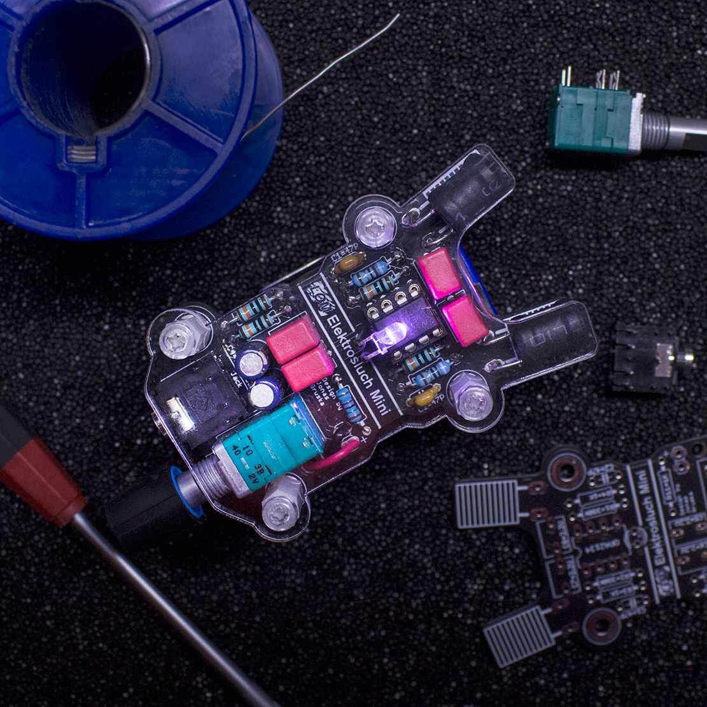

# Building Elektrosluch Mini

## Introduction
!!! warning "Important notice"
    This kit requires skill and experience with soldering. We are providing it “as is”. We are confident it will work, when properly constructed according to the published design. We will not be able to help you with bad soldering jobs or other errors based on an insufficient standard of assembler workmanship.

Please do not attempt to construct the project if you do not fully understand it, or if you do not feel completely confident that you can build the project without further assistance.

If you never soldered before, we highly recommend watching these videos before you start with the kit.
[ Soldering Tutorial Part by EEVblog Part 1](http://youtu.be/J5Sb21qbpEQ ) & [Part 2](http://youtu.be/fYz5nIHH0iY)
## Required tools
For assembly of the Elektrosluch Mini DIY kit you will need:
- a soldering iron (at least 20 W or better)
- solder (ideally 60/40, 0.75mm)
- side cutters
- screwdriver
## Building guide

1. **Examine the printed circuit board.** You can see that it is covered with markings, indicating the correct placement of the components. During this tutorial, you will be mostly placing components (from the top side!) in the correct places and soldering them from the underside of the circuit board. After each soldering stage, you can cut off the leads of the components with side cutters, so they're not in the way.

 
2. It is best to **start soldering the shortest components first** and then move on to the larger ones. After you place the component legs through the holes, it may be handy to bend them in such a way that it wont fall out when the board is flipped over for soldering.

Our tutorial starts with resistors. Solder them all in their unique locations, according to the marks on the circuit board.

 
3. **Continue with the socket for the integrated circuit.** Note its orientation, marked by the little U-shaped cutout. This cutout should be pointed to the top. Using a socket is good practice when dealing with chips - it allows you to swap the chip for another one for altering the performance of the circuit, and protects the chip from damage during the soldering stage.

Solder one pin first then check if the socket is placed snugly to the circuit board. If not heat the solder back up and realign, it would be much hard to do so after soldering all of the pins. 

 
4. The next in line is the **jack connector**.

 
5. Then the yellow **ceramic capacitors** marked as 470 (47 pF). These will help to protect the circuit from very high frequencies beyond the audible range and oscillations. These are not polarity sensitive.

 
6. **Now you can solder in the 4 pink polypropylene capacitors.** These will limit low frequency pick-up. These capacitors are also not polarized. Also if you decide that you would like to have bit more bass, you can replace these with higher values (for example 10 μF instead of 2.2 μF).

7. **Solder in the two electrolytic capacitors.** Beware of their polarity, minus (-) is marked on the body and plus (+) is marked on the circuit board! Double check you are soldering them in correctly, it isn't easy to desolder them.

 
8. **Put the knob on the potentiometer** (notice the "D-shaped" shaft). Then push it gently onto the board until it snaps into place and solder it in.

9. Next **place the double sided sticky pads on the "antennae"** at the top of the circuit board as pictured.

 
10. **Place the inductors**, so they are held by the sticky pads. Solder them in.

 
11. **Pop-in the integrated circuit chip into the socket.** Make sure you're placing it with the U shaped cutout towards to the antennae, as pictured. It might be necessary to change the angle of its legs so they fit snuggly. You can realign them easily by pressing them against a table.

 
12. **Solder in the LED.** Use the provided heat-shrink tubing to cover the LED legs. **The longer leg goes into to the right side hole.** Once placed, bend the LED as you see fit.

13. **Solder the battery connector in place as pictured.** You can use the provided holes to pull the wires through – this will act as a strain relief for the connection. The red lead goes to the plus and black to the minus.

 
14. (Optional) **Cover the battery with attached LOM sticker.**

15. **Check one more time if all the polarities (chip, capacitors, battery connector, battery) are correct.** Reversing the polarity might irreversibly damage the circuit. Attach the battery and turn on the device with the potentiometer (it has a built-in switch!).

16. **Check whether the LED lights up.** Plug-in your headphones, turn the potentiometer almost all the way up and **listen if you can hear the buzzing and humming of the electricity** around you from both channels.

17. **Now it is time to attach the battery holder to the bottom.** Make sure that the leads are cut as short as possible, so they won't protrude into the double sided tape used to attach the holder. They might otherwise create a short circuit and cause malfunction. Use the tape to attach the holder as pictured.

 
18. **Insert the battery into the holder.**

 
19. **Attach the front cover using the 8 screws and 4 stand-offs.**

20. **Voilá!** Enjoy your new Elektrosluch!