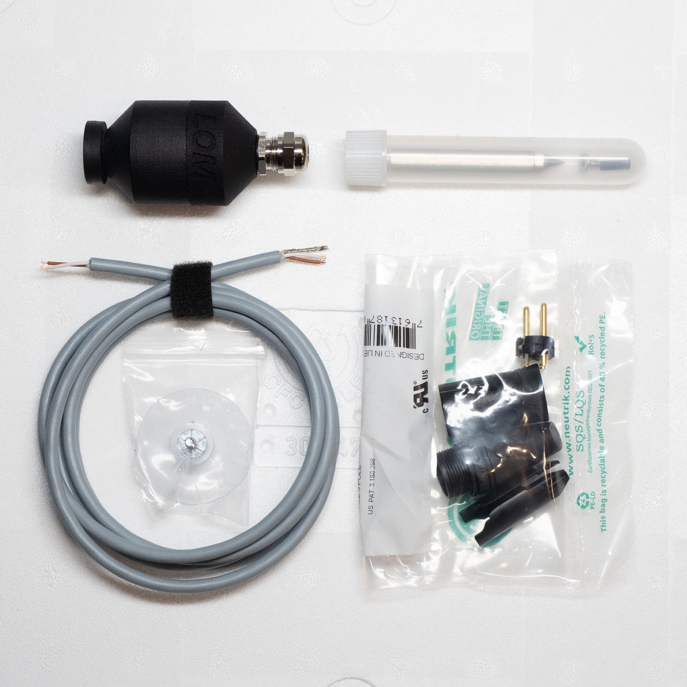
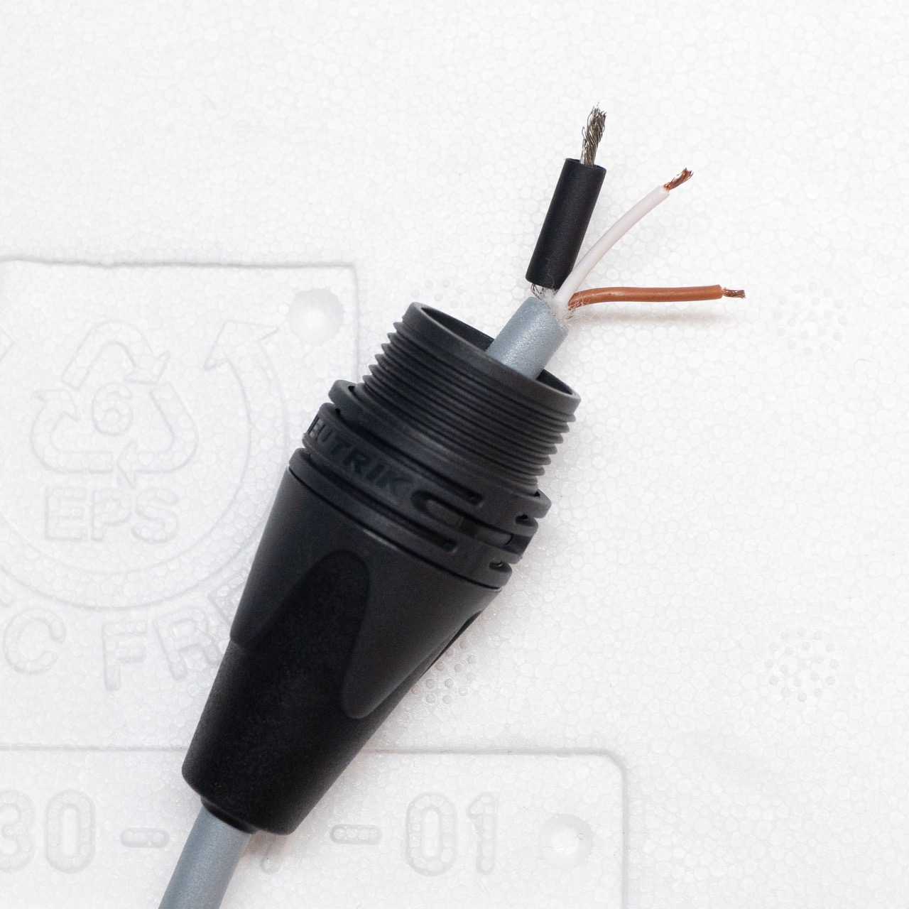
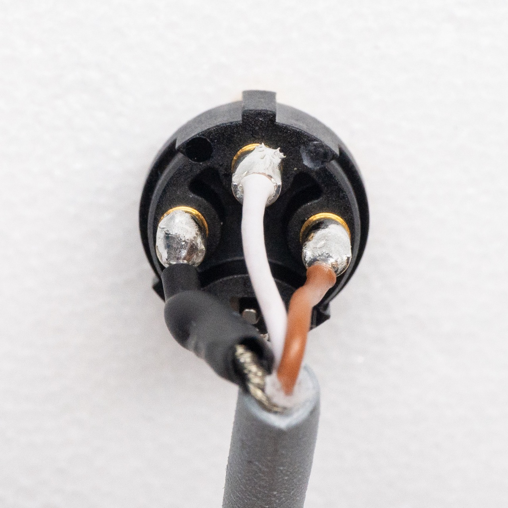
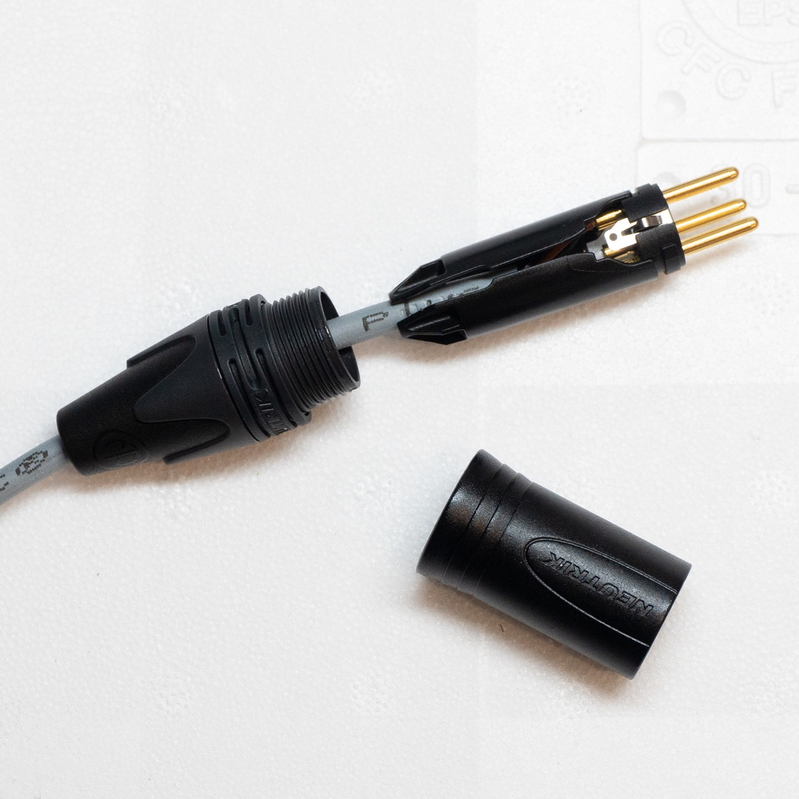
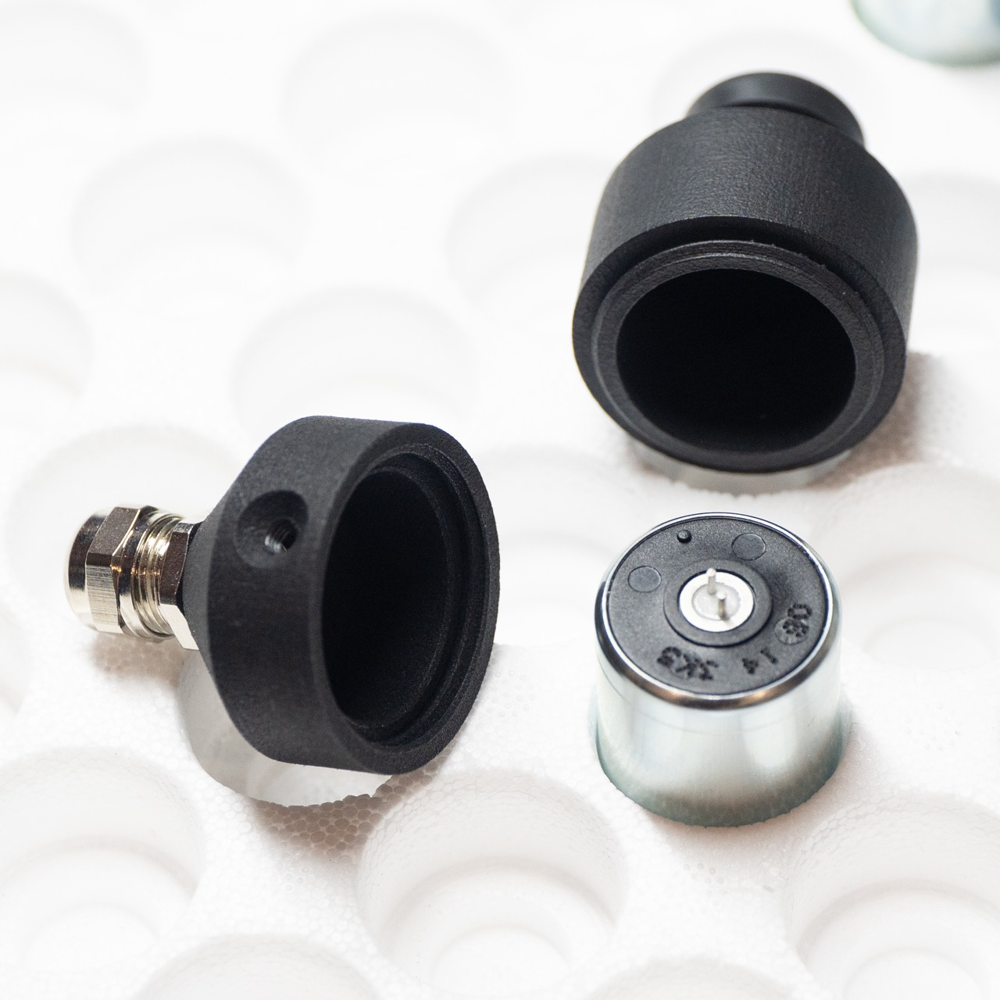
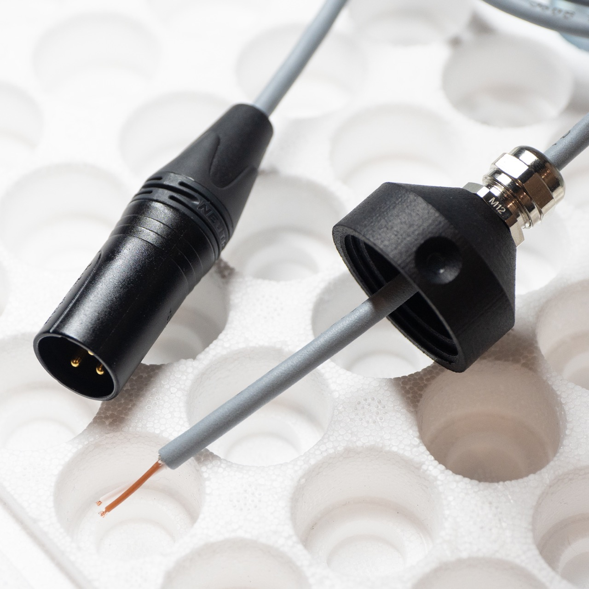
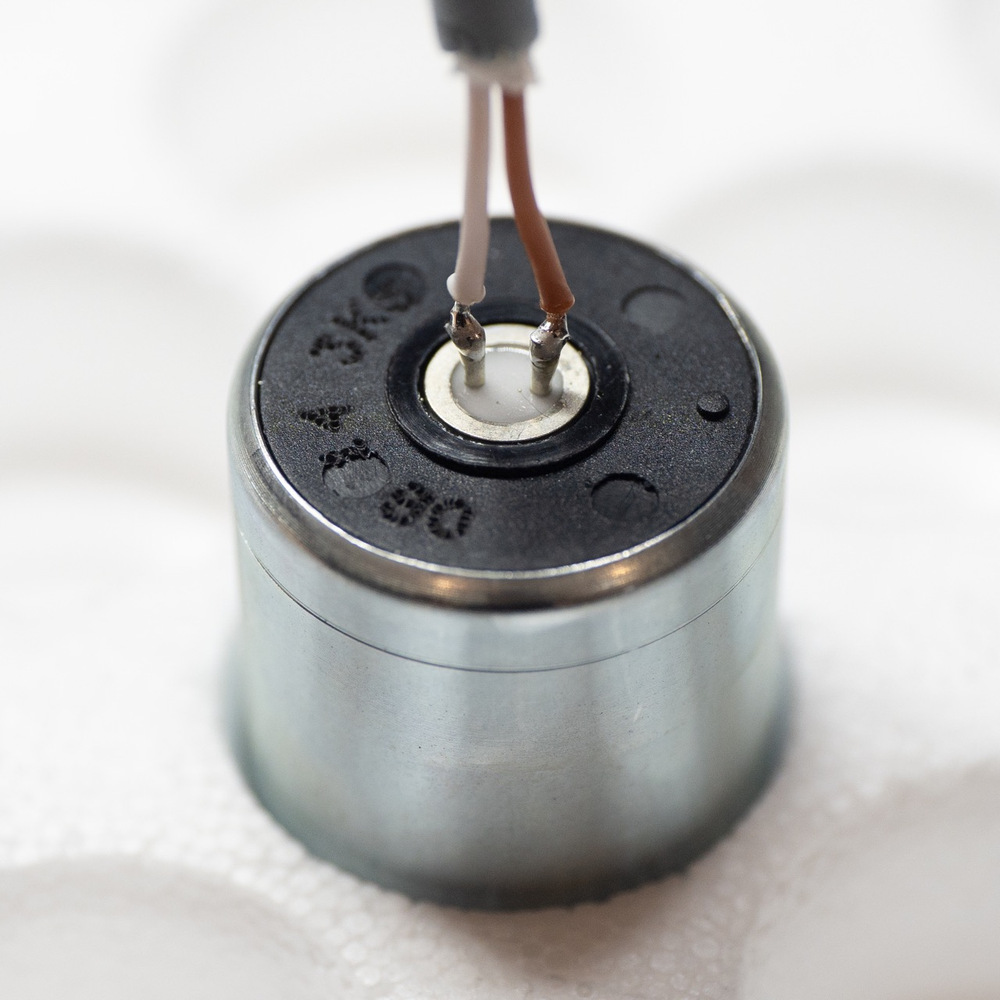
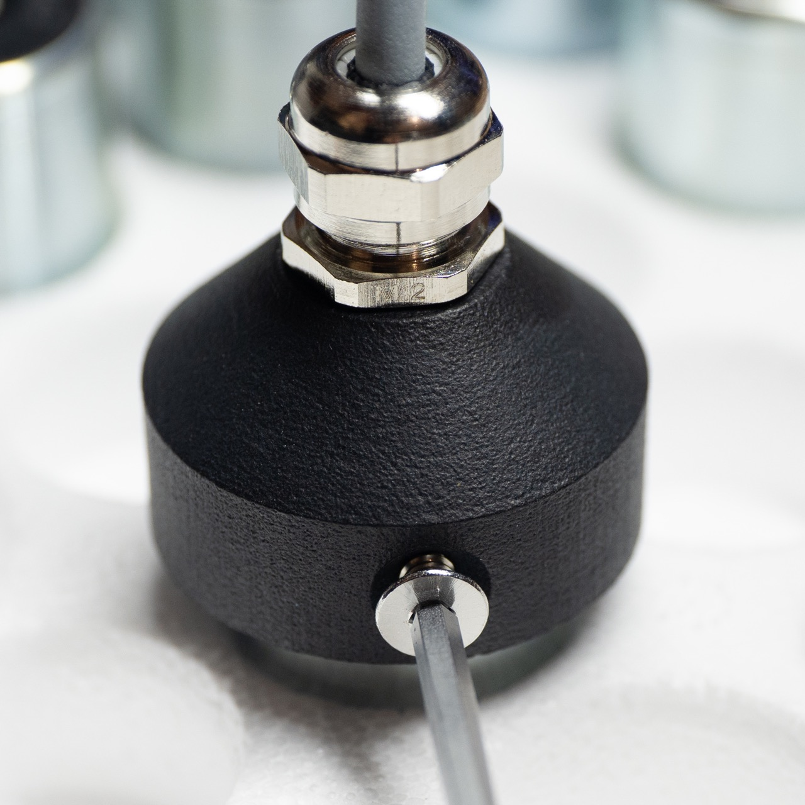
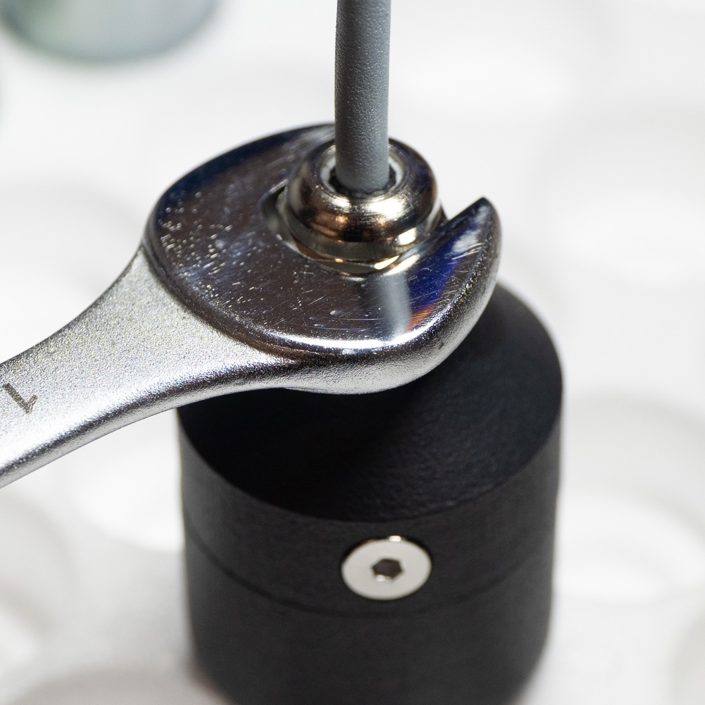
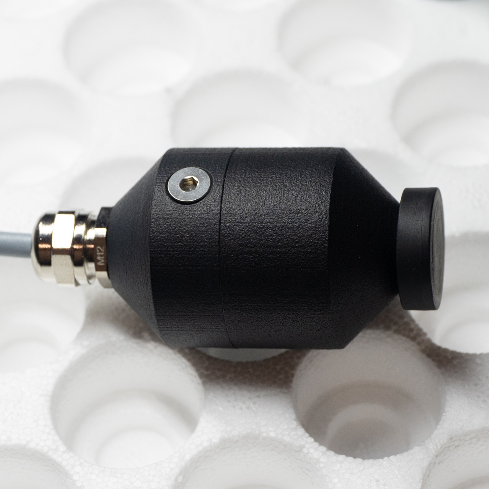

# Geofón DIY kit guide
## Introduction
!!! warning "Important notice"
    This kit requires skill and experience with soldering. We are providing it "as is". We are confident it will work, when properly constructed according to the published design. We will not be able to help you with bad soldering jobs or other errors based on an insufficient standard of assembler workmanship.

    Please do not attempt to construct the project if you do not fully understand it, or if you do not feel completely confident that you can build the project without further assistance.

    If you never soldered before, we highly recommend watching these videos before you start with the kit:
    [Soldering Tutorial by EEVblog Part 1](http://youtu.be/J5Sb21qbpEQ) & [Part 2](http://youtu.be/fYz5nIHH0iY)

## Package contents
- Geofón body, consisting of two parts, with a cable gland
- Geofón element (hidden in the body)
- 1,5 m polyurethane cable
- M4 x 6 mm stainless bolt (in the tube)
- a heat-shrink tubing (in the tube)
- Neutrik XLR connector
- a neodymium magnet (attached to the body)
- a stainless steel spike with an extender (in the tube)
- a suction cup

## Required tools
For assembly of the Geofón DIY kit you will need:
- a soldering iron (at least 20 W or better)
- solder (0.75 mm or 1 mm, lead-free)
- 2.5 mm Allen (hex) key
- 14 mm wrench (optional)

## Building guide

1. Examine the package and check if you have all the necessary components and tools (see the lists above).

 
2. Unpack the XLR connector and the small piece heat-shrink tubing from the tube. Identify the cable end with three conductors. Slide the XLR boot onto the cable (if you forget, you may need to desolder the connector later) and the small piece of heat-shrink tubing onto the exposed twisted conductor without insulation—this is the cable's shielding.

 
3. Tin the exposed conductors on the cable with a bit of solder. Check the XLR connector — you'll notice it has small number markings. Solder the exposed conductor with heat-shrink tubing to pin number 1, the brown conductor to pin 2, and the white conductor to pin 3. 

The heat-shrink tubing will shrink as you solder the shielding conductor. If you're not satisfied with the amount of shrinkage, you can use a lighter or a heat gun to ensure it shrinks fully.

*Technical note: The Geofón is connected as a true balanced microphone, resulting in the exceptional low noise.*

 
4. Assemble to connector. If you need help, refer to [the manual by its manufacturer.](https://www.neutrik.com/media/8050/download/xlr-xx-series.pdf?v=1)

*Technical note: We use gold-plated connectors for better performance in outdoor conditions.*

 
5. Unscrew the Geofón body parts apart and remove the Geofón element from inside. 

Note: newer version of the Geofón body may have threads swapped between top and bottom part, compared to the picture.

 
6. Pull the unused cable end through the cable gland on the top part of the Geofón body. Do not tighten the gland yet!

 
7. Tin the exposed conductors on the cable with a bit of solder. Solder the conductors to the pins on the element. Brown conductor should be connected to the pin with a dot next to it. Solder as fast as possible, one joint shouldn't take longer then 2-4 seconds (depending on your soldering iron).

!!! tip
    It helps to temporarily place a piece of paper on top of the element (pierce it through the pins) to prevent solder from sticking to the metallic ring around them.

 
8. Carefully pull the cable with the element soldered on through the gland as far as possible. Make sure you won't damage the solder joints. Use the provided bolt (in the tube) and a 2.5 mm Allen (hex) key to fix the element in position through the side hole on the top part of the Geofón body. The thread is in the plastic material, so be careful not to over-tighten as you may strip it. 

*Technical note: The main purpose of this bolt is to prevent the Geofón element from rotating when the body is disassembled.*

 
9. Screw the bottom part of the Geofón body onto the top part. Tighten the cable gland on top of the top part of the Geofón body as tightly as possible by hand. If necessary (cable is slipping), use a 14 mm wrench. Do not overtighten the gland. 

If you encounter difficulties while screwing the bottom part of the body, check if the side bolt pressed against the Geofón element is deforming the top part of the Geofón body and loosen it as needed.

 
10. Your Geofón is ready for the vibrations of the world!