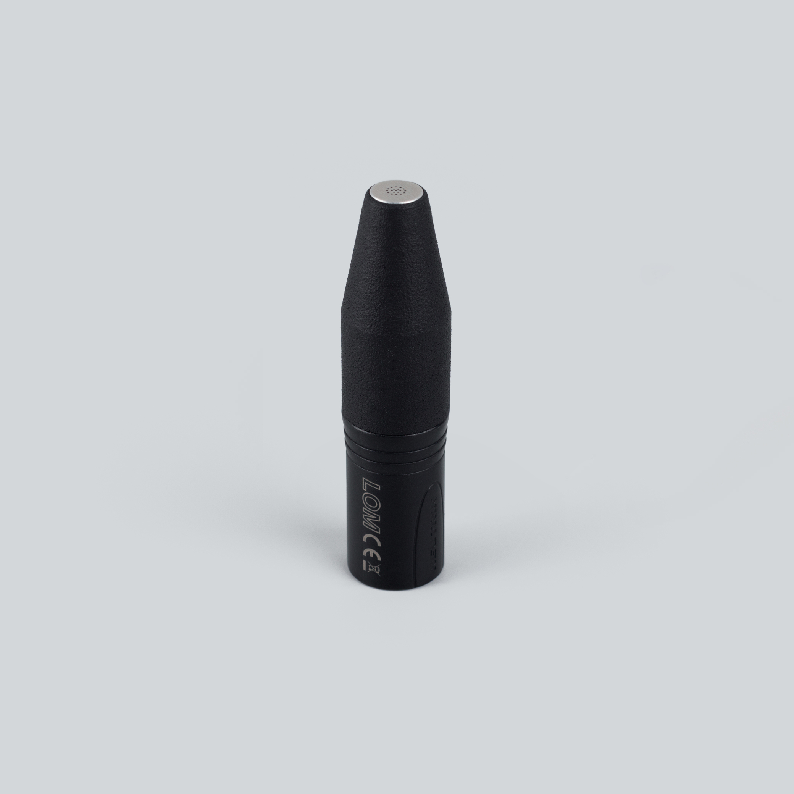
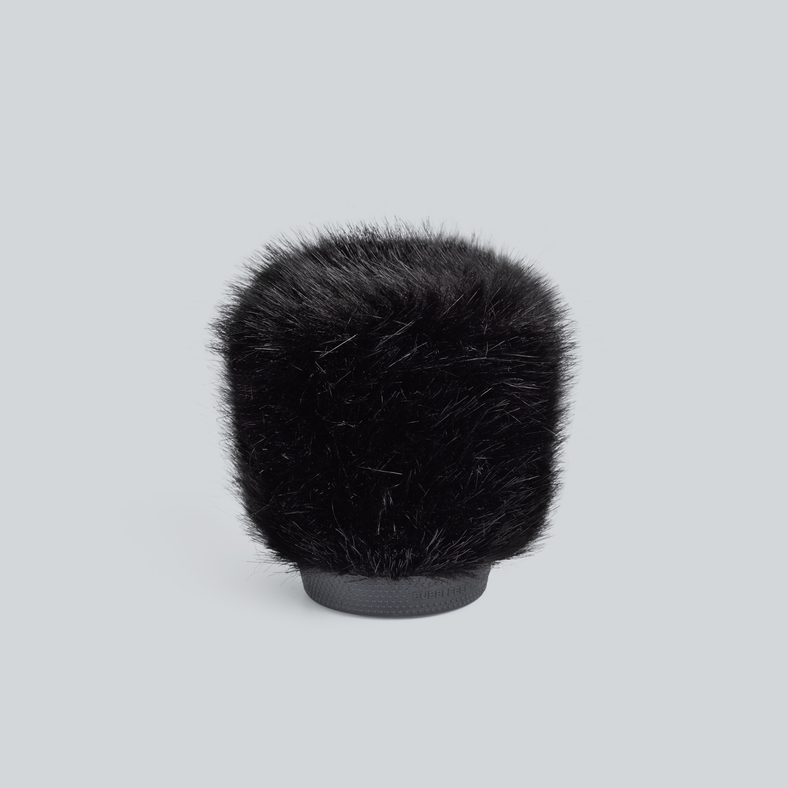
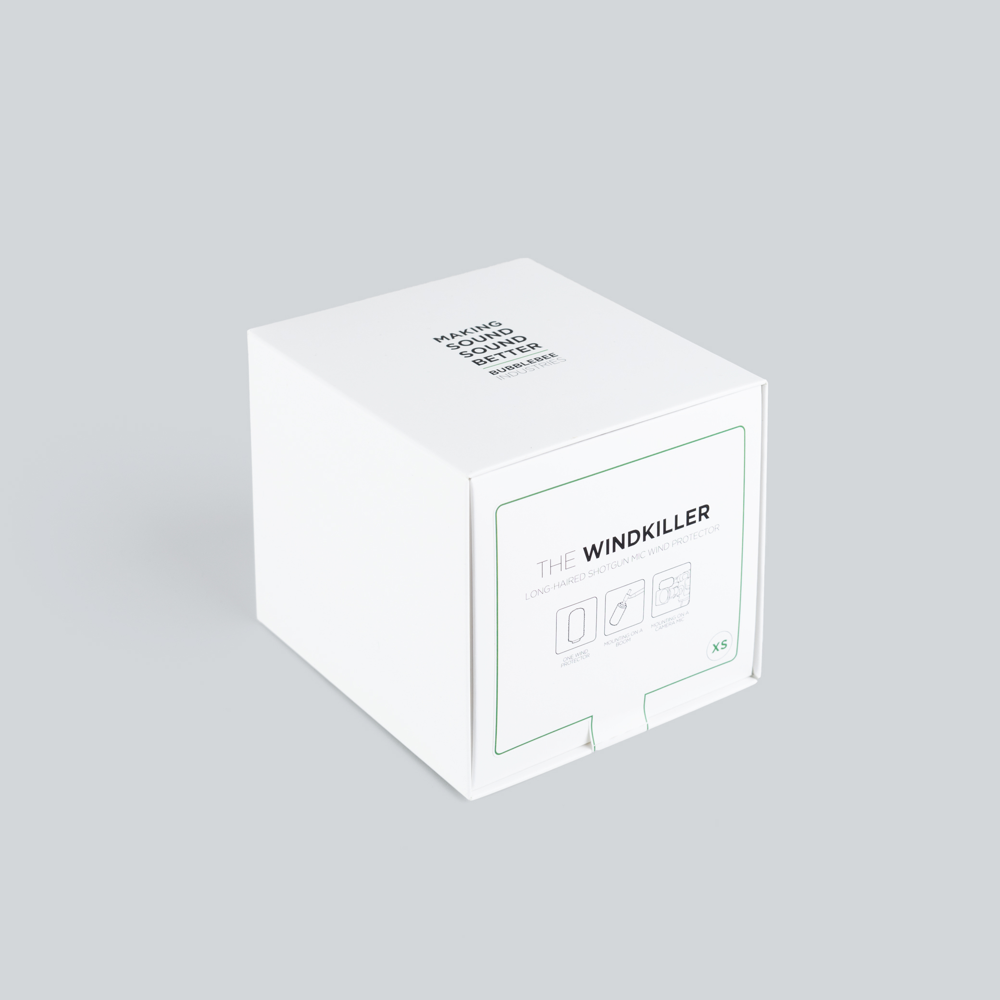

  

    
  

  

    <h1>basicUcho</h1>
    
Mono electret · ⌀20.3 mm · XLR balanced, 24–48 V phantom

    

      <a class="btn btn-solid" href="../downloads/basicucho-spec.pdf">Download spec sheet (PDF) →</a>
      <a class="btn" href="https://store.lom.audio/products/basicucho">Buy at store.lom.audio ↗</a>
    

    

Phantom-powered, high-quality omnidirectional electret microphone with an industry-standard XLR connector. Designed for field recording, sound art, and acoustic research, the basicUcho delivers exceptionally low self-noise and high sensitivity through its large ⌀20.3 mm capsule. Its rugged construction makes it ideal for capturing delicate sounds in demanding environments.
    

    

      
In the box: 1× basicUcho microphone <em>(XLR cable not included)</em>

    

  

<h2>Important information</h2>

--8<-- "safety-microphones.md"

<h2>Key features</h2>

- Large ⌀20.3 mm capsule for low self-noise and high sensitivity
- Exceptionally low self-noise (~14 dBA)
- Phantom powered (24–48 V)
- Industry-standard XLR-3M balanced transformer-less output
- Rugged build for field recording and demanding use
- Omnidirectional pickup pattern

<h2>Specifications</h2>

| Parameter | Value |
|---|---|
| Transduction principle | Pre-polarized condenser (electret) |
| Directional characteristic | Omnidirectional |
| Sensitivity (free field, 1 kHz) | −24 dB re 1 V/Pa (≈63 mV/Pa) at 1 kHz, ±3 dB (unit-to-unit) |
| Equivalent noise level (A-weighted) | ~14 dBA |
| Maximum input SPL | ~110 dB |
| Power supply | 24–48 V phantom (IEC 61938) |
| Current consumption | ~3 mA per pin |
| Rated output impedance | 30–50 Ω |
| Minimum load impedance | 1 kΩ |
| Output connector | XLR-3M |
| Output type | Balanced transformer-less |
| Dimensions | 80 mm × ⌀20.3 mm |
| Operating temperature | −10 °C to +55 °C |
| Storage temperature | −25 °C to +70 °C |

<h2>User manual</h2>

**Will it work with my recorder?**

basicUcho needs one XLR microphone input with **phantom power** (24–48 V, IEC 61938) and any standard XLR cable — unlike the Uši series, no special cable is required (and none is included). Any recorder or preamp with 48 V phantom works; a 24 V mode saves battery with identical performance.

**Quick start**

1. Connect basicUcho to your recorder's XLR mic input with a standard XLR cable.
2. Turn on **phantom power** (usually labeled 48 V) — on some recorders this is a switch, on others a menu setting. Check your recorder's manual.
3. Put on headphones and set the gain: start low, then raise it until the loudest sounds you expect peak around −12 dB. Gently rub a finger near the capsule to confirm it's live.
4. Make a short test recording and listen back before the real take.

**Recording in stereo**

Two basicUchos make a stereo pair — and we can sensitivity-match them if you [order them together](../faq/microphones.md#can-i-get-basicucho-matched). Matching can't be done retroactively.

**Using the basicUcho mount** *(optional accessory)*

Fit basicUcho into the basicUcho mount to attach it to a microphone stand or hold it in position.

**Using the wind protection — basicUcho windkiller** *(optional accessory)*

For outdoor recording, fit the basicUcho windkiller over the capsule to reduce wind noise.

<h2>Accessory guide</h2>

<h2>Applications</h2>

basicUcho is built for quiet sources and rough conditions: nature ambiences and bioacoustics (the large capsule keeps self-noise at ~14 dBA), acoustic research, sound art, and long unattended recording sessions where its rugged body earns its keep. The capsule responds beyond the audible range (up to ~60 kHz) for [ultrasound work](../tips/recording-ultrasound.md). It trades maximum level for sensitivity — sources above ~110 dB SPL (loud concerts, close machinery) may distort; for those, reach for the [Uši series](usi-comparison.md) instead.

<h2>Care & maintenance</h2>

--8<-- "care-microphones.md"

<h2>What to do if…</h2>

- **No sound, or a very quiet signal** → is phantom power actually on, and on the right input? Try a known-good XLR cable. See [no signal](../faq/troubleshooting.md#mic-no-signal).
- **Crackling or popping** → most often condensation after a temperature change. See [crackling and popping](../faq/troubleshooting.md#mic-crackling).
- **Distortion on loud sources** → lower the gain; above ~110 dB SPL the capsule itself overloads. See [distortion](../faq/troubleshooting.md#mic-distortion).
- **Hum or buzz** → almost always a cable or powering issue. See [hum and buzz](../faq/troubleshooting.md#mic-hum).

<h2>Compatible accessories</h2>

basicUcho mount

Microphone clip and stand adapter for mounting

<a class="buy" href="https://store.lom.audio/products/basicucho-mount">Buy</a>

basicUcho windkiller

Maximum wind protection for extreme conditions

<a class="buy" href="https://store.lom.audio/products/basicucho-windkiller-single">Buy</a>

Stereo XLR cable

Balanced stereo cable for connection to recorders

<a class="buy" href="https://store.lom.audio/products/stereo-snake-xlr-cable">Buy</a>

<h2>Photos</h2>

<h2>Downloads</h2>

*Manual PDF download coming soon*

<h2>Warranty & compliance</h2>

--8<-- "warranty-compliance.md"

<h2>Frequently asked questions</h2>

- [How do I choose between basicUcho, mikroUši, and Uši?](../faq/microphones.md#difference-series)
- [Can I get basicUcho matched?](../faq/microphones.md#can-i-get-basicucho-matched)
- [What wind protection do you recommend?](../faq/microphones.md#wind-protection)
- [See all microphone FAQs →](../faq/microphones.md)

