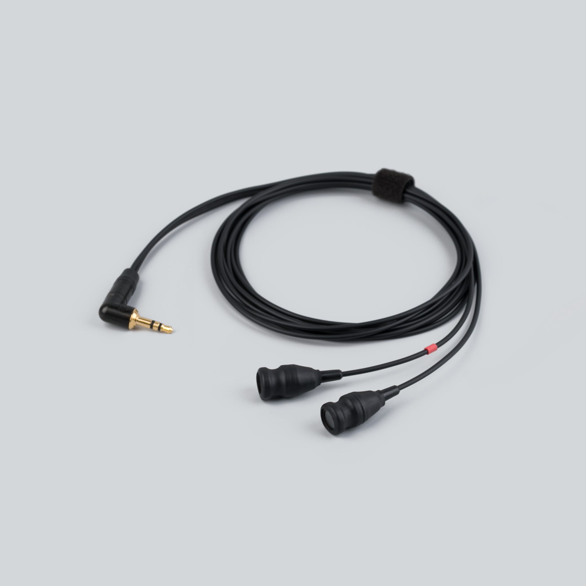
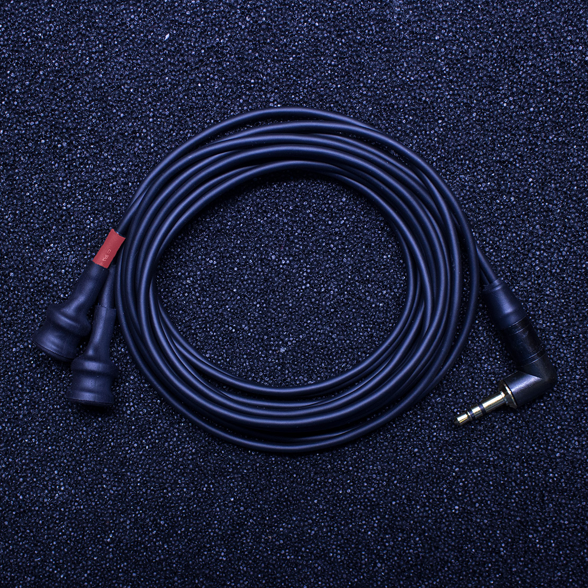

  

    
  

  

    <h1>Elektrouši</h1>
    
Passive electromagnetic sensor pair · 3.5 mm stereo

    

      <a class="btn btn-solid" href="../downloads/elektrousi-spec.pdf">Download spec sheet (PDF) →</a>
      <a class="btn" href="https://store.lom.audio/products/elektrousi">Buy at store.lom.audio ↗</a>
    

    

A pair of passive electromagnetic sensors for extended electromagnetic listening. Connect them to your Elektrosluch 2, 3, or 3+ for an extended sensing range, or use them directly with portable audio recorders equipped with plug-in power inputs.
    

    

      
In the box: 2× Elektrouši sensors, 1× stereo minijack cable

    

  

<h2>Key features</h2>

- Passive electromagnetic sensors (no power required)
- Stereo pair configuration
- Compatible with all Elektrosluch models
- Compatible with portable recorders with plug-in power
- Compact form factor
- Extended sensing range

<h2>Specifications</h2>

| Parameter | Value |
|---|---|
| Type | Passive electromagnetic sensors |
| Power Required | None |
| Output | 3.5 mm stereo minijack |
| Configuration | Stereo pair |
| Operating Temperature | -10 to +55°C |
| Storage Temperature | -25 to +70°C |

<h2>How To Use Elektrouši</h2>

1. Plug Elektrouši into Elektrosluch input or the microphone input of your recorder
2. Set your gain to appropriate levels and enjoy!

<h2>Compatible accessories</h2>

Elektrosluch 3+

Handheld electromagnetic listening device

<a class="buy" href="https://store.lom.audio/products/elektrosluch-3">Buy</a> · <a class="ref" href="../elektrosluch-3/">Details</a>

Elektrosluch Mini City

DIY kit for building your own Elektrosluch

Uši mount (single)

Lyre shock-mount — the only mount safe for the Elektrouši plastic case

<a class="buy" href="https://store.lom.audio/products/usi-microphone-mount-single">Buy</a>

<h2>Photos</h2>

<h2>Downloads</h2>

[↓ Spec Sheet PDF](../downloads/elektrousi-spec.pdf){.download-btn}

*Manual PDF download coming soon*

<h2>Frequently asked questions</h2>

- [What's the difference between Elektrosluch, Elektrouši, Elektroucho Pro and Priezor?](../faq/electromagnetic.md#difference-em)
- [Can Elektrouši be mounted with a Uši mount?](../faq/electromagnetic.md#elektrousi-mount)
- [See all electromagnetic FAQs →](../faq/electromagnetic.md)

