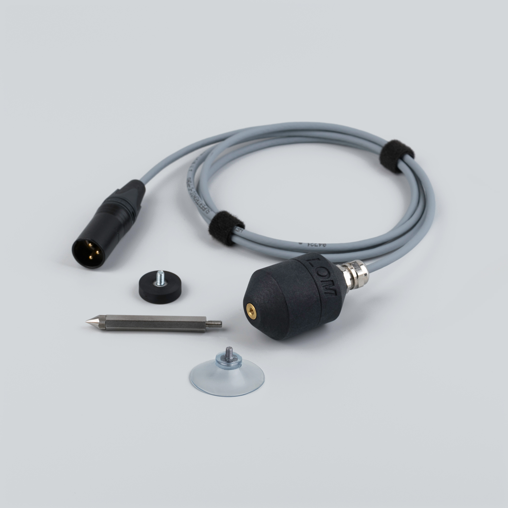
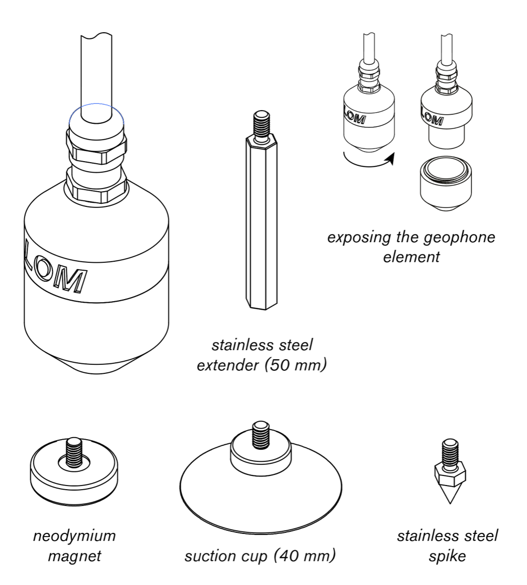

  

    
  

  

    <h1>Geofón</h1>
    
Contact geophone for vibrations · XLR balanced

    
Manual, specifications, and compatible accessories below.

    

      <a class="btn btn-solid" href="../downloads/geofon-spec.pdf">Download spec sheet (PDF) →</a>
      <a class="btn" href="https://store.lom.audio/products/geofon">Buy at store.lom.audio ↗</a>
    

    

Sensitive geophone adjusted for field recording purposes. Originally designed for seismic measurements, Geofón captures very faint vibrations in various materials and soil using standard field recording equipment. Suitable for sound art, experimental music, infrastructure monitoring, and soil research.
    

    

      
In the box: 1× Geofón, 1× neodymium magnet (M4), 1× suction cup (M4), 1× extender and spike

    

  

<h2>Key features</h2>

- High sensitivity contact microphone
- Omnidirectional vibration pickup
- Extended frequency response (10 – 1000+ Hz)
- Professional XLR-3M output
- Balanced gold-plated Neutrik connector
- Includes neodymium magnet and suction cup for mounting
- Robust metal housing
- Multiple mounting options

<h2>Specifications</h2>

| Parameter | Value |
|---|---|
| Type | Omnidirectional geophone |
| Frequency Response | 10 – 1000+ Hz |
| Output | XLR-3M balanced gold-plated Neutrik |
| Dimensions | 52.5 mm × ⌀36.5 mm |
| Weight | 190 g (with cable and magnet) |
| Operating Temperature | -10 to +55°C |
| Storage Temperature | -25 to +70°C |

<h2>How To Use Geofón</h2>

Geofón is a robust geophone designed to be used both outdoors and indoors. It is weather-resistant, but not waterproof.

The bottom of the case has an M4 thread where you can attach the provided neodymium magnet, suction cup, or the spike (via extender).

For sensitive measurements, you can unscrew the bottom plastic part of the geophone to expose the element. You can attach the element using chewing gum-like adhesive used for hanging posters.

**Clinking sound when shaking the geophone is normal and expected.** It is the inner coil suspended on springs.

**Do not use phantom power with Geofón — it is not necessary.**

!!! warning
    Neodymium magnets may cause interference with credit cards (magnetic stripes), cardiac pacemakers and ICDs.

!!! warning
    Due to the nature of the geophone sensor, you may experience electromagnetic interference in specific urban areas and places with strong electromagnetic fields.

<h2>Compatible accessories</h2>

Geofón magnet

Additional neodymium magnet for mounting

<a class="buy" href="https://store.lom.audio/products/geofon-magnet">Buy</a>

Geofón suction cup

Suction cup mount for smooth surfaces

<a class="buy" href="https://store.lom.audio/products/geofon-suction-cup">Buy</a>

Geofón extender and spike

Extension mount with spike for ground penetration

<a class="buy" href="https://store.lom.audio/products/geofon-extender-and-spike">Buy</a>

Geofón / Priezor adapter

Adapter for alternative connections

<a class="buy" href="https://store.lom.audio/products/geofon-priezor-adapter">Buy</a>

<h2>Photos</h2>

<h2>Downloads</h2>

*Manual PDF download coming soon*

