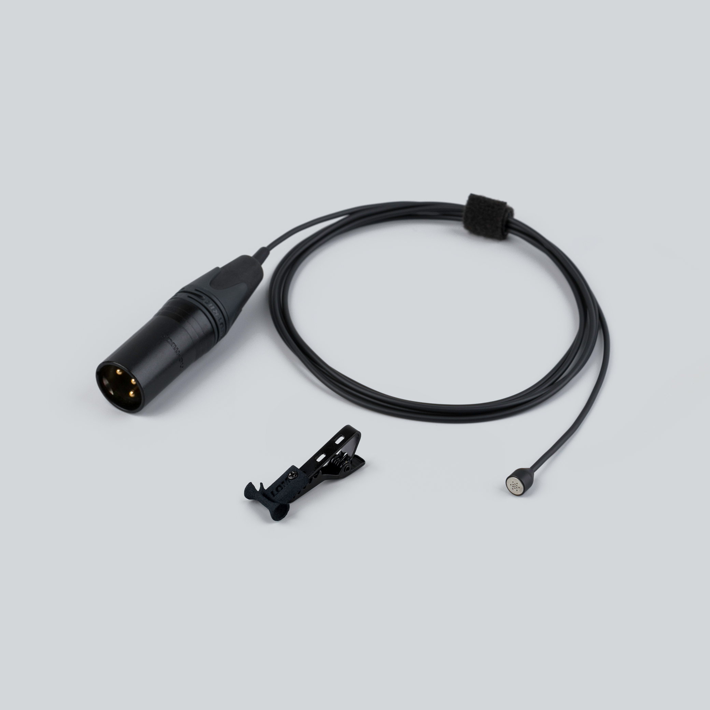

  

    
  

  

    <h1>mikroUcho Pro</h1>
    
Mono electret · ⌀6.8 mm · XLR balanced, 24–48 V phantom

    
Manual, specifications, and compatible accessories below.

    

      <a class="btn btn-solid" href="../downloads/mikroucho-pro-spec.pdf">Download spec sheet (PDF) →</a>
      <a class="btn" href="https://store.lom.audio/products/mikroucho-pro">Buy at store.lom.audio ↗</a>
    

    

Single phantom-powered miniature omnidirectional electret microphone with professional balanced XLR output. The mikroUcho Pro uses the same ultra-compact 6.8 mm capsule and active electronics as the mikroUši Pro stereo pair, sold individually for mono recording applications or as a replacement and expansion unit. Ideal for specialized recording setups requiring maximum concealment with professional audio quality.
    

    

      
In the box: 1× mikroUcho Pro microphone, 1× active XLR-miniXLR cable (1.5 m), 1× microphone clip

    

  

<h2>Key features</h2>

- Phantom powered (24–48 V)
- Ultra-compact 6.8 mm diameter for nearly invisible placement
- Balanced transformer-less XLR output
- Low self-noise (~20 dBA)
- Low output impedance (30–50 Ω)
- Compatible with mikroUši series accessories

<h2>Specifications</h2>

| Parameter | Value |
|---|---|
| Transduction principle | Pre-polarized condenser (electret) |
| Directional characteristic | Omnidirectional |
| Sensitivity (free field, 1 kHz) | −32 dB ±3 dB at 1 kHz |
| Equivalent noise level (A-weighted) | ~20 dBA |
| Power supply | 24–48 V phantom (IEC 61938) |
| Current consumption | ~3 mA per pin |
| Rated output impedance | 30–50 Ω |
| Minimum load impedance | 1 kΩ |
| Output connector | XLR-3M |
| Output type | Balanced transformer-less floating |
| Dimensions | ⌀6.8 mm |
| Cable length | 1.5 m |
| Cable diameter | 2.5 mm |
| Operating temperature | −10 °C to +55 °C |
| Storage temperature | −25 °C to +70 °C |

<h2>How To Use Mikroucho Pro</h2>

1. Plug mikroUcho Pro into the XLR input on your device
2. Turn on the phantom power
3. Set your gain to the appropriate level and enjoy!

[How to mount Uši →](../tips/mounting-usi.md)

<h2>Compatible accessories</h2>

mikroUši windbubbles

Foam windscreens sized for 6.8 mm diameter

<a class="buy" href="https://store.lom.audio/products/mikrousi-windbubbles">Buy</a>

Uši expander

Cable extension system

<a class="buy" href="https://store.lom.audio/products/usi-expander">Buy</a>

<h2>Photos</h2>

<h2>Downloads</h2>

*Manual PDF download coming soon*

