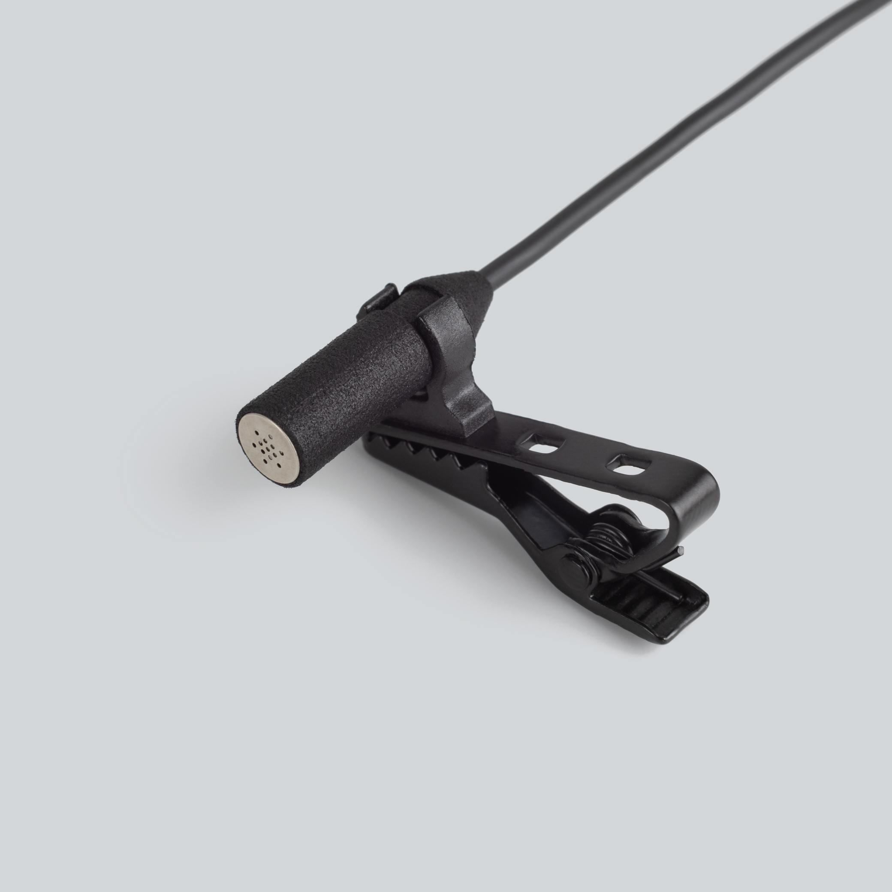
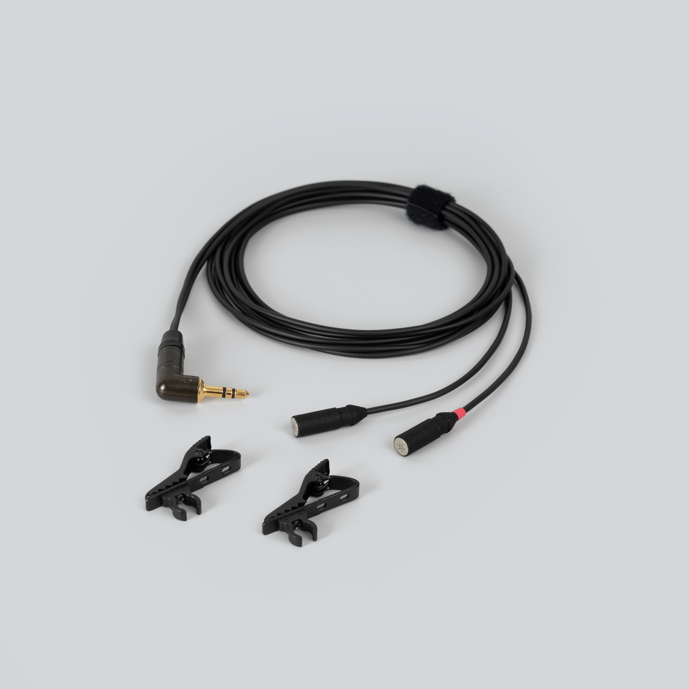
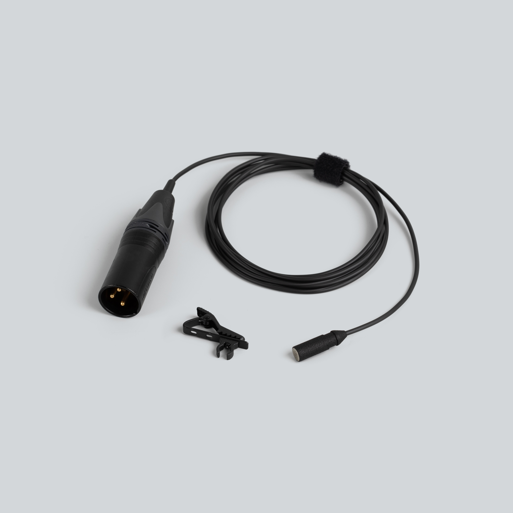

  

    
  

  

    <h1>mikroUši clip</h1>
    
Microphone clip for the mikroUši series · works together with mikroUši windbubbles

    

      <a class="btn" href="https://store.lom.audio/products/mikrousi-clip-single">Buy at store.lom.audio ↗</a>
    

    

Microphone clip for the current version of the mikroUši series microphones. It is designed to be used together with the mikroUši windbubbles: the microphone sits in the clip's cup with its cable in the groove, and the windbubble slips over both. Two clips are included with every mikroUši and mikroUši Pro, one with mikroUcho Pro.
    

    

      
In the box: 1× mikroUši clip

    

  

<h2>Key features</h2>

- Holds the microphone by its body — no strain on the cable
- Shaped to work together with the mikroUši windbubbles
- Clips to clothing, hat brims, straps and stands
- Light enough to wear all day

<h2>Specifications</h2>

| Parameter | Value |
|---|---|
| Compatible microphones | mikroUši, mikroUši Pro, mikroUcho Pro (current version) |
| Older mikroUši bodies | Fit the clip, but cannot be combined with windbubbles |
| Wind protection | [mikroUši windbubbles](https://store.lom.audio/products/mikrousi-windbubbles) |
| Weight | 4 g |
| Sold as | Single |
| Included with | 2× mikroUši, 2× mikroUši Pro, 1× mikroUcho Pro |

<h2>Using the clip</h2>

1. Insert the microphone cable into the groove of the clip.
2. Gently pull the microphone into the cup until it sits flush.
3. For outdoor recording, slip a mikroUši windbubble over the capsule and cup.
4. Clip it to clothing, a hat brim, a strap or a stand. For a natural stereo image with a pair, space the microphones roughly head-width apart (15–20 cm) — see [more mounting ideas](../tips/mounting-usi.md).

<h2>Compatible accessories</h2>

mikroUši windbubbles

Foam windscreens sized for 6.8 mm diameter

<a class="buy" href="https://store.lom.audio/products/mikrousi-windbubbles">Buy</a>

<h2>Photos</h2>

<h2>Frequently asked questions</h2>

- [Mounting Uši and mikroUši microphones](../tips/mounting-usi.md)
- [What wind protection do you recommend?](../faq/microphones.md#wind-protection)
- [See all microphone FAQs →](../faq/microphones.md)

