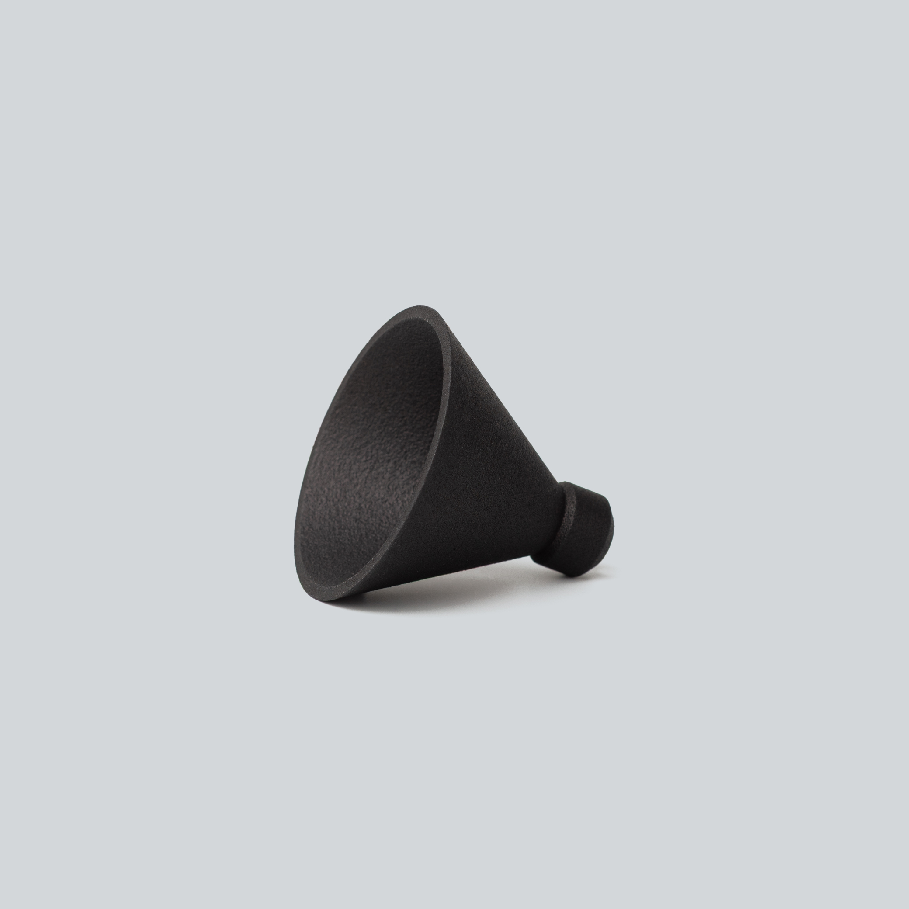
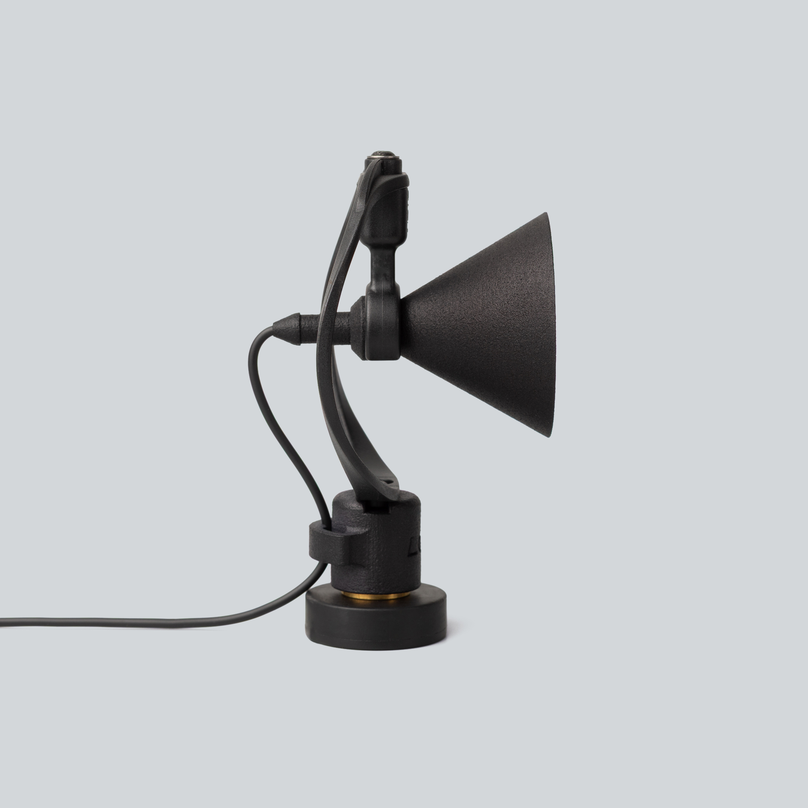

  

    
  

  

    <h1>mikroUši ultrasonic horn</h1>
    
Passive acoustic horn · ~+15 dB from 1 kHz into the ultrasonic range · fits the Uši mount

    

      <a class="btn" href="https://store.lom.audio/products/mikrousi-ultrasonic-horn">Buy at store.lom.audio ↗</a>
    

    

Ultrasonic amplification horn for the current version of the mikroUši series microphones. It provides around +15 dB of passive acoustic boost from 1 kHz up to the ultrasonic range (50+ kHz), which makes it especially useful for recording birds, insects and bats for research purposes. Be aware that the horn severely alters the frequency response of the microphone — recordings will not sound "natural".
    

    

      
In the box: 1× mikroUši ultrasonic horn (microphone and Uši mount not included)

    

  

<h2>Key features</h2>

- Around +15 dB of passive acoustic gain from 1 kHz into the ultrasonic range (50+ kHz)
- No power, no electronics — pure acoustics
- Made for birds, insects and bats
- Outer diameter fits the Uši mount for stand mounting
- Open design — the STL file is available for download

<h2>Specifications</h2>

| Parameter | Value |
|---|---|
| Compatible microphones | mikroUši, mikroUši Pro, mikroUcho Pro (current version) |
| Acoustic gain | ~+15 dB, 1 kHz to 50+ kHz (passive) |
| Mounting | Outer diameter fits the [Uši mount](https://store.lom.audio/products/usi-microphone-mount-single) |
| Weight | 6 g |
| Sold as | Single (one per microphone) |
| 3D model | [STL on GitHub](https://github.com/LOM-instruments/mikroUsi-accessories/blob/main/mikroUsi%20horn.stl) |

<h2>Using the horn</h2>

1. Slide the horn over the microphone capsule until it seats. No tools are needed.
2. Point the horn at your subject. Every microphone becomes directional at ultrasonic frequencies, and a horn more so — aim it like a lens.
3. Start with lower gain than you would use without the horn. It adds around 15 dB of acoustic level, so loud or very close sources will overload the microphone roughly 15 dB sooner than usual.
4. For stand mounting, seat the horn in the Uši mount — its outer diameter matches the Uši body.
5. To hear what you recorded, slow the file down — see [how to record ultrasound](../tips/recording-ultrasound.md).

!!! warning "Not for natural-sounding recordings"

    The horn strongly colours the frequency response: the boost starts around 1 kHz and rises into the ultrasonic range, while the low end is left untouched. Use it for research and detection work, and take the horn off for ordinary ambience recording.

<h2>Compatible accessories</h2>

Uši mount

Microphone mount with vibration-dampening lyre · 19 g

<a class="buy" href="https://store.lom.audio/products/usi-microphone-mount-single">Buy</a>

<h2>Photos</h2>

<h2>Downloads</h2>

- [mikroUši horn — STL file](https://github.com/LOM-instruments/mikroUsi-accessories/blob/main/mikroUsi%20horn.stl) (GitHub, LOM-instruments/mikroUsi-accessories)

<h2>Frequently asked questions</h2>

- [How to record ultrasound with LOM microphones](../tips/recording-ultrasound.md)
- [How do I choose between basicUcho, mikroUši, and Uši?](../faq/microphones.md#difference-series)
- [See all microphone FAQs →](../faq/microphones.md)

