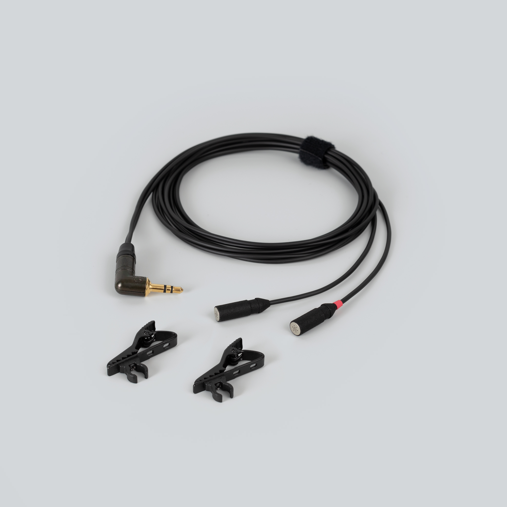
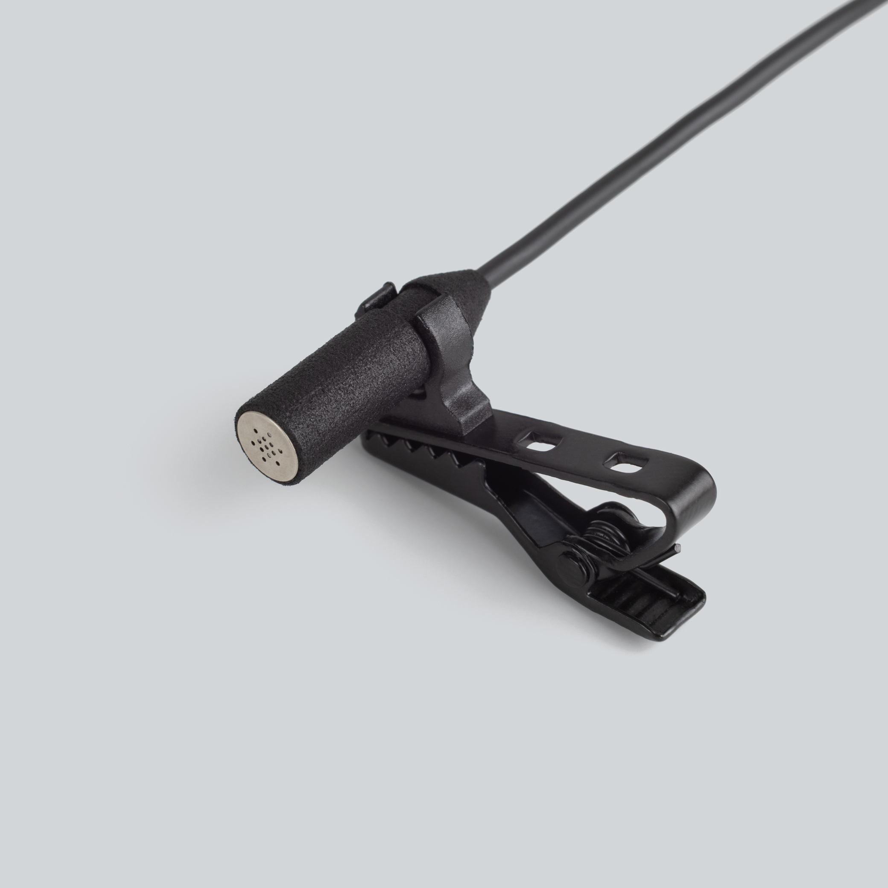

  

    
  

  

    <h1>mikroUši</h1>
    
Matched stereo electret pair · ⌀6.8 mm · 3.5 mm TRS, plug-in power

    
Manual, specifications, and compatible accessories below.

    

      <a class="btn btn-solid" href="../downloads/mikrousi-spec.pdf">Download spec sheet (PDF) →</a>
      <a class="btn" href="https://store.lom.audio/products/mikrousi">Buy at store.lom.audio ↗</a>
    

    

Matched stereo pair of miniature high-quality omnidirectional electret microphones. At only 6.8 mm in diameter, they rank among the smallest professional microphones available, offering exceptional concealment while maintaining exceptionally low self-noise and high sensitivity. The modular cable system and plug-in power design make them ideal for covert field recording, location sound, and specialized applications.
    

    

      
In the box: 2× mikroUši microphones, 1× Uši (minijack) cable, 2× microphone clips

    

  

<h2>Key features</h2>

- Stereo-matched pair with consistent response
- Ultra-compact 6.8 mm diameter for nearly invisible placement
- Modular cable system for maximum flexibility
- Plug-in powered (2–10 V)
- Low self-noise (~20 dBA)
- High sensitivity (−32 dB re 1 V/Pa)

<h2>Specifications</h2>

| Parameter | Value |
|---|---|
| Transduction principle | Pre-polarized condenser (electret) |
| Directional characteristic | Omnidirectional |
| Sensitivity (free field, 1 kHz) | −32 dB ±3 dB at 1 kHz |
| Equivalent noise level (A-weighted) | ~20 dBA |
| Power supply | 2–10 V plug-in power |
| Rated output impedance | 1.6 kΩ ±30% |
| Minimum load impedance | 16 kΩ |
| Output connector | 3.5 mm jack |
| Output type | Unbalanced |
| Dimensions | ⌀6.8 mm |
| Cable length | 1.5 m per microphone |
| Operating temperature | −10 °C to +55 °C |
| Storage temperature | −25 °C to +70 °C |

<h2>How To Use Mikrouši</h2>

1. Plug mikroUši into your recorder's "mic in" (3.5 mm minijack input)
2. Make sure that **plug-in power is on**
3. Set your gain to appropriate levels and enjoy!

[How to mount Uši →](../tips/mounting-usi.md)

<h2>Compatible accessories</h2>

Uši (minijack) cable

Modular minijack output cable (1.5 m)

<a class="buy" href="https://store.lom.audio/products/usi-cable">Buy</a>

Uši Pro (XLR) cable

Modular XLR output cable for pro-level connections

<a class="buy" href="https://store.lom.audio/products/usi-pro-cable">Buy</a>

Uši phantom adapter

Converter for phantom power operation

<a class="buy" href="https://store.lom.audio/products/usi-phantom-adapter">Buy</a>

mikroUši windbubbles

Foam windscreens sized for 6.8 mm diameter

<a class="buy" href="https://store.lom.audio/products/mikrousi-windbubbles">Buy</a>

Uši expander

Cable extension for stereo pairs

<a class="buy" href="https://store.lom.audio/products/usi-expander">Buy</a>

<h2>Photos</h2>

<h2>Downloads</h2>

[↓ Spec Sheet PDF](../downloads/mikrousi-spec.pdf){.download-btn}

*Manual PDF download coming soon*

