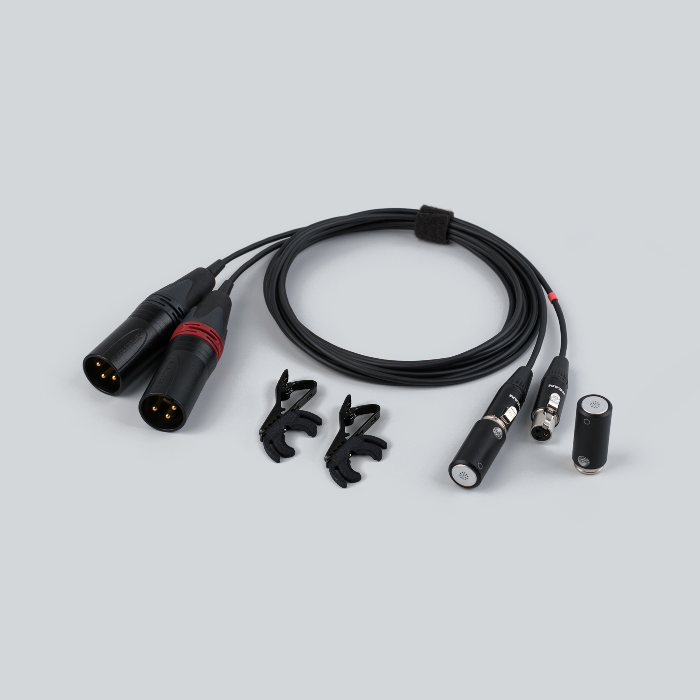

  

    
  

  

    <h1>Uši Pro</h1>
    
Matched stereo electret pair · ⌀13 mm · XLR balanced, 24–48 V phantom

    

      <a class="btn btn-solid" href="../downloads/usi-pro-spec.pdf">Download spec sheet (PDF) →</a>
      <a class="btn" href="https://store.lom.audio/products/usi-pro">Buy at store.lom.audio ↗</a>
    

    

Matched stereo pair of phantom-powered, high-quality omnidirectional electret microphones with professional balanced XLR output. Built on the same compact ⌀13 mm capsule as the Uši, the Pro version features active electronics for low-impedance balanced output, making it ideal for professional field recorders and preamplifiers. The modular design supports cable swapping for maximum flexibility.
    

    

      
In the box: 2× Uši Pro microphones, 1× Uši Pro (XLR) cable, 2× microphone clips

    

  

<h2>Important information</h2>

--8<-- "safety-microphones.md"

!!! danger "Use only LOM cables"

    Never use third-party mini-XLR cables with Uši Pro. The Uši Pro (XLR) cable contains circuitry that converts phantom power to the voltage the capsules expect — **connecting a plain cable while phantom power is on may permanently damage the microphones**, and such damage is not covered by the warranty.

<h2>Key features</h2>

- Stereo-matched pair with consistent response
- Phantom powered (24–48 V)
- Balanced transformer-less XLR output
- Compact ⌀13 mm capsule for discreet placement
- Exceptionally low self-noise (~14 dBA)
- Low output impedance (30–50 Ω)
- Modular cable system

<h2>Specifications</h2>

| Parameter | Value |
|---|---|
| Transduction principle | Pre-polarized condenser (electret) |
| Directional characteristic | Omnidirectional |
| Sensitivity (free field, 1 kHz) | −18 dB re 1 V/Pa (≈126 mV/Pa) at 1 kHz, ±3 dB (unit-to-unit) |
| Channel matching (matched pair) | < 0.5 dB at 1 kHz |
| Equivalent noise level (A-weighted) | ~14 dBA |
| Maximum input SPL | ~122 dB |
| Power supply | 24–48 V phantom (IEC 61938) |
| Current consumption | ~3 mA per pin |
| Rated output impedance | 30–50 Ω |
| Minimum load impedance | 1 kΩ |
| Output connector | XLR-3M |
| Output type | Balanced transformer-less floating |
| Dimensions | 26.2 mm × ⌀13 mm |
| Cable length | 1.5 m per microphone |
| Cable diameter | 2.5 mm |
| Operating temperature | −10 °C to +55 °C |
| Storage temperature | −25 °C to +70 °C |

<h2>User manual</h2>

**Will it work with my recorder?**

Uši Pro needs two XLR microphone inputs with **phantom power** (24–48 V, IEC 61938). Any recorder or preamp with standard 48 V phantom works; if yours has a 24 V mode, it saves battery with identical performance. Each microphone draws ~3 mA. If you only have a 3.5 mm plug-in-power recorder, the capsules also work with the [Uši (minijack) cable](https://store.lom.audio/products/usi-cable).

**Quick start**

1. Connect each microphone to the Uši Pro (XLR) cable — push the mini-XLR connector on until it clicks.
2. Plug both XLR connectors into your recorder's mic inputs. **The connector with the red ring is the right channel** — keep it in the right input.
3. Turn on **phantom power** (usually labeled 48 V) — on some recorders this is a switch, on others a menu setting. Check your recorder's manual.
4. Put on headphones and set the gain: start low, then raise it until the loudest sounds you expect peak around −12 dB. Gently rub a finger near each capsule to confirm both channels are live.
5. Make a short test recording and listen back before the real take.

**Positioning the pair**

For a natural stereo image, space the capsules roughly head-width apart (15–20 cm), or clip them to your shoulders or hat brim for a wearable, binaural-style rig. See [more mounting ideas](../tips/mounting-usi.md).

**Using the included Uši clip**

Snap the clip onto the silver groove on the microphone body, then attach it to clothing, a strap, or a stand. See [more mounting ideas](../tips/mounting-usi.md).

**Using the wind protection — Uši windbubbles** *(optional accessory)*

For outdoor recording, slip a windbubble over each capsule to reduce wind noise. Match the size to the microphone — see [recommended wind protection](../faq/microphones.md#wind-protection). For extreme winds, we recommend the "Extreme" version of Uši windbubbles.

**Using the Uši mount** *(optional accessory)*

Seat the microphone in the lyre of the Uši mount for suspension that isolates it from handling and stand-borne vibration.

**Swapping cables**

The system is fully modular: Uši Pro capsules also work with the Uši (minijack) cable, and standard Uši capsules work with this XLR cable — just swap. Use only LOM cables (see Important information above).

**Disconnecting the capsules from the cable**

Press the button on the mini-XLR connector and pull the capsule straight off. If you can't get the connector off, try [this](../faq/troubleshooting.md#i-cant-disconnect-the-cable-from-my-usi-microphones).

<h2>Accessory guide</h2>

<h2>Applications</h2>

Uši Pro is at home wherever quiet sources meet professional gear: nature ambiences and quiet field recording (the ~14 dBA self-noise keeps hiss out of silent scenes), discreet urban and documentary stereo, wearable binaural-style rigs, sound-art installations, and unattended drop rigs. The capsules respond far beyond the audible range (up to ~80 kHz), so with a high-sample-rate recorder they also work for [recording ultrasound](../tips/recording-ultrasound.md). Sources louder than ~122 dB SPL (concerts next to the PA, very close machinery) will overload the capsule — see the [comparison table](usi-comparison.md) if you record extremes.

<h2>Care & maintenance</h2>

--8<-- "care-microphones.md"

<h2>What to do if…</h2>

- **No sound, or a very quiet signal** → is phantom power actually on, and on the right inputs? See [no signal](../faq/troubleshooting.md#mic-no-signal).
- **Only one channel records** → check both mini-XLR connectors are clicked in and the recorder isn't set to mono. See [one channel silent](../faq/troubleshooting.md#mic-one-channel).
- **Crackling or popping** → most often condensation after a temperature change. See [crackling and popping](../faq/troubleshooting.md#mic-crackling).
- **Distortion on loud sources** → lower the gain; above ~122 dB SPL the capsule itself overloads. See [distortion](../faq/troubleshooting.md#mic-distortion).
- **Hum or buzz** → almost always a cable or powering issue. See [hum and buzz](../faq/troubleshooting.md#mic-hum).
- **The cable won't come off** → don't force it — see [the technique](../faq/troubleshooting.md#i-cant-disconnect-the-cable-from-my-usi-microphones).

<h2>Compatible accessories</h2>

Uši (minijack) cable

Modular minijack output cable for standard Uši

<a class="buy" href="https://store.lom.audio/products/usi-cable">Buy</a>

Uši Pro (XLR) cable

Modular balanced XLR output cable (1.5 m)

<a class="buy" href="https://store.lom.audio/products/usi-pro-cable">Buy</a>

Uši mount

Microphone mount with vibration-dampening lyre

<a class="buy" href="https://store.lom.audio/products/usi-microphone-mount-single">Buy</a> · <a class="ref" href="../../research/usi-clips/">Details</a>

Uši magnetic clip

Magnetic attachment for ferrous surfaces

<a class="buy" href="https://store.lom.audio/products/magnetic-usi-clip">Buy</a> · <a class="ref" href="../../research/usi-clips/">Details</a>

Uši expander

Expands the Uši body to basicUcho size for use with basicUcho accessories

<a class="buy" href="https://store.lom.audio/products/usi-expander-single">Buy</a>

Uši windbubbles

Foam windscreens for wind noise reduction

<a class="buy" href="https://store.lom.audio/products/usi-windbubbles">Buy</a>

Uši windbubbles Extreme

Advanced wind protection for extreme conditions

<a class="buy" href="https://store.lom.audio/products/usi-windbubbles-extreme">Buy</a>

<h2>Photos</h2>

<h2>Downloads</h2>

[↓ Spec Sheet PDF](../downloads/usi-pro-spec.pdf){.download-btn}

*Manual PDF download coming soon*

<h2>Warranty & compliance</h2>

--8<-- "warranty-compliance.md"

<h2>Frequently asked questions</h2>

- [How do I choose between basicUcho, mikroUši, and Uši?](../faq/microphones.md#difference-series)
- [What wind protection do you recommend?](../faq/microphones.md#wind-protection)
- [Can I use my own mini-XLR cables?](../faq/microphones.md#own-cables)
- [I can't disconnect the cable from my mic](../faq/troubleshooting.md#i-cant-disconnect-the-cable-from-my-usi-microphones)
- [See all microphone FAQs →](../faq/microphones.md)

