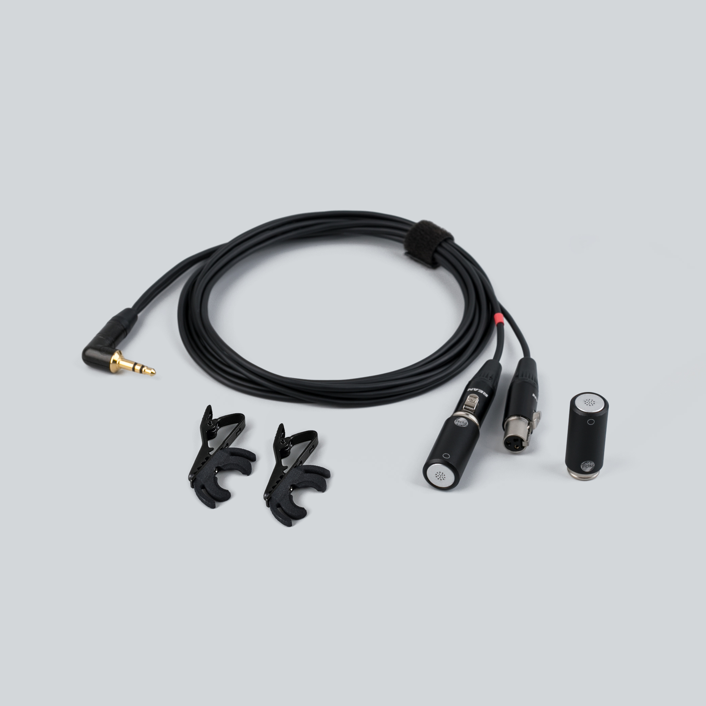

  

    
  

  

    <h1>Uši</h1>
    
Matched stereo electret pair · ⌀13 mm · 3.5 mm TRS, plug-in power

    

      <a class="btn" href="https://store.lom.audio/products/usi">Buy at store.lom.audio ↗</a>
    

    

      Matched stereo pair of high-quality omnidirectional electret microphones with exceptionally low noise and high sensitivity. The modular cable system allows seamless swapping between minijack and XLR outputs. The compact ⌀13 mm form factor enables discreet placement for portable field recording, sound art, and professional audio applications.
    

    

      
Applications: Field recording, ambient stereo, sound art, binaural-style placement

      
In the box: 2× Uši microphones, 1× Uši (minijack) cable, 2× microphone clips

      
Power: 2–10 V plug-in

    

  

<h2>Important information</h2>

--8<-- "safety-microphones.md"

!!! danger "Use only LOM cables"

    Never use third-party mini-XLR cables with Uši. LOM cables contain circuitry that adapts the recorder's voltage to the capsules — **connecting a plain cable to a powered input may permanently damage the microphones**, and such damage is not covered by the warranty.

<h2>Key features</h2>

- Stereo-matched pair with consistent response
- Modular cable system (swap between minijack and XLR)
- Compact ⌀13 mm capsule for discreet placement
- Exceptionally low self-noise (~14 dBA)
- High sensitivity (−28 dB re 1 V/Pa)
- Plug-in powered (2–10 V)

<h2>Specifications</h2>

| Parameter | Value |
|---|---|
| Transduction principle | Pre-polarized condenser (electret) |
| Directional characteristic | Omnidirectional |
| Sensitivity (free field, 1 kHz) | −28 dB re 1 V/Pa (≈40 mV/Pa) at 1 kHz, ±3 dB (unit-to-unit) |
| Equivalent noise level (A-weighted) | ~14 dBA |
| Maximum input SPL | ~122 dB |
| Power supply | 2–10 V plug-in power |
| Rated output impedance | 2.4 kΩ ±30% |
| Minimum load impedance | 24 kΩ |
| Output connector | 3.5 mm jack |
| Output type | Unbalanced |
| Dimensions | 26.2 mm × ⌀13 mm |
| Cable length | 1.5 m per microphone |
| Cable diameter | 2.5 mm |
| Operating temperature | −10 °C to +55 °C |
| Storage temperature | −25 °C to +70 °C |

<h2>User manual</h2>

**Will it work with my recorder?**

Uši needs a 3.5 mm stereo microphone input that provides **plug-in power** (2–10 V). Practically every dedicated field recorder has one — though on some, plug-in power must be enabled in a menu first. Smartphone and laptop headset sockets use different wiring (TRRS, mono mic) and are **not** directly compatible. If your recorder only has XLR inputs, use the [Uši phantom adapter](https://store.lom.audio/products/usi-phantom-adapter) or swap to the [Uši Pro (XLR) cable](https://store.lom.audio/products/usi-pro-cable).

**Quick start**

1. Connect each microphone to the Uši (minijack) cable — push the mini-XLR connector on until it clicks.
2. **The cable branch with the red ring is the right channel.** Position the microphones — for a natural stereo image, space them roughly head-width apart (15–20 cm), or clip them to your shoulders or hat brim for a wearable, binaural-style rig.
3. Plug the minijack into your recorder's 3.5 mm mic input and make sure **plug-in power is on** (check your recorder's manual).
4. Put on headphones and set the gain: start low, then raise it until the loudest sounds you expect peak around −12 dB. Gently rub a finger near each capsule to confirm both channels are live.
5. Make a short test recording and listen back before the real take.

**Using the included Uši clip**

Snap the clip onto the silver groove on the microphone body, then attach it to clothing, a strap, or a stand. See [more mounting ideas](../tips/mounting-usi.md).

**Using the wind protection — Uši windbubbles** *(optional accessory)*

For outdoor recording, slip a windbubble over each capsule to reduce wind noise. Match the size to the microphone — see [recommended wind protection](../faq/microphones.md#wind-protection). For extreme winds, we recommend the "Extreme" version of Uši windbubbles.

**Using the Uši mount** *(optional accessory)*

Seat the microphone in the lyre of the Uši mount for suspension that isolates it from handling and stand-borne vibration.

**Swapping cables**

The system is fully modular: Uši capsules also work with the Uši Pro (XLR) cable for phantom-powered recorders, and Uši Pro capsules work with this minijack cable — just swap. Use only LOM cables (see Important information above).

**Disconnecting the capsules from the cable**

Press the button on the mini-XLR connector and pull the capsule straight off. If you can't get the connector off, try [this](../faq/troubleshooting.md#i-cant-disconnect-the-cable-from-my-usi-microphones).

<h2>Accessory guide</h2>

<h2>Applications</h2>

Uši shines in quiet field recording on lightweight rigs: nature ambiences (the ~14 dBA self-noise keeps hiss out of silent scenes), urban stereo, wearable binaural-style recording, and sound-art installations where the small capsules disappear from view. The capsules respond far beyond the audible range (up to ~80 kHz), so with a high-sample-rate recorder they also work for [recording ultrasound](../tips/recording-ultrasound.md). Sources louder than ~122 dB SPL will overload the capsule — see the [comparison table](usi-comparison.md) if you record extremes.

<h2>Care & maintenance</h2>

--8<-- "care-microphones.md"

<h2>Troubleshooting</h2>

- **No sound, or a very quiet signal** → is plug-in power enabled, and are you in a *mic* (not line) input? See [no signal](../faq/troubleshooting.md#mic-no-signal).
- **Only one channel records** → check both mini-XLR connectors are clicked in and the recorder isn't set to mono. See [one channel silent](../faq/troubleshooting.md#mic-one-channel).
- **Crackling or popping** → most often condensation after a temperature change. See [crackling and popping](../faq/troubleshooting.md#mic-crackling).
- **Distortion on loud sources** → lower the gain; above ~122 dB SPL the capsule itself overloads. See [distortion](../faq/troubleshooting.md#mic-distortion).
- **The cable won't come off** → don't force it — see [the technique](../faq/troubleshooting.md#i-cant-disconnect-the-cable-from-my-usi-microphones).

<h2>Compatible accessories</h2>
<a class="banner-right" href="https://store.lom.audio/collections/microphones-accessories">All accessories ↗</a>

<a class="accessory-card" href="https://store.lom.audio/products/usi-clip-single">

Uši clip

Standard clip for attaching Uši to clothing, straps, and stands

Buy

</a>
<a class="accessory-card" href="https://store.lom.audio/products/usi-cable">

Uši (minijack) cable

Modular minijack output cable (1.5 m)

Buy

</a>
<a class="accessory-card" href="https://store.lom.audio/products/usi-pro-cable">

Uši Pro (XLR) cable

Modular XLR output cable for pro-level connections

Buy

</a>
<a class="accessory-card" href="https://store.lom.audio/products/usi-microphone-mount-single">

Uši mount

Microphone mount with vibration-dampening lyre

Buy

</a>
<a class="accessory-card" href="https://store.lom.audio/products/magnetic-usi-clip">

Uši magnetic clip

Magnetic attachment for ferrous surfaces

Buy

</a>
<a class="accessory-card" href="https://store.lom.audio/products/usi-phantom-adapter">

Uši phantom adapter

Converter for phantom power operation

Buy

</a>
<a class="accessory-card" href="https://store.lom.audio/products/usi-expander-single">

Uši expander

Expands the Uši body to basicUcho size for use with basicUcho accessories

Buy

</a>
<a class="accessory-card" href="https://store.lom.audio/products/usi-windbubbles">

Uši windbubbles

Foam windscreens for wind noise reduction

Buy

</a>
<a class="accessory-card" href="https://store.lom.audio/products/usi-windbubbles-extreme">

Uši windbubbles Extreme

Advanced wind protection for extreme conditions

Buy

</a>

<h2>Photos</h2>

<h2>Downloads</h2>

*Manual PDF download coming soon.*

<h2>Warranty & compliance</h2>

--8<-- "warranty-compliance.md"

<h2>Frequently asked questions</h2>

- [How do I choose between basicUcho, mikroUši, and Uši?](../faq/microphones.md#difference-series)
- [What wind protection do you recommend?](../faq/microphones.md#wind-protection)
- [Can I use my own mini-XLR cables?](../faq/microphones.md#own-cables)
- [I can't disconnect the cable from my mic](../faq/troubleshooting.md#i-cant-disconnect-the-cable-from-my-usi-microphones)
- [See all microphone FAQs →](../faq/microphones.md)

