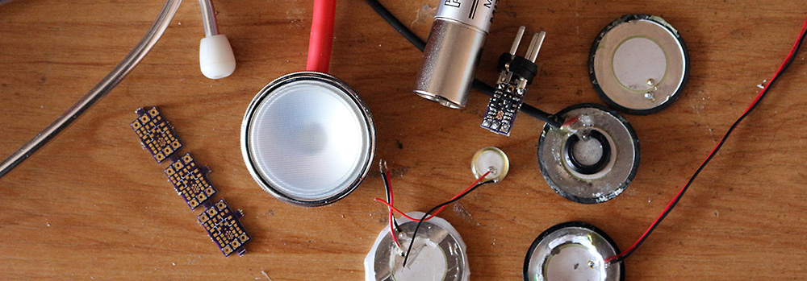

# DIY contact microphones
This is a collaborative article dedicated to various aspects of making of contact microphones and contact microphone pre-amplifiers (buffers or impedance converters).

## Contact microphones
A microphone transduces acoustic energy to electrical energy, converting sound to voltage. Most microphones that we are familiar with react to sound pressure waves in air. Contact microphones are useful in performing a different function, **transducing vibrations that occur in a solid material**. They are normally used by attaching them to the material in question, either by firm pressure, adhesive tape, a suction cup, or another method.

Most contact mics are made of a **piezoelectric material**, which is a material that releases an electrical charge when under stress (or physical pressure). This explains why they are colloquially known as **piezos**. 

The most common form of a piezoelectric contact microphone is a metal disk, but piezos may also be found in cylinders or as thin film-like coating. Like all transducers, a piezo disk may be used in the opposite kind of application: induced electricity will cause the disk to vibrate, even resonate at distinct pitches. For this reason, piezo disks are also used in speakers (especially tweeters) and buzzers. 

*Common piezoelectric forms: disc, cylinder, film, and bar.*

Piezoelectric discs are inexpensive and easy to source. However, in their raw form they have several issues which can negatively affect their sound quality: **resonance**, **sensitivity to electrical interference**, and **very high impedance**.
## Problems of piezoelectric contact microphones
### Resonance
Disc piezos do not detect vibration frequencies in a linear manner. Although they can have an extended frequency range, they have a characteristic resonance that varies with the diameter of the disc. This resonance is usually between 2 and 6 kHz, producing a "metallic" or "honky" sound. The resonance can be reduced by increasing the mass of the disc. However, this can adversely affect the overall sensitivity of the element. A good strategy is to increase the mass of the metallic part, while not excessively loading the central ceramic portion.

A comparison of two different bodies is demonstrated in the following video. Notice the "tone" of the piezo without additional mass:
<iframe width="100%" height="400" src="https://www.youtube.com/embed/wq8wnFRAPas" title="Video" frameborder="0" allow="accelerometer; autoplay; clipboard-write; encrypted-media; gyroscope; picture-in-picture; web-share" allowfullscreen></iframe>
### Interference
An unshielded piezo disc acts as an antenna for electromagnetic interference (EMI), picking up stray signals from its surroundings. One solution is to cover the element in copper tape that is connected to the system ground.  This creates an EMI shield, just like the outside braided conductor in a microphone or guitar cable.
### Impedance
Piezoelectric elements are capacitive, which means their impedance is inversely proportional to frequency. The lower the frequency, the higher their impedance ([impedance calculator](http://www.sengpielaudio.com/calculator-RC.htm)). This typically results in an attenuation of lower frequencies when the contact mic is plugged into a preamplifier, which explains the characteristic "tinny" sound that many listeners experience. The piezo element actually has a wide frequency response, but the bass is rolled off in most circuits and this is exacerbated by the resonant peaks (as discussed above).

Another way to express this is that the impedance of a contact mic is not "well matched" to typical audio inputs. Piezos transducers need to work at high impedance (over 1 MΩ). A typical line input of an audio mixer has input impedance of about 50 kΩ. This forms a 200 Hz high pass filter (HPF) with typical piezo elements. Worse yet, the microphone input on many mixers and preamps have around a 1.5 kΩ impedance. This results in a 1 kHz HPF, omitting bass frequencies entirely. 

The solution is to "buffer" the contact mic. The circuit that performs this function is called an impedance converter. Strictly speaking, it does not necessarily amplify the signal. But it matches the output impedance of the piezo element to the input impedance of mixers and preamplifiers.  This maintains the natural frequency response of the piezo transducer and reduces noise generation in the circuit. 
## Impedance converters
There are two basic types of impedance converters, those based on passive circuitry and those using an active circuit. Their primary task in each case is to match a high-impedance signal to a low-impedance input. They often also convert an unbalanced output to a balanced output, so the unbalanced, high impedance signal from the piezo element can then be used with a low impedance, balanced mixer or preamplifier. It also allows a longer cable run, without the risk of electrical interference or signal degradation. Finally, an impedance converter might ensure that the signal level is at an appropriate level for a microphone input. 

Devices that perform all three of these functions are known to musicians as DI (Direct Inject) boxes. These devices are used in recording studios to appropriately match instrument signals (say, an electric bass guitar) to a mic input on a mixing desk. Some mixers have inputs with this circuitry built in. These inputs might have switches marked "instrument" or "high-Z" (where "Z" stands for impedance). 

A **passive impedance converter** works on the basis of impedance matching or impedance bridging. Often they simply use a transformer coil between the input and the output. The number of coil windings on each side of the transformer dictates the impedance ratio.  So, by having many windings on the input of the transformer and only a few on the output, the piezo element will see a high impedance input, but the transformer's output signal will be well suited for use with a low impedance mixer or preamplifier. This solution has several advantages including low cost, low noise, and the fact it requires no power. However, signal amplitude necessarily drops. In order to ensure fidelity, this necessitates the use of a preamplifier with significant clean gain. This is not an issue in the studio, but may be a problem when using portable or consumer-grade recording gear. 

[Hosa](http://hosatech.com/product/mit-129/) makes a typical adapter to convert from 50 kΩ, the typical impedance of the magnetic pickup of an electric guitar, to 200 Ohms, the typical input impedance of an audio mixer. This unit is hence not optimized for piezo disks, but might provide a partial solution.

An **active impedance converter** contains an actual amplifier circuit, based on either Field Effect Transistors (FETs), op-amps, or a vacuum tube. Active impedance converters may be powered by batteries, a standard outlet, or the phantom power provided by the mixer or the recorder. Active impedance converters are more complex and are often more expensive than their passive counterparts, but they can be highly optimized to their task. By using a proper active impedance converter with your piezo contact microphone, characteristics of the mixer, particularly how much clean gain is available, become less critical.

Video exploring the effects of active impedance converter:
<iframe width="100%" height="400" src="https://www.youtube.com/embed/LXDjLeU8-kE" title="Video" frameborder="0" allow="accelerometer; autoplay; clipboard-write; encrypted-media; gyroscope; picture-in-picture; web-share" allowfullscreen></iframe>
## Useful resources and products
### Schematics
Active impedance converter designs and schematics are available from many online sources. 

- [J. Donald Tillman](http://www.till.com/articles/PreampCable/) describes a FET Preamp Cable, powered by phantom.
- Alex Rice published an early design, powered by phantom. Now offline.
- [Zach Poff](http://www.zachpoff.com/diy-resources/alex-rice-piezo-preamplifier/) optimised Rice's work, provides Eagle board files.
- [Dave Murray Rust](http://www.mo-seph.com/projects/piezopreamps) provides files for a Poff circuit, designed to be as small as possible.
- [Walter Harley](http://cafewalter.com/pzp-1/pzp-1/) has a surface-mount circuit working off 9V, optimised for guitar pickups. 
- [Scott Helmke](http://www.scotthelmke.com/Mint-box-buffer.html) has his own version of Harley's design.
- [Richard M.](http://www.megalithia.com/sounds/tech/piezo/opamp.html) has a low noise solution.
- [Martin Nawrath](http://interface.khm.de/index.php/lab-log/piezo-disk-preamplifier/) provides Eagle board files for a buffer that works off 3V.
- [Collin Cunningham](http://makezine.com/2011/12/20/collins-lab-diy-contact-mic/) provides yet another 9V solution.
### Products
The following products are available for purchase.

**Passive impedance converters:**
- [Hosa MIT-129](http://hosatech.com/product/mit-129/) – passive impedance matching transformer. Does not require phantom power, but requires high gain on the pre-amplifier. 

**Active impedance converters:**
- [Aquarian Audio](http://www.aquarianaudio.com/pa1.html) sell the PA1 Hydrophone Buffer Amp, powered by PIP or phantom. 
- [Zeppelin](http://zeppelindesignlabs.com/product/cortado-balanced-piezo-contact-mic/) sell the Cortado Balanced Buffered Contact Mic for $25 (kit) or $45 (assembled). Phantom powered. 
- [Walter Harley](http://cafewalter.com/pzp-1/how-to-purchase/) sells the PZP-1 Piezo buffer for $49. Uses 9V battery.
- [Yann Seznec](http://www.yannseznec.com/works/custom-contact-mic-preamps/) builds boutique amps, based on Zach Poff's circuit.
- [Triton Audio BigAmp Piëzo](http://tritonaudio.com/bigamp-pi%C3%ABzo.html) is a phantom powered piezo buffer
- [CTACT Box by Pulp Logic](http://pulplogic.com/product/ctact-box/) is a coin-cell powered impedance converter
- [Radial StageBug™ SB-4 Piezo DI](http://www.radialeng.com/stagebugsb4.php) is phantom powered "active DI optimized for piezo transducers"
- [Stompville Phantom Piezo Preamp](http://www.stompville.co.uk/shop/26-phantom-piezo-preamp.html) is phantom powered piezo preamp module
### Other resources
- [The first rule of CONTACT MIC club](http://www.musicofsound.co.nz/blog/the-first-rule-of-contact-mic-club) by Tim Prebble
- [Building Contact Mics](https://www.zachpoff.com/resources/building-contact-mics/?highlight=contact) by Zach Poff
- [Microphones, Hydrophones, Vibration Transducers: Rolling Your Own](https://www.zachpoff.com/site/wp-content/uploads/David-Dunn-Microphones_Hydrophones_Vibration-Transducers__Rolling_Your_Own__Dunn2007.pdf) by David Dunn
### Credits
Authors, editors and contributors (listed alphabetically):  
Till Bovermann, Jonas Gruska, Jerry Lee Marcel, Robin Parmar, Terry Setter  
Videos by Jonas Gruska