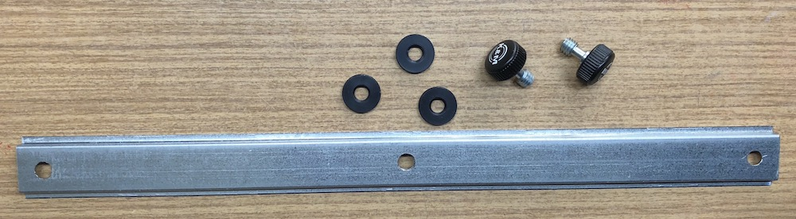
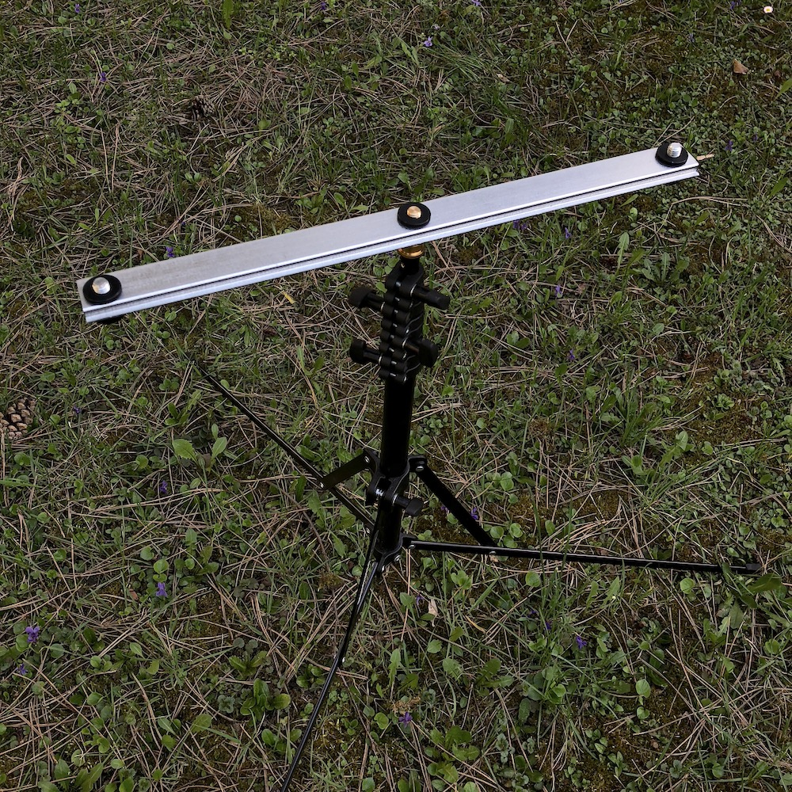
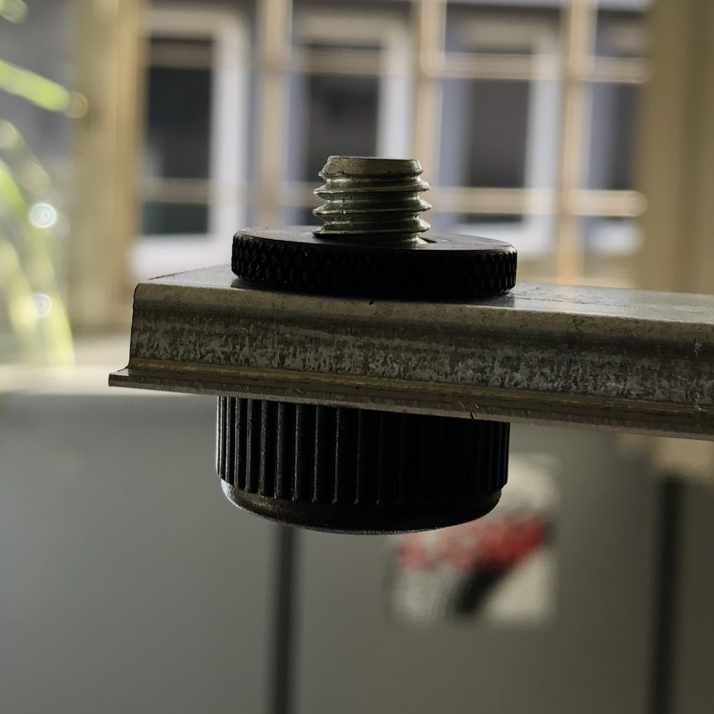
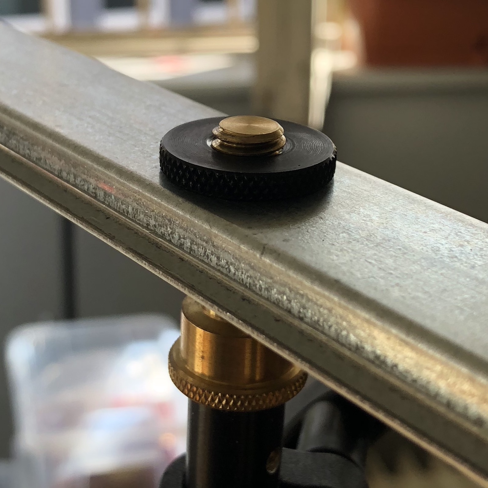

# DIY stereo bar (on budget)
**Ingredients:**
- unperforated, zinc-plated steel DIN rail (available in electrical supply stores or [TME](https://www.tme.eu/gb/details/ts35_7.5-1m/rail-mounted-connectors/))
- 2 K&M 3/8" thumb screws (available on [Thomann](https://www.thomann.de/intl/km_raendelschraube.htm))
- 3 K&M 3/8" thumb wheel (available on [Thomann](https://www.thomann.de/intl/km_raendelscheibe_alu_sw.htm)

**Tools:**
- drill for making the holes in the rail
- 9mm drill bit (but you can use a smaller one and extend it manually)

**Total cost: ~6€**

1. Adjust the size of the rail to your liking. For a 40 cm AB stereo bar I went with 42.5 cm.
1. Drill the three holes in the top rail. For 3/8" you can use 9mm drill bit on the sides and 10mm on the central one. On the sides, the closer to the internal diameter of 3/8" you'll get, the better.
1. Screw in the screws into the holes and use thumbwheels as washers, protecting the screws from falling out. Alternatively you can use M8 retaining rings for shafts.
1. Use the third thumb wheel as a way to tighten the bar to your stand. You can epoxy-glue the wheel to the bar to attach it permanently.
  
 .  . 