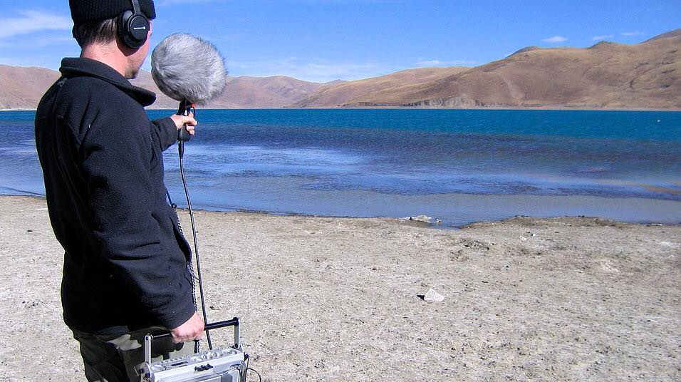
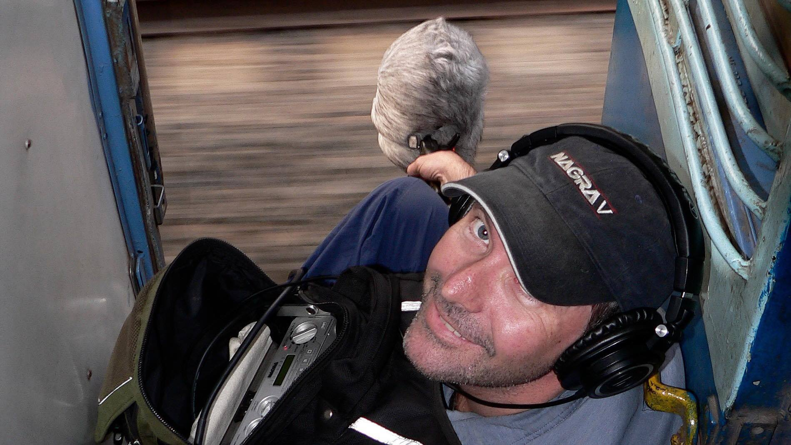
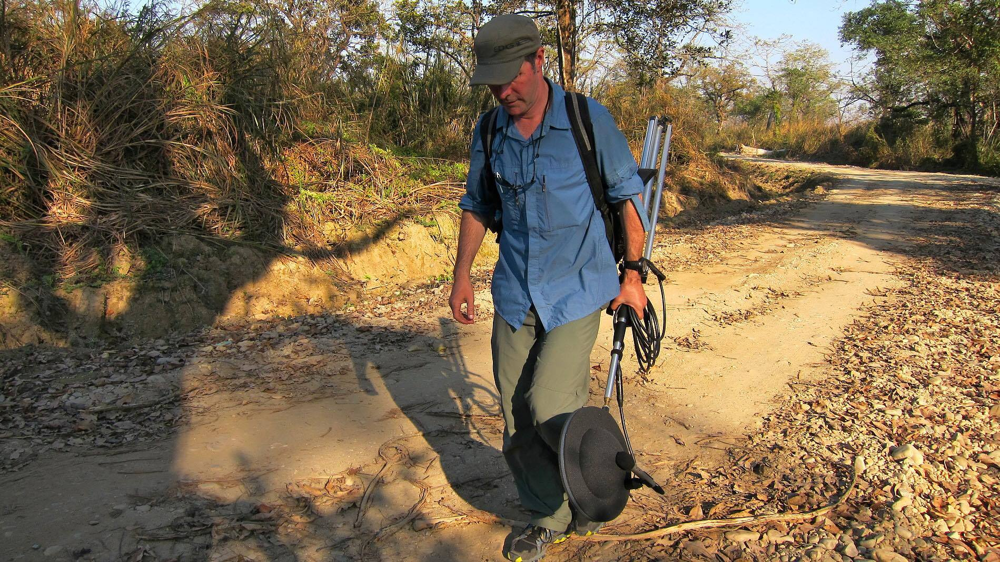

# Field recording in South-East Asia

*by Greg Simmons*

I've been a regular backpacking recordist since 2004, after spending decades in recording studios and concert halls. I have typically spent around three months per year since 2004 running around Nepal, India, Tibet, Thailand, Myanmar (Burma), Borneo and similar places recording music and sounds. I've used all kinds of stuff in all kinds of places. Right now I'm in the 10th month of what will hopefully be a never-ending recording journey — it will end when I die, if all goes to plan! I'm currently in Bangkok making refinements to my latest recording rig. Here are some thoughts regarding putting a recording rig together for South East Asia.

### Microphones

First and foremost, you need a very good idea of the kinds of sounds you're after and what you intend to do with them because that will influence the equipment you take with you — especially the microphones. There is no such thing as a one-size-fits-all microphone rig unless you're prepared to spend a lot of money.

For capturing immersive sound fields, such as a swamp late at night, a stereo or multichannel microphone array that captures a wide area of the soundfield is appropriate; think of it as a wide-angled lens. A pair of omnidirectional microphones is commonly recommended for this kind of field recording because omnidirectional microphones capture a 360° sound field, so a pair captures the 360° sound field in stereo. There are many other microphone arrays that can be used, however, with varying degrees of directionality for situations where you don't want to capture the whole 360° sound field. Some techniques, such as MS, offer the ability to change the directionality after the recording has been made — essentially zooming in on sounds in the centre, or panning out wide to sounds on the sides.

Capturing sounds for sound effect libraries, sampling and similar applications requires microphones with the ability to focus on a specific aspect of a sound field or object. For stereo work, I'd suggest an MS pair with cardioid or hypercardioid M capsule. For sampling and sound libraries for movies and games, where the sound is often required in mono and extraneous sounds are unwelcome, some field recordists use a microphone with a hypercardioid or shotgun polar response to get a highly focused capture of a particular sound. Bird recorders will often resort to using mics mounted in the focal point of a parabolic dish for extreme directionality.

There are three microphone designs in common use throughout the audio industry: ribbon mics, dynamic mics and condenser microphones. The latter are the most sensitive and most accurate of the three, which makes them the primary choice for field recording. However, the climate throughout South East Asia is generally hot and humid, and humidity can cause noise, crackling, popping and rumbling sounds with some condenser microphones. I have lost a number of good recording opportunities due to microphones being upset by humidity. My expensive Schoeps MS pair is just as prone to humidity as my budget Rode omnis. 'RF condensers' are the best choice here, because the RF capsule technology offers far greater immunity to humidity (it also offers low self-noise relative to the size of the diaphragm, which is another great advantage for field recording). Sennheiser's MKH series of RF condensers rule the roost when it comes to immunity to humidity. Some of Rode's NTG shotgun microphones also use RF condensers.

### Recorder

I'm not going to make any recommendations for specific recording machines. If you consider the analogue part of the recording chain as consisting of microphone, preamp and AD converter, the microphone itself represents about 80% of the resulting tonal quality. The preamp and AD converter (both inside the recorder) contribute such a small amount that differences between contemporary machines from a tonal point of view are quite insignificant compared to differences between microphones. So make sure you spend much more on the mics than the recording machine. If you had, say, $5k to spend on mics and recorder, I'd recommend allocating about 80% of that on the mics and the remaining 20% on the recorder — 80/20, in accordance with what I wrote above about the contribution of those things to the captured signal. A pair of expensive mics into a cheap recorder is going to sound way better than a pair of cheap mics into an expensive recorder.

Having said that, in some types of field recording (e.g. nature sounds) very low noise is the primary goal — which requires microphones with very low self-noise. Some of the quietest microphones on the market are not necessarily the most expensive, e.g. Rode quotes a self-noise of only 4 dBA for their affordable NT1. It's not the greatest microphone on the market, but it's certainly one of the quietest! You'd be hard pressed to follow the 80/20 rule if a pair of NT1s (at around $500 US the pair) represented 80% of your budget!

### Tech support and powering

Another thing to watch out for is what I call 'tech support' — this is all the additional stuff required to make your gear work, e.g. AC adaptors, battery packs, battery chargers, interface cabling to computers, etc. It all adds up to considerable weight and bulk in your pack. It's always worth laying out all the audio/video gear on a bed or similar large surface and dividing it into two piles: tech, and tech support. I am often dismayed by the bulk and weight of tech support needed to run an otherwise small and lightweight rig.

A lot of stuff these days is USB powered, which is great. It means you can buy a single multi-port USB charger to recharge all of your stuff at once, typically overnight, from a single power point. That's very handy in rooms where there is only one power point.

Everything in my new rig is USB powered, except the Nagra 7 field recorder which uses an AC adaptor. In Bangkok I was able to buy a solid little power board/multi-port USB combo for a few bucks that has two universal AC power sockets (can take just about any international plug without needing an adaptor) and six USB outlets; four rated at 1 A, two rated at 2.4 A. The latter are excellent for fast charging my iPad and powerbank. (I have a 20,000 mA/hr powerbank that's roughly the size of a packet of cigarettes and can keep my USB devices powered for quite a long time in the field.)

That combined power board and multi-port USB charger replaces a much larger separate power board (six sockets) and a handful of different USB adaptors (one for my phone, one for my iPad, one for my camera, one for my powerbank, etc.) with something that is 1/3 the overall volume and 1/3 the overall weight. The reduction in volume and weight is considerable and, because it was purchased locally, it plugs straight into the wall sockets found throughout South East Asia without needing an adaptor plug — unlike the powerboard it replaced. That's another small weight saving and one less bit of messing around when setting up a home base.

One more thing I really like about that particular combined power board and multi-USB outlet is that it has a long AC power cord. Power outlets in SE Asia are often higher up on the wall, 60 cm to a metre is typical, so you need a decent length of power cord if you want to sit the power board on the floor — otherwise you'll find yourself trying to jam a chair or foot stool into some cramped space between the bed and the wall to sit the power board on. Power points in SE Asia are often very loose fitting, so anything with a bit of weight to it (wallwart, cable with power board hanging off the end of it, etc.) will keep falling out.

Also, it's important to realise that South East Asia is prone to blackouts, which can be a real bummer if you're planning on recharging something overnight and there's a long blackout while you're asleep. You'll wake up feeling recharged, but your devices won't.

If your powerbank can provide recharging power to your USB devices at the same time as it is being recharged, consider recharging your most important USB devices from the powerbank *while* it is being recharged. In the event of a blackout the powerbank will continue to charge your USB devices (assuming it has some charge onboard) during the blackout so that hopefully they'll still be charged when you're ready to use them. (I learnt that trick from spending many winters in Kathmandu, where they have regularly scheduled blackouts of up to 8 hours at a time and up to 16 hours per day.)

On the topic of charging, I like to have two battery packs for my crucial gear and I try to keep them both fully recharged whenever possible.

### Cables

Field recording in South East Asia means sometimes working in hot and dusty environments, and sometimes in damp and humid environments. The top soil in many of these places is very fine and can really make a mess of an XLR connector — especially when a bit of moisture gets involved. Even worse when you have well-meaning locals jumping in to help with the packing up process and dragging the ends of your cable across the dirt, through damp grass or — horror of horrors — through a fresh mound of buffalo pooh (I've had that happen in a village in the Himalaya). So… never let anyone else pack up your cables, always clean off your cables after use with a bit of old rag or similar, and always keep your cables in ziplock bags when not in use. Ziplock bags not only keep the cables dry, they also prevent them from getting tangled with other stuff in your bag — a major hassle that can lead to cable damage when trying to remove them in a hurry. I also recommend those XLR sealing caps that Neutrik make; I don't use them myself but they've been on the list of things I've been meaning to get for years.

I use Neutrik XLRs with gold-plated pins for all of my cables. Contrary to popular belief, gold is not an amazing conductor (it's equivalent to copper) but it has the wonderful benefit that it doesn't oxidise or tarnish, which is helpful in the kind of field conditions we're talking about. Oxidisation can adversely affect an electrical connection, although it can be argued that if the connectors are in good condition then the act of regularly plugging and unplugging them will be enough to keep them clean and free of oxide and tarnish. I also use a contact enhancing product called Stabilant 22 on all of my XLRs, but if you're going to use that you really do need to make sure you don't get any dirt or dust in the connectors.

### Data storage

Data storage is always an important consideration, and the longer you intend to be in the field the more of it you're going to need. Field recording often involves making very long recordings in the hope of capturing an interesting minute or two (especially with nature recordings) so you need to have a plan for data storage. If you are adding HD video footage, your storage needs will increase considerably.

Avoid bringing any mains-powered hard disks. Although they offer good value for money compared to portable drives, they are much larger and heavier. Furthermore, if there's a blackout in the middle of a data transfer you might end up with a dead drive — either from the blackout itself, or from the surge that sometimes happens when the hotel or guest house turns on its back-up generator. Stick to the bus-powered drives. I've had great success with LaCie's range of rugged hard disks, but I haven't tried many others so that's not a definitive recommendation.

My new rig has moved away from disk drives altogether, favouring a combination of SD cards and cloud storage. My recorder and camera both record to SD cards, so I have purchased a number of large-capacity SD cards that ought to be enough to cover my storage needs during my forays away from wifi. The free wifi in many cafes, guest houses and hotels in the bigger cities of South East Asia is often ridiculously fast, so I plan to upload the most valuable stuff to cloud storage as an additional backup. It's an experiment for now, but I'm sure in a year or two I'll look at pictures of my portable hard disks in the same way I look at dot matrix printers today.

### Readily available

Don't fuss over things that you can get anywhere, such as USB cables, USB chargers, SD cards, USB sticks and similar. South East Asia is very switched on in that respect and you'll find it easy to get replacements for all of those things, often in roadside mobile phone shops and similar. Likewise with mains adaptor plugs. Any major city in South East Asia will have those things readily available. For example, Pantip Plaza in Bangkok is a five story shopping mall entirely dedicated to computer and mobile technology; if you can't find the right cable, charger or storage medium there then it probably doesn't exist.

Certainly bring backups of any specialised cables.

### Itinerary

It is *usually* more cost-effective and time-effective to keep moving forwards rather than backtracking (i.e. returning to a 'home base' after each foray). Also, it is *usually* cheaper to go overland rather than flying from one country to another if you can afford the time and don't mind bus or train travel. Another advantage of land crossings is that border officials rarely check your bags, and when they do they're far less fussy than the customs officials at airports.

I try to plan itineraries like those challenges where you have to draw the picture without taking the pen off the map (that means flying) and without going over the same line twice (that means backtracking). For South East Asia, an extensive itinerary that goes overland as much as possible with no backtracking would start in Indonesia, head west to Malaysia, north to Thailand, west (from Bangkok) to Myanmar, north then east of Myanmar and across the top of Thailand (via Chiang Mai/Chiang Rai) to Laos, south to Cambodia, south east to the bottom of Vietnam then north up to the top of Vietnam.

### Security

Try to avoid visually obvious Pelican cases and similar. A Pelican case says "Expensive stuff inside" and "Rich guy here", and that leaves you open to all kinds of exploitation. You become a target for thieves who will assume Pelican cases mean cameras, and stolen cameras are easy to fence in a developing country. You might also become an easy target for unscrupulous customs officials who will refuse to let you into the country without a film permit or similar (regardless of whether such a thing exists), and you'll find yourself faced with the option of paying an expensive carnet or a marginally cheaper bribe. I have had all of those things happen to me.

A final thought on the topic of security. There is a trend happening among travel bloggers now to avoid mentioning where their next destination is going to be until after they have left it. In other words, they are always one country ahead of where they say they are. There are people who follow travel bloggers on line with the intention of stealing their gear or similar, so the idea is to not give any advance notice of where you're going next in order to avoid an unwelcome welcoming committee. Be wary of the driver standing outside the airport or train station holding up a piece of cardboard with your name on it when you didn't arrange to be picked up!

*Greg Simmons is a writer, educator, traveller and sound recordist. He runs educational sound recording expeditions through Asia and the Himalaya for small groups of interested people. More at [soundexpeditions.com](http://www.soundexpeditions.com).*
