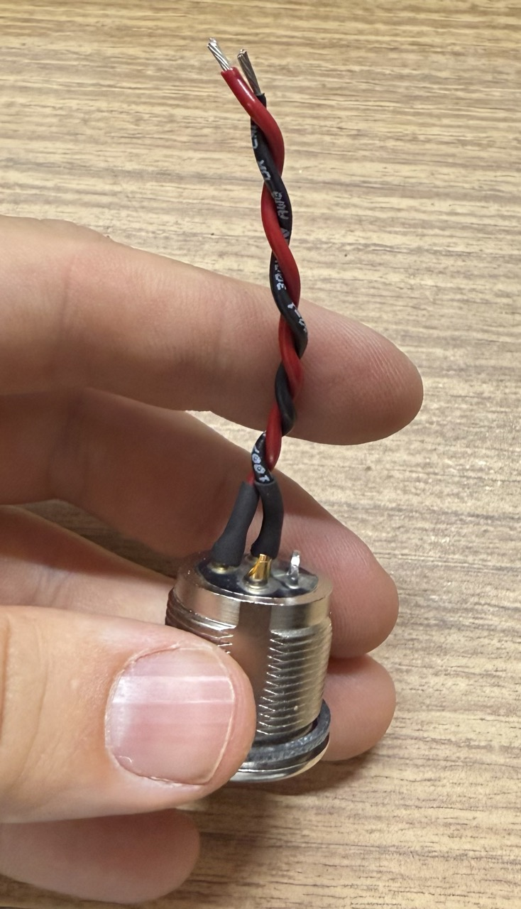
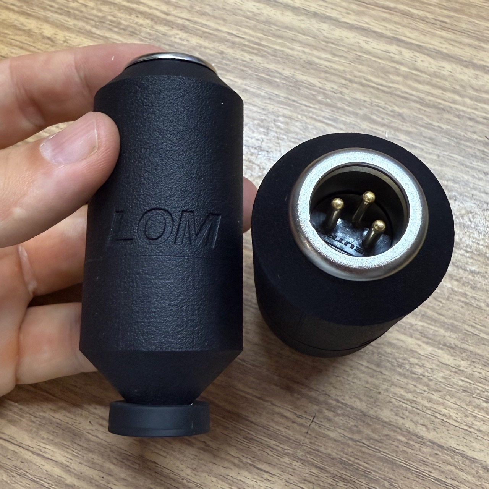

# Geofón XLR mod
One of our customers approached us with an interesting idea—they wanted to create a "wireless" version of Geofón using small XLR wireless transmitter. So I designed a special modified version of the Geofón case top to include a heavy duty XLR connector. 
## Parts & tools
- [3D printed Geofon_XLR top](https://github.com/LOM-instruments/Geofon-accessories/blob/main/geofon_xlr.stl)
- [Neutrik heavy-duty XLR connector, NC3MPR-HD](https://www.neutrik.com/en/product/nc3mpr-hd)
- DIN 7991 M4 x 8 mm bolt
- ~10 cm of thin, stranded single core wire
- soldering iron and solder
- M4 tap drill ([for example](https://wiha.com/int/en/tools/bits/wiha-drill-bits/combination-drill-bits/combination-drill-bit/27898))
## Instructions
1. Print the provided STL file. Tap the two screw holes on the side: the top hole uses an M4 x 8 mm bolt, and the bottom hole uses the original bolt from your Geofón.
1. Prepare two wires of equal length and solder them to pins 2 and 3 of the XLR connector.
1. Attach the XLR connector to the printed body and secure it using the M4 x 8 mm bolt from the side.
1. Solder the wires to the element: the pin marked with a dot should be connected to pin 2 on the XLR connector.
1. Insert the element into the casing and secure it from the side, as you would with a regular Geofón. Finally, screw on the bottom part of the casing using the original Geofón’s component.

