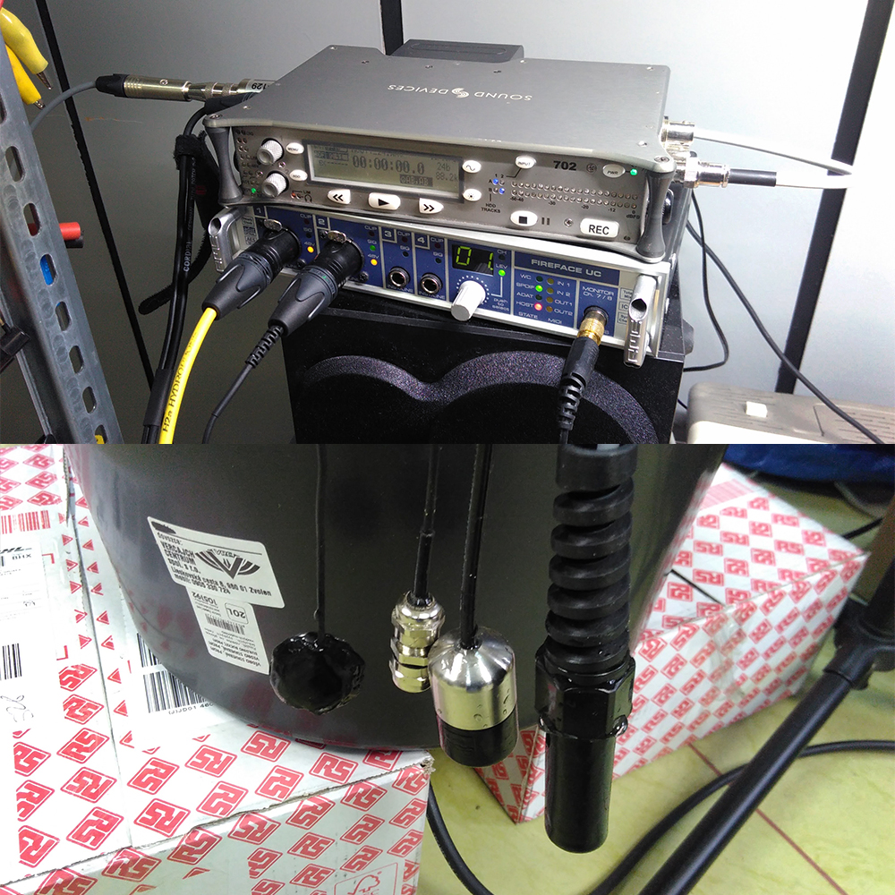

# DIY hydrophones

- [Construction and Testing of Low Noise Hydrophones](http://www.dtic.mil/cgi-bin/GetTRDoc?AD=ADA420311) by Miguel Alvarado Juarez 
- [A guide to constructing hydrophones and hydrophone arrays for monitoring marine mammal vocalizations](https://swfsc.noaa.gov/publications/TM/SWFSC/NOAA-TM-NMFS-SWFSC-417.PDF) by Jay Barlow, Shannon Rankin and Steve Dawson
- [A cheap sensitive hydrophone for monitoring cetacean vocalisations](http://www.lukemiller.org/journal/journal_pics/hydrophone/piezo_hydrophone_1995.pdf) by ?
- [Electret microphone in mineral oil](http://www.instructables.com/id/Underwater-Microphone-Hydrophone/)
## Main methods
- Piezoceramic sensors (disc – basic, cylinder and other shapes - advanced)
- Electret microphone in mineral oil ([example](http://www.instructables.com/id/Underwater-Microphone-Hydrophone/))
- Water proof speaker used as underwater transducer