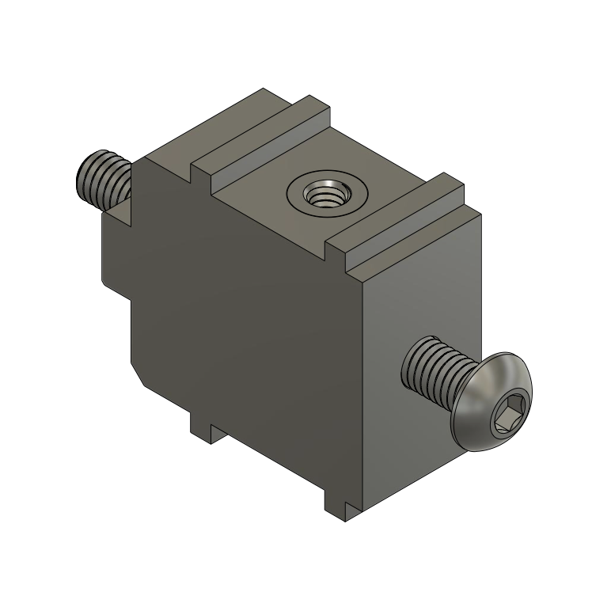
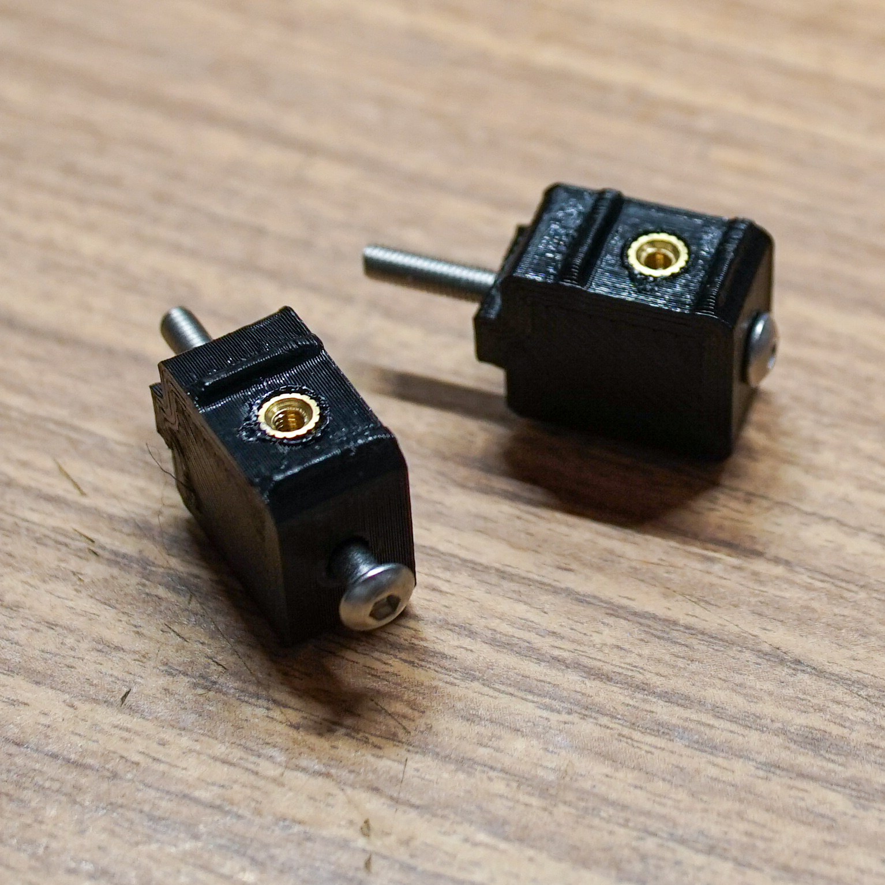
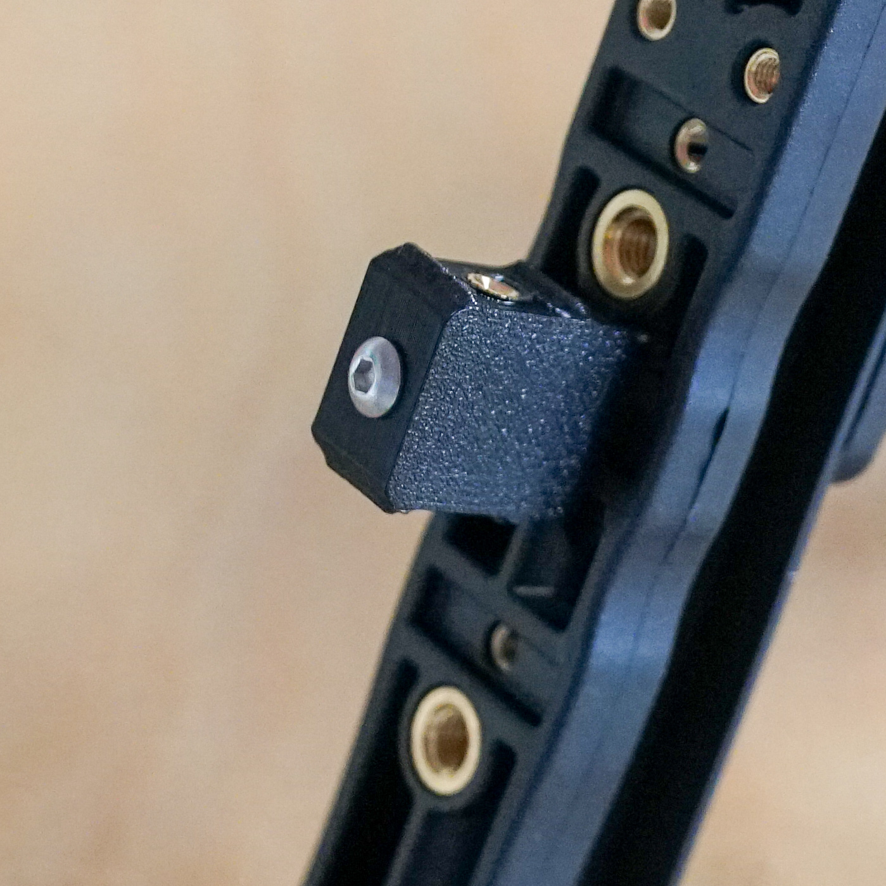
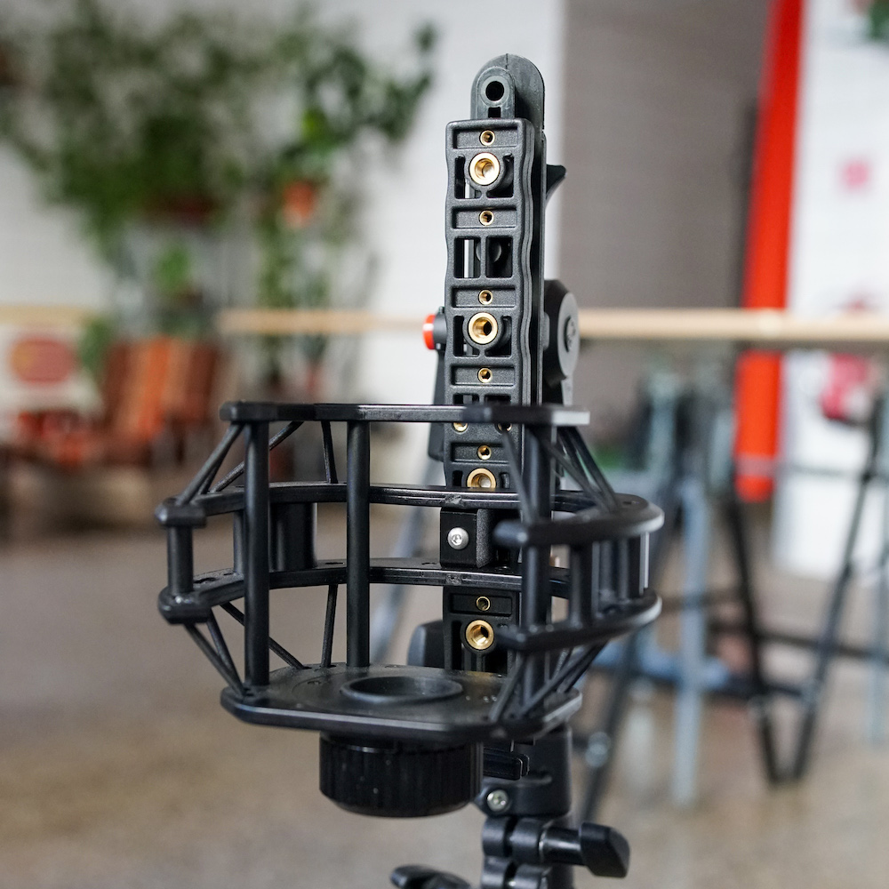
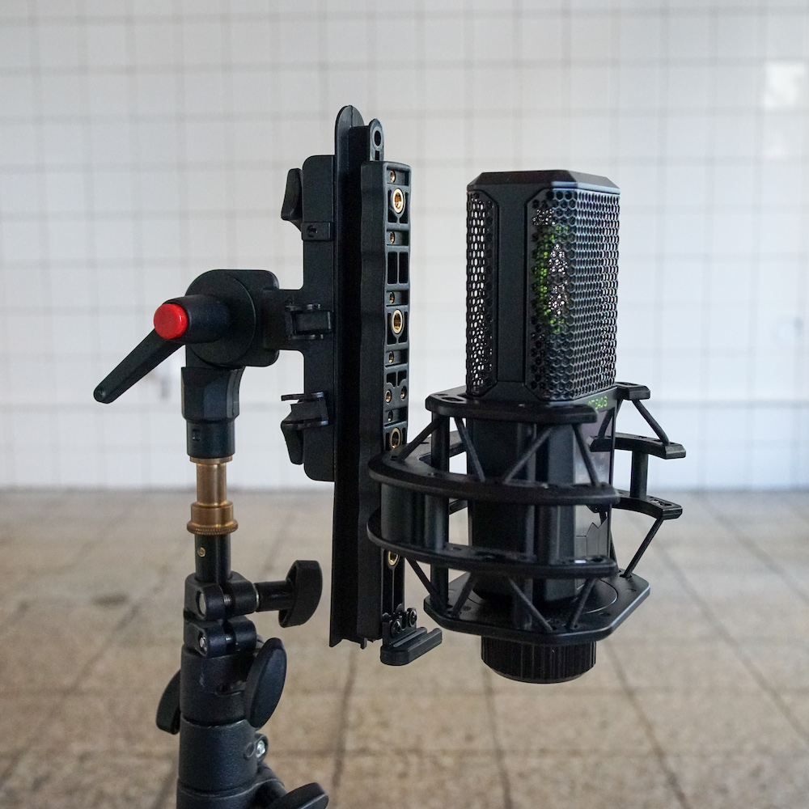

# Lewitt LCT 540 S + Rycote Stereo Windhsield adapter
[Lewitt LCT 540 S](https://www.lewitt-audio.com/microphones/lct-recording/lct-540s) is a popular field recording microphone due to its super low-noise figures. Unfortunately there are no good ready-made windprotection solutions on the market, so I decided to make a improvised version on my own. Magnus Bergson from fieldrecording.net came up with an interesting [solution](https://photos.google.com/share/AF1QipOj1DoC-HzItf01LZbP73RaDXVI3hsqbBqq-QdnS_U_qaDVJI0xRv5S7oSPRc-3RA?key=dEFReEN0T29FdXpZaU5YWTktU0tMdG81S2otWlNn) using [Stereo Windshield WS AE ORTF Kit](https://mymic.rycote.com/products/stereo-windshield-ws-ae-ortf-kit/), and I decided to improve on his design. 

I discovered that one can reuse the original microphone suspension basket provided with the microphone and mount it directly on the rail of the windshield with a simple 3D printed adapter. I removed all the lyres from the rail, removed the swivelling bracket from the basket and used the adapter to connect the two using M3 x 30 stainless bolt and original M2.5 bolts from the basket. Result is a firm connection of the original suspension in a proven windshield.

If you are interested in a 3D print of the adapter, contact me at jonas@lom.audio. If you want to print it yourself, you will also need two M2.5 x 4 mm threaded inserts (to be [inserted with soldering iron](https://youtu.be/hwq15qH-4x4)) and M3 x 30 mm bolt. The model can be downloaded [here](https://github.com/LOM-instruments/Misc/blob/main/lewitt%20to%20rycote%20adapter.stl).

