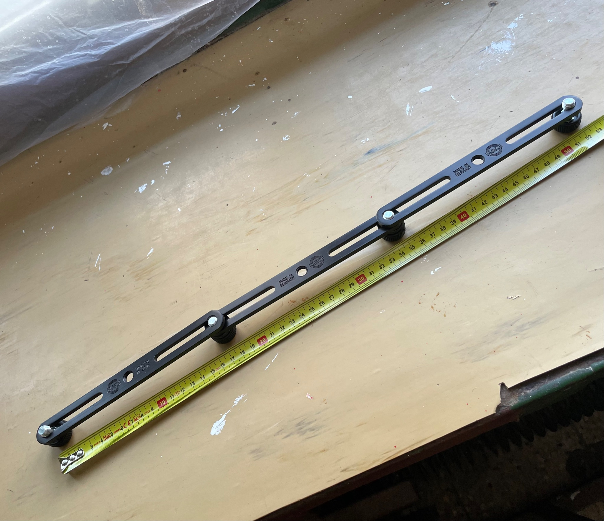
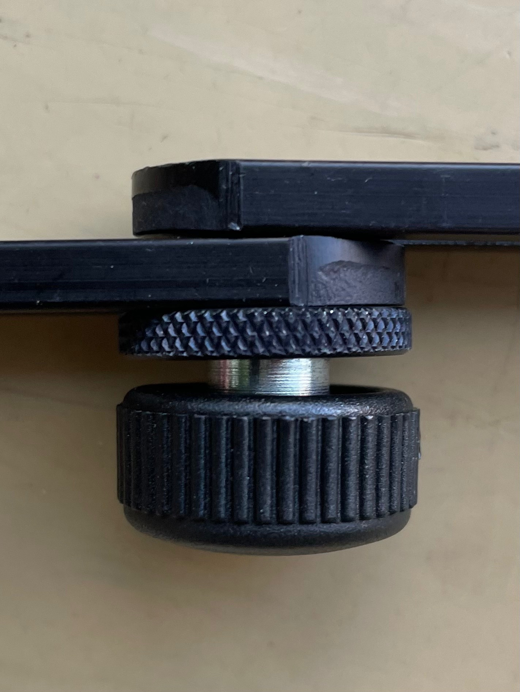

# Modular stereo bar

**Ingredients:**
- 3x K&M 23550 Microphone Stereo Bar ([Thomann](https://www.thomann.de/intl/k+m_235-50.htm))
- 2x K&M Thumbwheel Alu BK ([Thomann](https://www.thomann.de/intl/km_raendelscheibe_alu_sw.htm))

Total available width is 52 cm, less than 20 cm folded. Weight is around 180 grams. The two nuts are placed in between the connecting bolt and the lower bar. The screw works better that way. Total price excluding shipping is 32€.