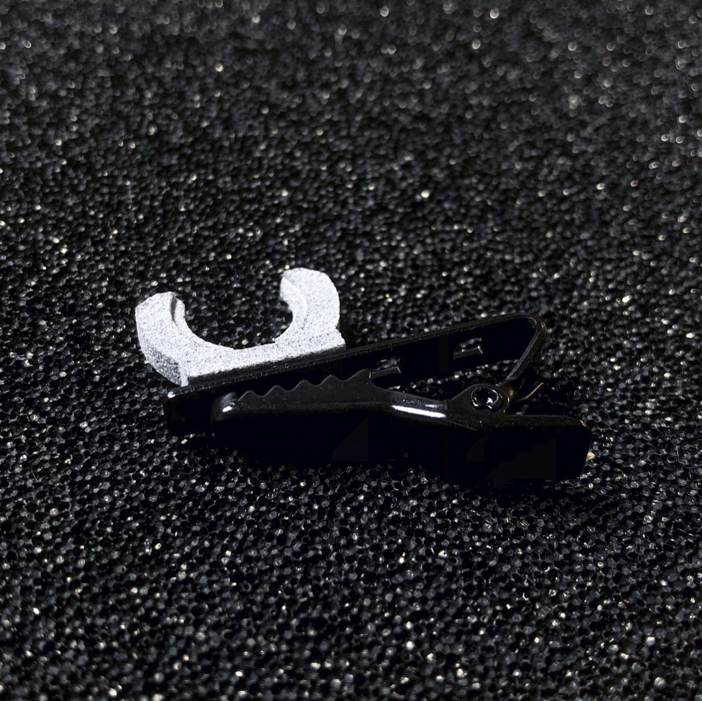
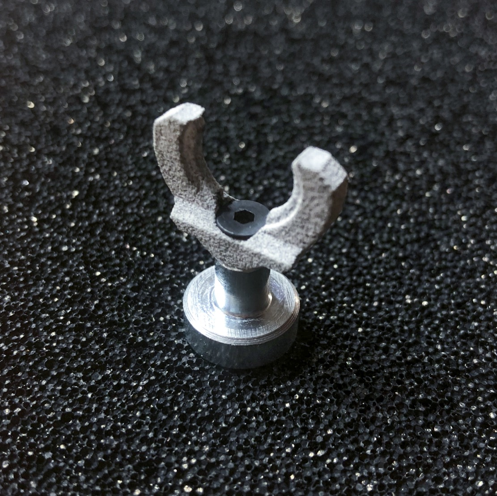
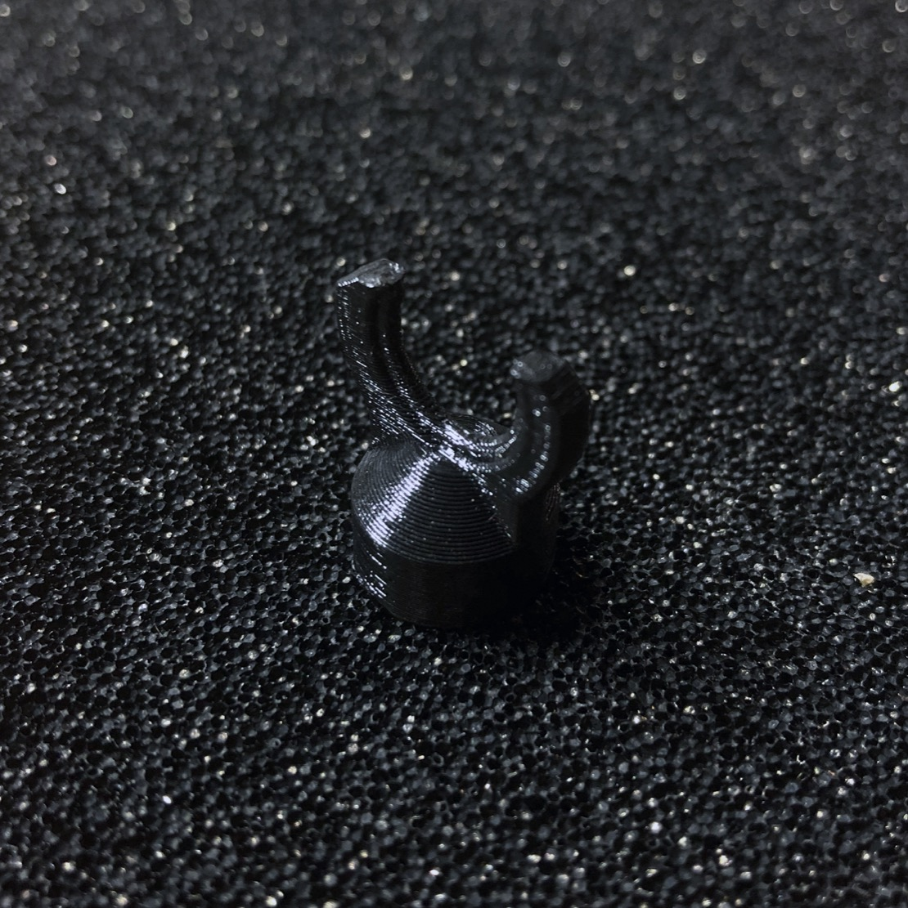
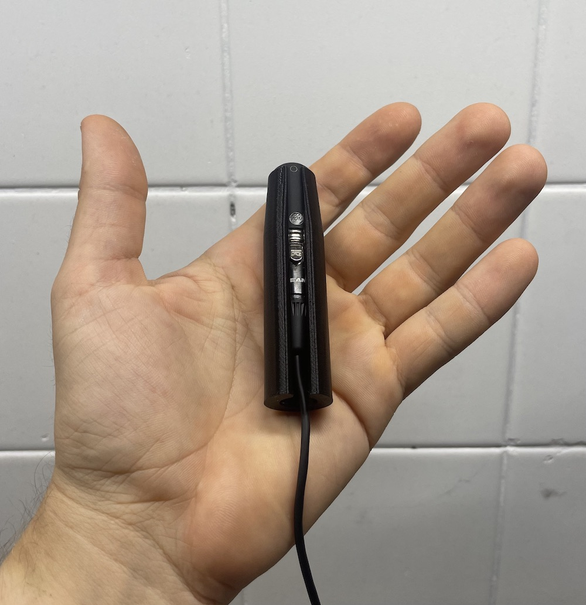

# DIY Uši microphone clips & accessories

## Classic clip
  
3D printed part + eBay sourced lavalier microphone clip  
[Download (*.stl)](https://github.com/LOM-instruments/Usi-accesories) • [Buy](https://store.lom.audio/collections/microphones-accessories/products/usi-clip-single)

## Magnetic clip
  
3D printed part + neodymium magnet (ELESA+GANTER GN 50.2-ND-13-M3)  
[Download (*.stl)](https://github.com/LOM-instruments/Usi-accesories) • [Buy](https://store.lom.audio/collections/microphones-accessories/products/magnetic-usi-clip)

## Uši basic mount
  
For use with standard microphone thread 3/8"  
[Download (*.stl)](https://github.com/LOM-instruments/Usi-accesories)

## Uši expander
  
For use with Uši series microphones. Expander expands the diameter of the microphone to basicUcho size, making it compatible with basicUcho accesories.  
[Download (*.stl)](https://github.com/LOM-instruments/Usi-accesories)