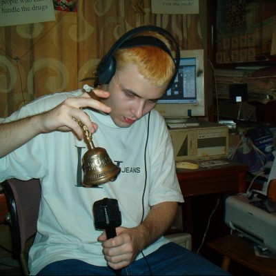

# VooDooMan

Marián Meravý a.k.a **VooDooMan** (17. 5. 1980 – 20. 10. 2015) was an experimental musician, painter, programmer, writer and radio presenter based in Bratislava, Slovakia. He authored 9 music albums, tens of humorous podcasts "Rádio Haluze" at [Rádio Tlis](http://www.tlis.sk/) where he also worked as a sound engineer. He ran his own music label called Oshipanah Records.

He often mentioned being inspired by [Coil](https://en.wikipedia.org/wiki/Coil_(band)), Jackson Pollock and Andy Warhol.

### Interests

#### Music

VooDooMan's music was usually very experimental, challenging traditional concepts of melody or rhythm with more abstract compositional processes, musique concrète or nearly harsh-noise attitude. His music contained for example sampling of his own voice or voices of other people (sometimes through telephone line), own distortion techniques and various acoustic recordings of custom-built instruments.

He started to release his work after a push from Andrej Chudý, his colleague from Rádio TLIS.
He never performed live, even though there was an attempt to organize a concert by 900piesek and Hargi from FUGA in Bratislava.

#### Electronics

VooDooMan was a very skilled electrical engineer. One of his projects was a complex electronic circuit designed to control vacuum cleaner through his computer's sound card. His aim was to create an electronic interference in the power grid, which he then planned to use as an unconventional sound source for his music. His electronics knowledge was all self-taught — he dropped out of high-school and studied from university textbooks.

VooDooMan also built his own radio station, which he used to transmit his podcasts to his neighbors.

#### Programming

VooDooMan was an experienced C++ programmer, contributing to various open-source projects as well as programming his own musical programming language, similar to [Pure Data](https://puredata.info/). He often used to dive deep into processor architecture and maximise utilisation of its resources via assembly code instructions. He used to maintain his own servers, located at his home.

#### Telephone

Telephones have been often present in VooDooMan's work. His mother used to work in Slovak Telecom — a national telecommunication company — and he, as a child, got to experience the old analog telephone exchange. He was well versed in the various technologies underlying telecommunication.

Apparently VooDooMan liked to randomly select and call telephone numbers in the phonebook, which sometimes resulted in new friendships. He also sampled some of his phone calls in his music or in "Rádio Haluze". The ones made for his podcast were mainly prank calls to various commercial or public institutions.

### Discography

**Oshipanah Records:**

- Ultranet Refresh
- Posteuphoric airiness goes to the lethargy
- Love, peace and suicide
- Mob psychosis of zombies
- Communication subsystem failure
- Red sabbath
- The difference
- Stuck in the infinity
- The little night music generator

**LOM:**

- [Voices from Antidimension](https://lom.audio/releases/04-voodooman-voices-from-antidimension/)

### Sources

**Memories:** Ach, Baška, Danky, Jonáš, Vladko

- [VooDooMan's homepage](http://vdm.valec.net/)
- [Arena aggregating fragments / online presence](https://www.are.na/goretexture-s/voodoo)

### Links

- [LOM — Voices from Antidimension](https://lom.audio/releases/04-voodooman-voices-from-antidimension/)
- [Rozhovor VooDooMana s VooDooManom](https://www.youtube.com/watch?v=W_uZkVqBP6w) (YouTube)
- [Rozhovor Jonáša Grusku s VooDooManom](https://lom.audio/voodooman-a-hlasy-z-antidimenzie/)
- [Rozhovor s Luciou Udvardyovou pre rádio Wave](http://www.rozhlas.cz/radiowave/kumst/_zprava/voodooman--802648)
- [The Sound and the Fury — Cadillac Face and the Noize Konspiracy](https://vimeo.com/218776622) (Gianmarco Del Re, 2016) — documentary film featuring interviews about VooDooMan's work
