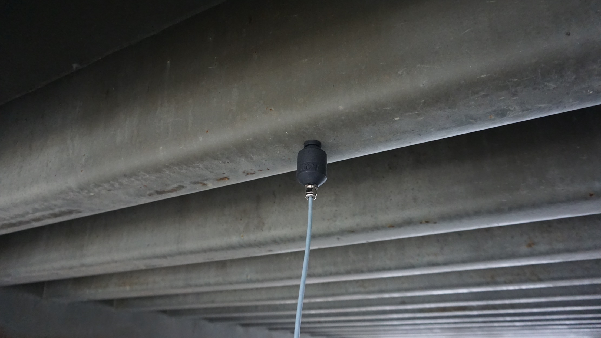

# Geofón and the seismic quiet of the anthropause

*by Andrej Chudý · originally published on 29 July 2020 as part of the LOM applied series*

<figure markdown="span">
  
  <figcaption>Geofón used by David Petráš</figcaption>
</figure>

I first heard the [Geofón](../manuals/geofon.md) in late 2019 and from the first moment I've been charmed by what I think is it's a most recognizable attribute - how it accentuates low-end frequencies and makes you feel like you are experiencing them from the inside of the recorded subject. I thought it would be great for capturing the inner reverberations of big structures, but one of the first examples I've seen and heard was Richard Devine applying it to a much smaller scale - [creating a sound space out of a waterphone instrument](https://www.instagram.com/p/B7R7jUbnE5b/) - and getting massive sound out of it nonetheless. It has shown me that with Geofón you don't need to go big to get impressive results.

Geofón is based on devices used for seismic measurement, quantifying the tremors and shakes propagated through the ground. One of the intended uses of Geofón is to be stuck directly into the ground with an attachable spike. In this context the year 2020 could be a good one for recording with Geofón as the "[global slowing of modern human activities](https://www.nature.com/articles/s41559-020-1237-z)" has resulted in a [50% drop in the seismic noise](https://doi.org/10.1126/science.abd2438). But after scouring the internet for examples of how the Geofón has been used, it seems only a few Geofón-ists have been sticking it into the ground - much more often they have used the magnetic attachment to connect it with constructions, objects, or embed it in an environment to create a musical instrument.

These first examples of Geofón use are coming from three areas, that overlap to some extent: field recording, music-making, and sound design.

## Geofón for the field recording

Field recording is the most obvious use for Geofón, as it enables you to literally record a field - you stick it to the ground and let the environment do its thing. What we've seen the most is Geofón being attached to structures and objects. Even though Geofón can stand on its own, people have been also using it in combination with other microphones - to help expand the low frequencies.

### Marcel & Libby ([Freetousesounds.com](https://www.freetousesounds.com/))

**Equipment used:** Zoom F6, AKG C411 contact microphone

Marcel & Libby, field recordists from freetousesounds.com, have done quite extensive recordings in Iceland with Geofón in different roles - capturing big metallic structures in wild (2:24), showing the potential of using Geofón as a musical instrument (5:59), explored everyday vibrating devices like a washing machine (7:13), and stuck it into the ground on a seashore (9:20). In some cases, they have done a live comparison with an AKG C411 contact microphone.

<iframe width="100%" height="400" src="https://www.youtube.com/embed/YjKRwIu7K3c" title="LOM Geofón Field Recording in Iceland" frameborder="0" allow="accelerometer; autoplay; clipboard-write; encrypted-media; gyroscope; picture-in-picture; web-share" allowfullscreen></iframe>

Based on the test in Iceland, they have created a free sound library including "almost 100 minutes of dark sounding recording". You can read more at [freetousesounds.com](https://www.freetousesounds.com/sfx/dark-drones-sound-effects) and download it at [Bandcamp](https://freetousesounds.bandcamp.com/album/dark-drones-sound-effects-geofon-sample-pack).

<iframe style="border: 0; width: 100%; height: 120px;" src="https://bandcamp.com/EmbeddedPlayer/album=3802655938/size=large/bgcol=ffffff/linkcol=0687f5/tracklist=false/artwork=small/transparent=true/" title="Geofón sample pack by freetousesounds" seamless><a href="https://freetousesounds.bandcamp.com/album/dark-drones-sound-effects-geofon-sample-pack">Geofón sample pack by freetousesounds</a></iframe>

### Audrius Simkunas ([YouTube channel](https://www.youtube.com/user/dragonas23/videos))

**Equipment used:** Self-made magnetic contact microphone, Sound Devices MixPre-3

Audrius have been creating field recordings of bigger structures - abandoned water tower, bridge,... The settings of his recordings are very atmospheric and Geofón enables to capture the spooky atmosphere.

<iframe width="100%" height="400" src="https://www.youtube.com/embed/W0HKMJGx7W8" title="Abandoned Watertower" frameborder="0" allow="accelerometer; autoplay; clipboard-write; encrypted-media; gyroscope; picture-in-picture; web-share" allowfullscreen></iframe>

<iframe width="100%" height="400" src="https://www.youtube.com/embed/NGd8HaTZA6U" title="Bridge as sound source" frameborder="0" allow="accelerometer; autoplay; clipboard-write; encrypted-media; gyroscope; picture-in-picture; web-share" allowfullscreen></iframe>

### Pablo Diserens ([Pablodiserens.studio](https://pablodiserens.studio/))

**Equipment used:** Zoom H6

Pablo, a field recordist and artist, shared their recording of a trolley pole in Berlin.

> "I used the magnetic extension to stick it to a metallic trolley pole next to a street. The result is a drone-like traffic composition which I really enjoy. I slightly EQed the recording so the low end wouldn't blow out completely. You'll hear car traffic, trams passing, general seismic vibrations caused by surrounding human activities and distant birds — all of that reverberating in the metal plate of the trolley pole."

<audio controls preload="metadata" style="width: 100%;" src="/audio/pablo-diserens-trolley-pole.mp3">
Your browser does not support the audio element.
</audio>

### Colin Hunter ([World-Sounds.org](https://www.world-sounds.org/))

**Equipment used:** Sound Devices MixPre-6

Colin, a field recordist from World Sounds, used Geofón to answer this question: "What does the Eiffel tower sound like?". The answer is that you can hear:

> "wind moving the structure, lift that moves up and down the centre, people walking on the stairwells, but mainly the low end rumble of this wrought-iron structure."

Many field recordists know the anxious feeling when recording in tricky locations, and Colin captures this feeling well [in his blog](https://web.archive.org/web/20210123224147/https://www.world-sounds.org/122-eiffel-tower-seismic-vibrations-paris-france/):

> "In order to [attach the Geofón to the main structure](https://www.instagram.com/p/CCRdjXBpg6d/) of the Eiffel Tower I used the magnetic attachment that the Geofón is supplied with. I was really nervous about doing this as it looked extremely suspicious attaching a small black device with a cable going into my backpack."

<iframe width="100%" height="166" scrolling="no" frameborder="no" allow="autoplay" title="Eiffel Tower Seismic Vibrations - Paris, France by World-Sounds.org" src="https://w.soundcloud.com/player/?url=https%3A//api.soundcloud.com/tracks/852680758&color=%23000000&auto_play=false&hide_related=true&show_comments=false&show_user=true&show_reposts=false&show_teaser=false"></iframe>

### Robert Cole Rizzi ([Soundcloud](https://soundcloud.com/rizzi))

**Equipment used:** Sound Devices MixPre-3 II

Graintower Kerteminde Harbour is a recording of an old grain tower silo singing a melody through it's metallic structure.

> "I stuck my LOM Geofón to this old grain/feed silo tower on the harbour in the small Danish town of Kerteminde... It was quite windy and the tall metal structure played a pretty descending melody - Bb A G - It's quite clear in the beginning of the recording... As well as the seagulls and someone talking...At the very end you'll some deep resonance from someone walking across the great big metal plate for the truck scale (bridge weight)"

<iframe width="100%" height="166" scrolling="no" frameborder="no" allow="autoplay" title="Graintower Kerteminde Harbour by rizzi" src="https://w.soundcloud.com/player/?url=https%3A//api.soundcloud.com/tracks/853587214&color=%23000000&auto_play=false&hide_related=true&show_comments=false&show_user=true&show_reposts=false&show_teaser=false"></iframe>

"Drone and Sprinklers Disquiet" is a composition that is mixing together two recordings - one with Geofón and the other one with Uši pro. This has been a part of [Disquiet Junto assignment In Two Landscapes](https://llllllll.co/t/disquiet-junto-project-0443-in-two-landscapes/33904).

> "I decided to treat one recording as the instrumental, and the other as the vocals. The deep drone (instrumental) is a recording of the vent shaft (in the track picture) that sits outside the music conservatory where I teach - I used a LOM Geofón to capture the resonance. The other recording (vocal) is a recording I made on the small island Fur in the northern part of Denmark - it features a sprinkler system at a tennis court - again I used equipment from LOM - the sprinklers were recorded with a pair of Uši Pro mics in ab 40 into a Sound Devices MixPre–3 II. I really like the oscillation that occurs in both tracks and the interplay between them."

<iframe width="100%" height="166" scrolling="no" frameborder="no" allow="autoplay" title="Geofon drone and sprinklers disquiet0443 by rizzi" src="https://w.soundcloud.com/player/?url=https%3A//api.soundcloud.com/tracks/847260847&color=%23000000&auto_play=false&hide_related=true&show_comments=false&show_user=true&show_reposts=false&show_teaser=false"></iframe>

### Tanjoy sound ([YouTube](https://www.youtube.com/channel/UC3rVLJy9vuKwfCbUwXd7How/videos))

**Equipment used:** Tascam DR-100MKIII

Tanjoy sound shows the great pleasures in exploring the sound environments by attaching Geofón to everyday devices such as water tap, car hood, city structures, piano,...

<iframe width="100%" height="400" src="https://www.youtube.com/embed/n6geqKlPjqQ" title="Field Recording LOM Geofon Stereo Set" frameborder="0" allow="accelerometer; autoplay; clipboard-write; encrypted-media; gyroscope; picture-in-picture; web-share" allowfullscreen></iframe>

### Adam Aronson ([Soundcloud](https://soundcloud.com/setfield))

**Equipment used:** Sound Devices MixPre-6 II

> "My objective was to capture the resonance - the "pulse" of the [Fisher Center](https://en.wikipedia.org/wiki/Richard_B._Fisher_Center_for_the_Performing_Arts) when not being used for performances. The building is a Frank Gehry designed concert hall at Bard College in upstate NY. The day I made this recording was [a rainy day](https://www.instagram.com/p/CB8uXxFj-1h/). I had hoped to capture some of the sound of the rain on the structure but the Geofón was getting hit by the rain so that recording was't particularly interesting. Instead I attached the Geofón to the building's façade just under the front entrance and recorded what you hear on this snippet. Even though the building is unoccupied due to the pandemic I believe that what is heard is the sound of the ventilation or air conditioning system."
>
> "This is the most interesting recording I've made with the Geofón thus far. I'd only had it for a week or so before I made this. It is so much more than just a contact microphone! I purchased it for the ability to capture lower frequency information for some of my sound projects. My intent is to use it mostly with large architectural structures whose resonances fascinate me as well as natural sound sources and their inherent or resonated sounds."

<iframe width="100%" height="166" scrolling="no" frameborder="no" allow="autoplay" title="Fisher Center - Geofon by SetField" src="https://w.soundcloud.com/player/?url=https%3A//api.soundcloud.com/tracks/864373273&color=%23000000&auto_play=false&hide_related=true&show_comments=false&show_user=true&show_reposts=false&show_teaser=false"></iframe>

## Geofón as a music instrument

Similar to pick-ups and contact microphones by embedding Geofón as part of a specific environment it can transform it into a musical/sound instrument.

### Richard Devine ([Bandcamp](https://richarddevine.bandcamp.com/))

**Equipment used:** Geofón + Sound Devices + Waterphone + HexBug

Richard, a composer and sound designer, used Geofón to pick the hum and vibrations of waterphone as a robotic bug was ramming into it.

> "Here I am using the Geofón with a Waterphone slowly spinning on a display motor while a toy HexBug rams into the different rods. The signal is being picked up through the Geophone then sent to my Sound Devices recorder"

[Watch Richard's waterphone video on Instagram](https://www.instagram.com/p/B7R7jUbnE5b/)

### A.F. Jones ([Bandcamp](https://afjones.bandcamp.com/))

**Equipment used:** MikroUši Pro (very low in the mix), Sound Devices 633; Sound Devices MixPre-D, mono-to-stereo, with line out patched to my Sony PCM-D50 recorder

Alan, a musician & sound engineer, has recorded a piece called [Nidoto nai yoni (Let it Not Happen Again)](https://afjones.bandcamp.com/album/nidoto-nai-yoni) at Bainbridge Island Japanese American Exclusion Memorial - a site where this first group of internees was taken from this island. The memorial honors those who suffered this injustice and the friends and neighbors who stood beside them and welcomed them back. This piece has been featured as part of the [Amplify 2020: Quarantine festival](https://amplify2020.bandcamp.com).

> "In this piece, many of the deeper tones are coming from an iron gate and other metallic structures to which I affixed the Geofón, using a magnet. And you will hear the sounds of footsteps walking across a small wooden bridge. In this case I wedged the Geofón between wooden planks with an attachable steel spike."
>
> "Musically, my practice often involves what I am lazily calling 'site synthesis'. This involves first exploring or traveling to a specific site in the interest of capturing and documenting its acoustic fingerprints. I often use a variety of microphones in any given place, and the Geofón has added a powerful and useful option that large diaphragm condenser or contact microphones can't traditionally offer."

Alan also shared his note about the response and low-noise profile:

> "Using both the MixPre-D and the 633, I did not roll off any low frequencies with hi-pass filters. The response and low-noise profile of the Geofón is so impressive for such an affordable unit and of such build quality. For tracking in the field, I trim back around 4 to 6 dB from more traditional mic input settings for both RMS and peaks with the Geofón, due to the large bandwidth and corresponding amplitude it manages to so aggressively capture. No limiters were used in either instance."

Nidoto nai yoni is a rewarding listen and it has one of my favorite Geofón moments.

<iframe style="border: 0; width: 100%; height: 120px;" src="https://bandcamp.com/EmbeddedPlayer/album=3950343661/size=large/bgcol=ffffff/linkcol=0687f5/tracklist=false/artwork=small/transparent=true/" title="Nidoto nai yoni by A.F. Jones" seamless><a href="https://afjones.bandcamp.com/album/nidoto-nai-yoni">Nidoto nai yoni by A.F. Jones</a></iframe>

### Θ ([Thetasounds.org](https://thetasounds.org/))

Θ, a musician, has recorded a dark and intense track using Geofón as an integral part of the self-built music instrument, the track is to be released soon on Verdant Weapons compilation. Here he speaks more about his process:

> "I have used the Geofón in a couple of experiments and recordings but none of them are available publicly yet. The first released work with this may come out soon as a song in a compilation. The way i have used it is on large metal structures which i hit with a sledgehammer. I have a project running now which is focusing on the idea of enormous gongs. that includes attaching the Geofón on massive cylindrical tanks, combined with normal microphones recording the 'air sound' and contact mic on the sledgehammer. By doing that, the whole experience of concentric doom is encapsulated. This is the base material, on which i plan to compose dark ambient and mix them together. It is still work in progress, but it is a project developed around the Geofón."

<iframe width="100%" height="166" scrolling="no" frameborder="no" allow="autoplay" title="Θ - Reach In.WAV by Θ (theta)" src="https://w.soundcloud.com/player/?url=https%3A//api.soundcloud.com/tracks/866748040&color=%23000000&auto_play=false&hide_related=true&show_comments=false&show_user=true&show_reposts=false&show_teaser=false"></iframe>

## Geofón for the sound design

### Robbie Elias ([Robbie Elias Sound](https://www.robbieeliassound.com))

**Equipment used:** Sound Devices MixPre-6 II, Uši Pro

Robbie, a sound designer, has made some [tests with Geofón](https://www.robbieeliassound.com/post/lom-geof%C3%B3n-field-recording-experiments) and if you listen to them closely you'll just have to disagree with the first part of his conclusion:

> "Geofón is not a "magic, everything I record with it is great" microphone. If anything it is a supplementary microphone that can be used to pick up more low end for your recordings that you can mix in later."

He used it to record everyday objects - AC Unit, door, handrail - converting them into low-end music instruments.

> "I could see those recordings being used to beef up the sound design for a futuristic door or robotic mech movement"
>
> Right off the bat I can see the Geofón being good for recording the following:
>
> - Machines in Parking Garages
> - Bridges that Cars are driving over
> - Interior Buses while they drive
> - Computers, Fans, Vents and Air Conditioners
> - Dryers/Washing Machines
> - Devices with Servos
> - Loose Metal that rattles
> - Dragging stuff on the ground"

<iframe width="100%" height="400" src="https://www.youtube.com/embed/N4EGZtKIvdM" title="LOM GeoFon Test 1 - So Much Low End..." frameborder="0" allow="accelerometer; autoplay; clipboard-write; encrypted-media; gyroscope; picture-in-picture; web-share" allowfullscreen></iframe>

<iframe width="100%" height="400" src="https://www.youtube.com/embed/txsjT5KlGkw" title="LOM GeoFon Test 2 - So Much More Low End..." frameborder="0" allow="accelerometer; autoplay; clipboard-write; encrypted-media; gyroscope; picture-in-picture; web-share" allowfullscreen></iframe>

<iframe width="100%" height="400" src="https://www.youtube.com/embed/dmzN605Zjmg" title="LOM GeoFon Test 3 - Car Doors, Locks and Wipers = Nice Weighty Sounds" frameborder="0" allow="accelerometer; autoplay; clipboard-write; encrypted-media; gyroscope; picture-in-picture; web-share" allowfullscreen></iframe>

<iframe width="100%" height="400" src="https://www.youtube.com/embed/70rUpnFDJts" title="LOM GeoFon Test 4 - Old Rusted Truck in the Woods" frameborder="0" allow="accelerometer; autoplay; clipboard-write; encrypted-media; gyroscope; picture-in-picture; web-share" allowfullscreen></iframe>

### A.F. Jones ([Laminal Audio](https://web.archive.org/web/20201107045814/https://www.laminalaudio.com/))

Alan couldn't share the examples of sound design - as they have been for an upcoming short horror film called Mudmonster (scheduled later this year), but he shared his take about using Geofón for sound design in combination with traditional microphones:

> "For sound design in film, the Geofón offers me extra latitude in capturing the low end of the frequency spectrum, to then be mixed with the same recorded subjects captured by traditional microphones. Slamming a car door, then, for instance, becomes as forceful as one's taste wants it to be in the mixing of loud transients, and without having to resort to plug-ins or other means of post-production trickery."

## Geofón as a meat microphone

Somebody once said that the Geofón looks like a "[meat microphone for the butt](https://www.instagram.com/p/CB5_aEfh7hf/)", and even though I don't think it necessarily needs to be just for butts, I kind of agree with the "meat" part of the description. A traditional omni-directional microphone positions you in the middle of the sound environment, but with Geofón you are exposed to a different perspective - it positions you just under the surface of a specific subject. This builds a different kind of connection with what is being recorded, instead of being like a ghost who is observing the environment, here your identity is merging with "the meat" of a specific subject. You are not just listening to a low hum of a fridge from outside, but you are becoming the fridge and the hum is part of you, your resonating body.
