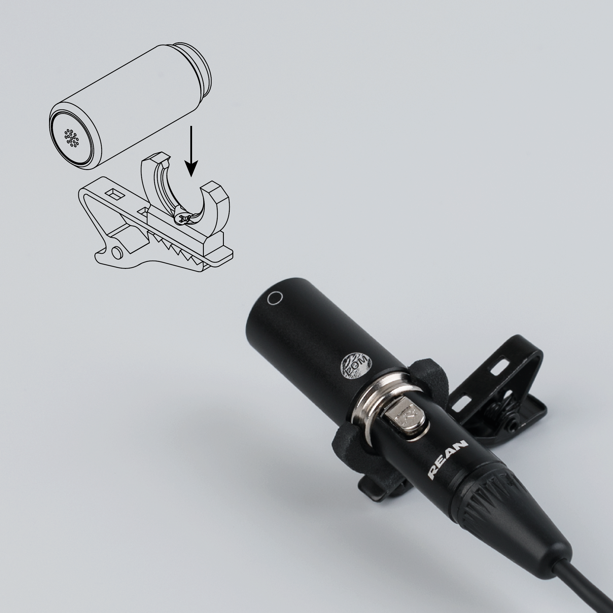
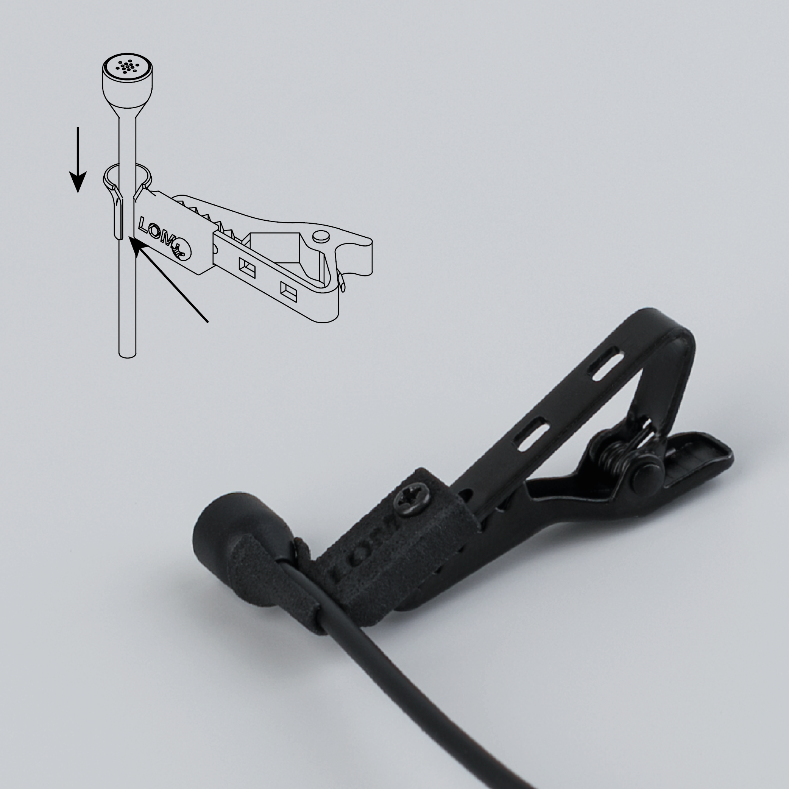
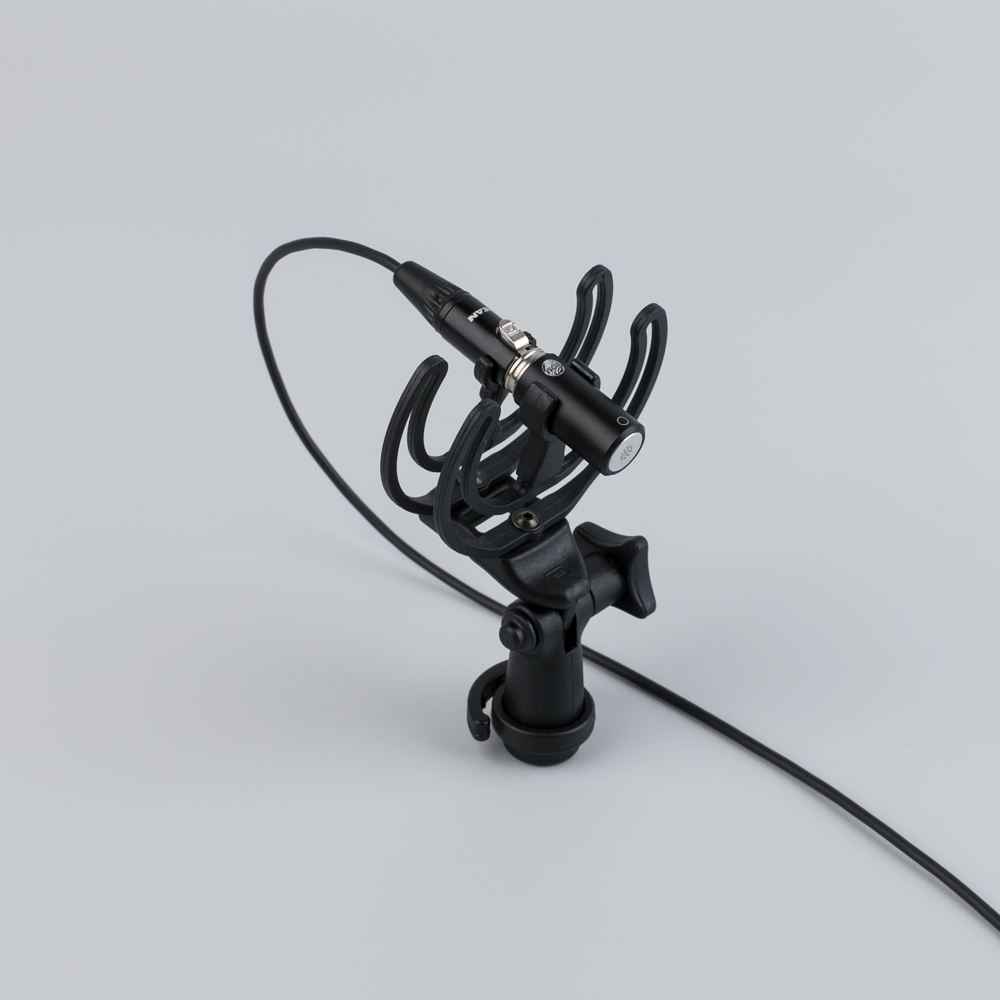
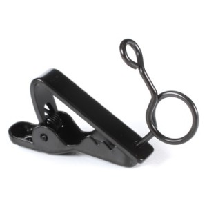
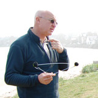

# How to mount (mikro) Uši (Pro)
There are endless ways of mounting Uši microphones, however, we would like to list a few to get you started!
#### Uši clips

[Uši clips](https://store.lom.audio/products/usi-clip-single) are easy to use. Just attach them to the microphone via the silver groove on the microphone body.
#### mikroUši clips

[mikroUši clips](https://store.lom.audio/products/mikrousi-clip-2-0-single) are designed to be used with wind protection. Insert the cable of the microphone to the groove, and then gently pull the microphone into the designated "cup".
#### Uši microphone mount

[Uši microphone mount](https://store.lom.audio/products/rycote-usi-mount) is the professional solution for mounting Uši range of mics. It provides excellent isolation from vibration noise coming to the mic through the stand.
#### Discontinued clips

They are easily accessible on eBay or other online stores. Look for "Sennheiser lavalier clip". Get the type with the circular holder, like on the picture.

Here is a short video on [how to mount them on your Uši](https://www.youtube.com/watch?v=4VlwUs4WB-s).
#### Other
Other ways of attaching Uši can be **rubber bands** (Uši mounted to your fingers, for example), **piece of solid-core wire**, **duct tape**, **blue-tack**...
### Microphone arrangements
#### Binaural recording
One of the popular microphone techniques is called **binaural recording** – simulating an experience of listening. In that case, microphones are positioned in place of ones ears and allow for realistic recordings. The proper binaural technique involves [artificial dummy head](https://www.neumann.com/?lang=en&id=current_microphones&cid=ku100_description), but we had some great results with simple mounting of the mics on glasses in the position of ears.
#### Coat hanger
Other popular method (apparently invented by Chris Watson) is **coat hanger mount**, where small mics are attached to a regular metallic coat hanger, which serves as a microphone stand.

#### Other methods
Another interesting and creative method is mounting the mics on your fingers using rubber bands, for great expressive positioning of the microphones in space.

We have also done many recordings with simple attaching of the microphones on a recorder bag, for extra stealthy setup.