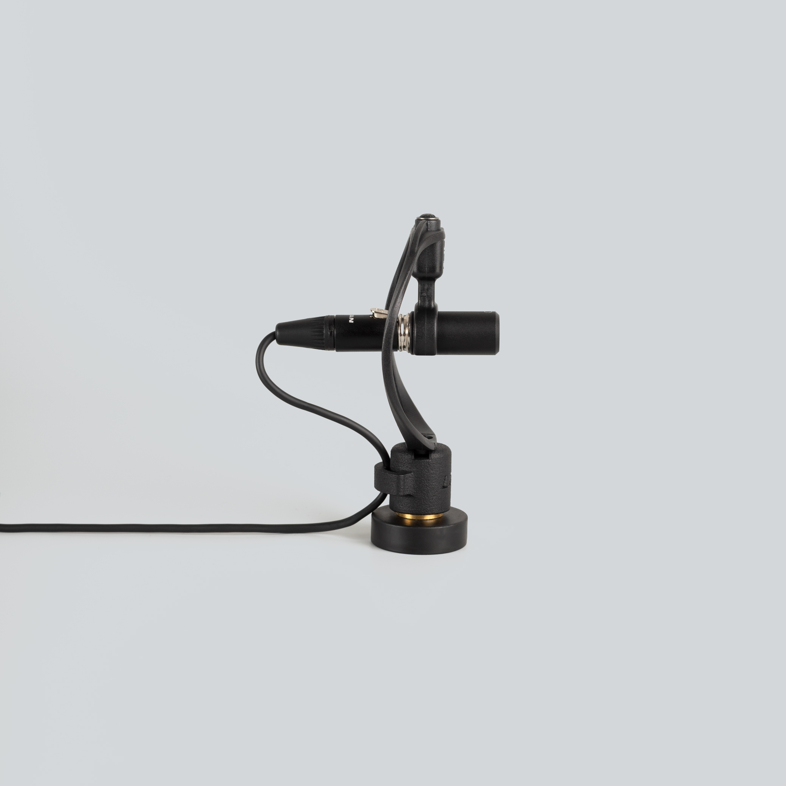
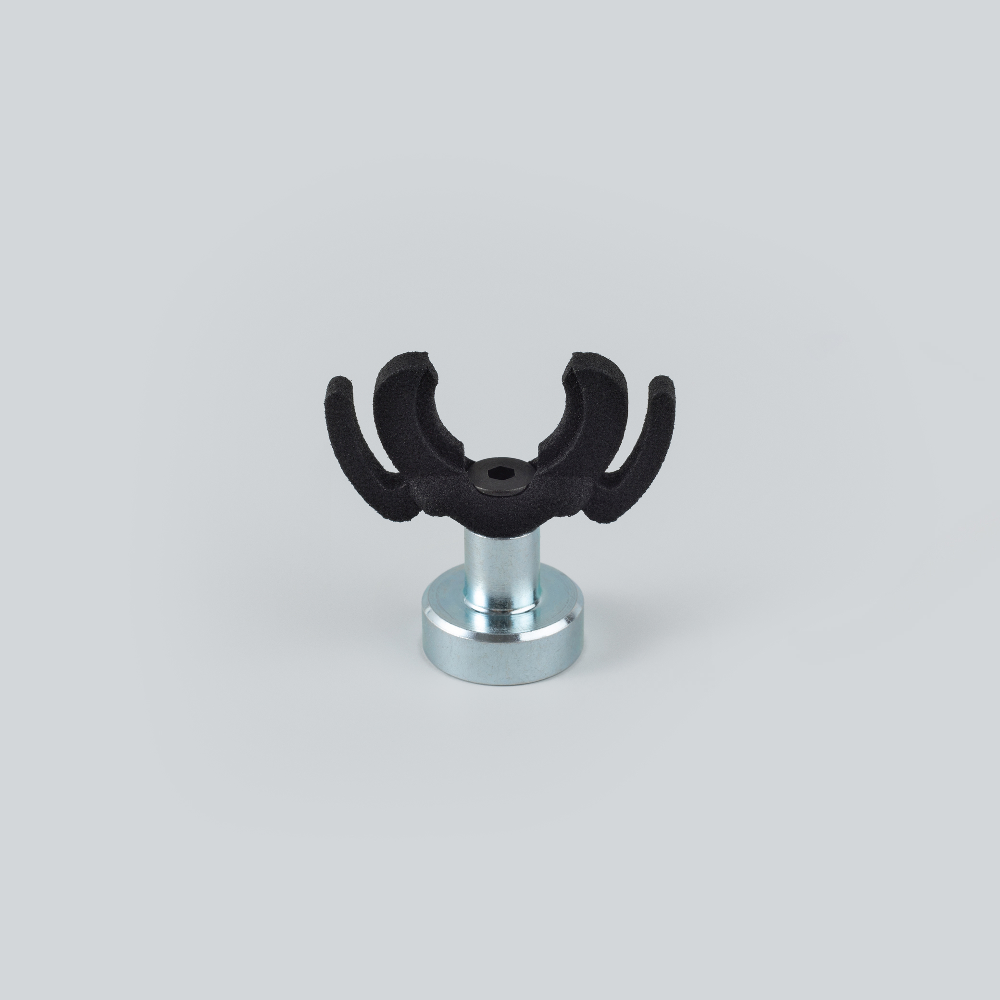
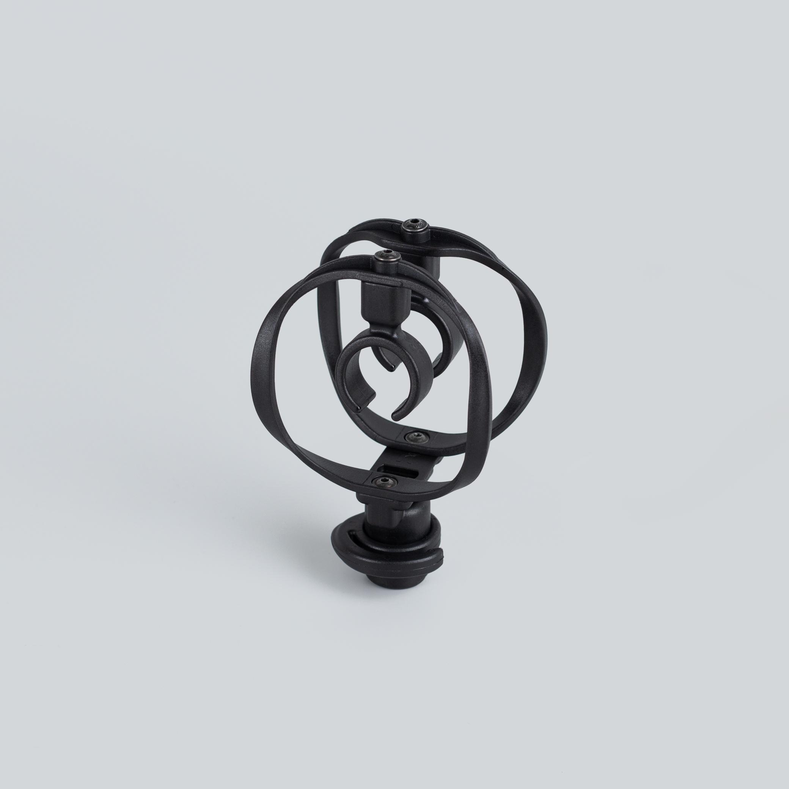

# How to mount (mikro) Uši (Pro)

There are endless ways to mount Uši microphones — from purpose-made clips to a coat hanger. This page covers the ready-made options, improvised alternatives, and a few classic positioning techniques to get you started.

All Uši-family microphones share the same silver groove near the capsule, so most clips work across the range. Just match the size: **Uši / Uši Pro / Ucho Pro** use the ⌀13 mm accessories, while **mikroUši / mikroUši Pro / mikroUcho Pro** use the smaller ⌀6.8 mm ones. If you'd rather 3D-print your own, see [DIY clips & accessories](../research/usi-clips.md).

## Clips & mounts

### Uši clip

[Uši clips](https://store.lom.audio/products/usi-clip-single) are the simplest option — clip them onto the silver groove on the microphone body and you're ready to position the mic on clothing, straps, or a stand.

### Uši mount

The [Uši microphone mount](https://store.lom.audio/products/usi-microphone-mount-single) is the professional solution for the Uši range. Its lyre suspension gives excellent isolation from vibration (handling and stand-borne noise). It's also the only mount we recommend for [Elektrouši](../manuals/elektrousi.md), whose plastic case other clips can damage.

### Uši magnetic clip

The [magnetic Uši clip](https://store.lom.audio/products/magnetic-usi-clip) lets you snap the microphone onto any ferrous surface — railings, radiators, machinery, car bodies — for quick, stable placements without a stand.

### mikroUši clip

[mikroUši clips](https://store.lom.audio/products/mikrousi-clip-single) are designed to be used together with wind protection. Attached the microphone to the clip via provided groove.

### basicUcho mount

The [basicUcho mount](https://store.lom.audio/products/basicucho-mount) is the professional mounting solution for the basicUcho range. Its lyre suspension gives excellent isolation from vibration (handling and stand-borne noise).

## Creative & improvised mounting

When you don't have a clip handy — or want an unusual placement — Uši are small and light enough for almost anything:

- **Rubber bands** — lash the mics to your fingers for expressive, hand-held positioning, or to almost any object.
- **Solid-core wire** — bend it into a custom holder or gooseneck.
- **Duct / gaffer tape or blue-tack** — quick, temporary placement on walls, windows, and surfaces.
- **Recorder bag** — attach the mics to a bag strap for a stealthy, discreet setup.

## Microphone arrangements

### Binaural recording

A popular technique that simulates the experience of listening: the microphones are placed where your ears would be, producing strikingly realistic, immersive recordings. The formal approach uses an [artificial dummy head](https://www.neumann.com/en-en/products/microphones/ku-100/), but we've had great results simply mounting the mics on a pair of glasses at ear position.

### Coat hanger

A classic method (apparently invented by Chris Watson): clip the mics to a regular metal coat hanger, which doubles as a lightweight, packable stereo bar and stand.

### Spacing & angle

For a wider stereo image, space the mics further apart; for a more focused, mono-compatible image, bring them closer. There's no single correct spacing — experiment, and let the source and the space guide you. Some people prefer going at least 40 cm with omnidirectional microphones — use your ears when setting up and pick the spacing that suits you most.

## See also

- [DIY clips & accessories](../research/usi-clips.md) — 3D-printable clips, mounts, and the Uši expander.
- [Microphones FAQ](../faq/microphones.md) — cables, matching, and choosing a model.
