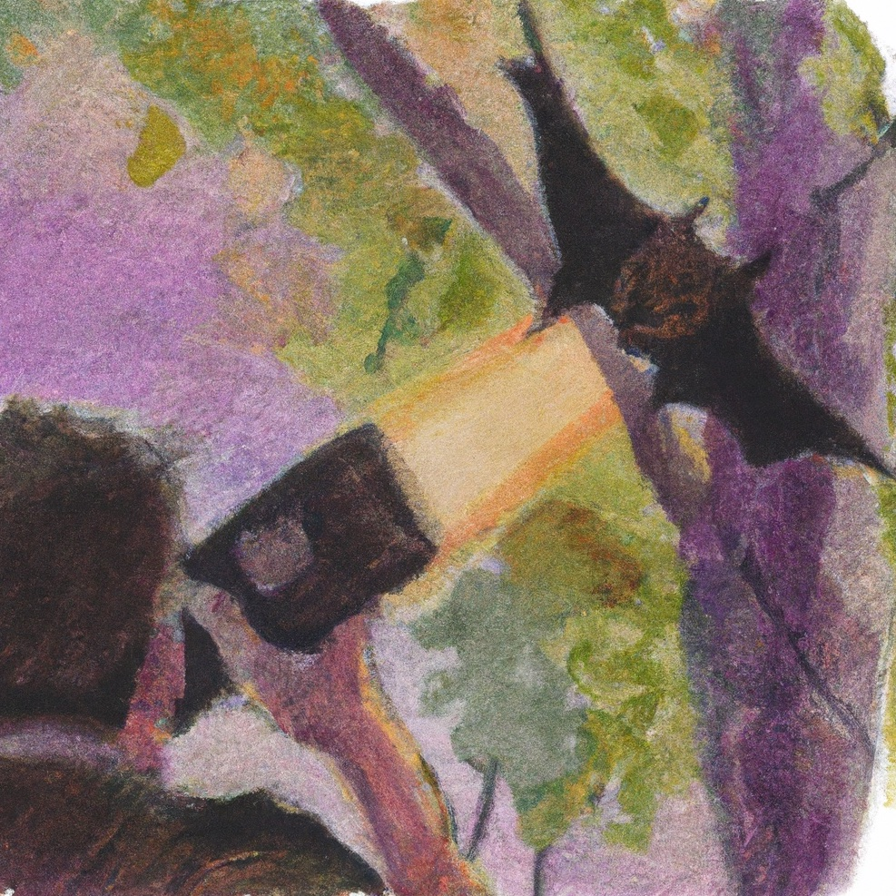
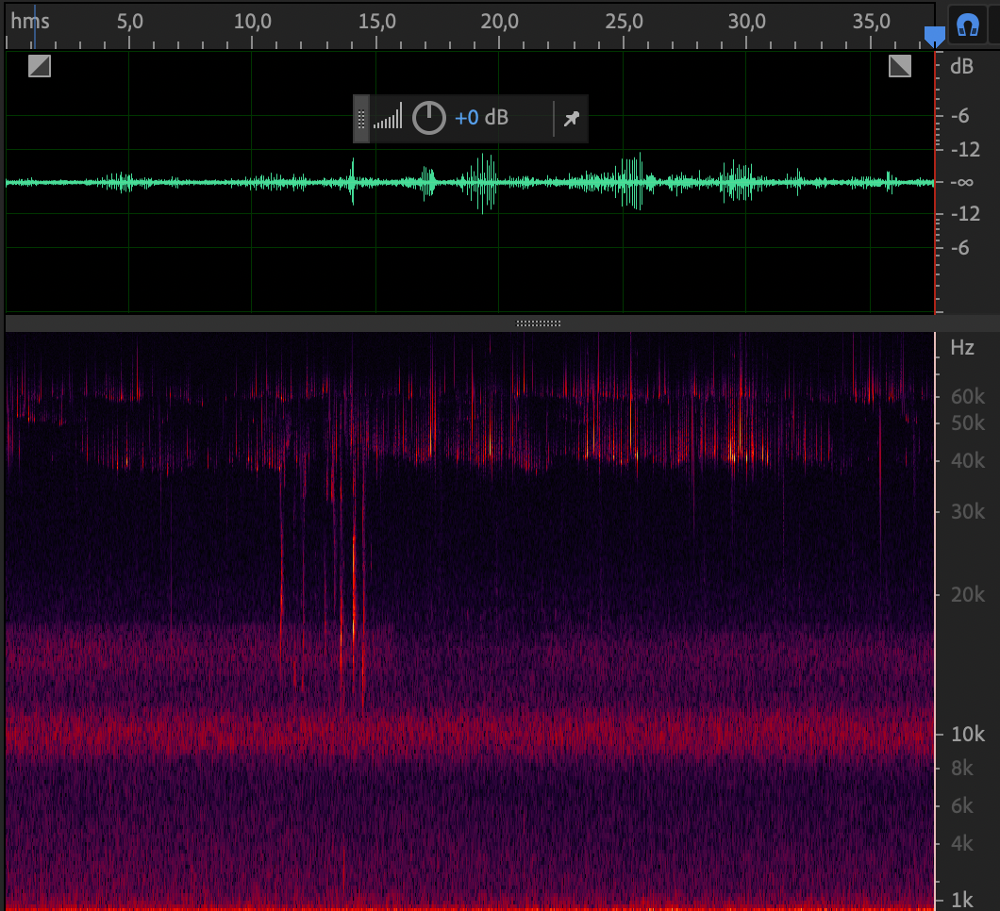
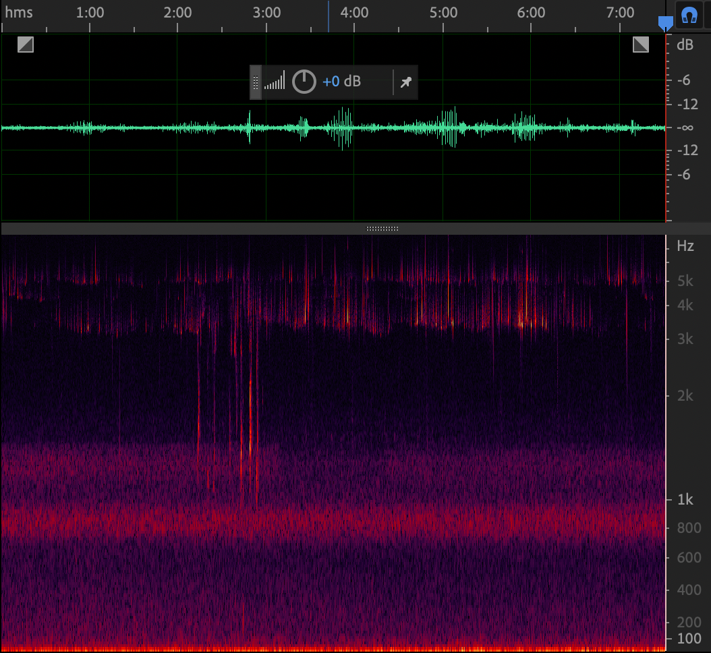

# How to record ultrasound (with LOM microphones)

Ultrasound refers to sound waves with frequencies higher than the upper audible limit of human hearing. This means that we can't perceive them, but fortunately, some microphones can. Our (LOM) Uši, basicUcho and mikroUši microphones can capture a significant portion of the ultrasonic range above 20 kHz. With the assistance of open-source software like [Audacity](https://www.audacityteam.org) or commercial software such as Adobe Audition, you can easily convert ultrasound into the audible range and listen to it using your own basic human ears.

To get started, you'll need a recorder capable of recording at a sample rate of 96 kHz or 192 kHz. The latter is preferred. The theoretical limit you can capture with a 96 kHz sample rate is half of that – 48 kHz. With a 192 kHz sample rate, you can record sounds up to 96 kHz. Keep in mind that this is a theoretical limit based on [the Nyquist-Shannon theorem](https://en.wikipedia.org/wiki/Nyquist–Shannon_sampling_theorem), and real-world performance can vary.

Secondly, you'll require microphones capable of capturing ultrasonic content. LOM Uši, mikroUši, and basicUcho series microphones are suitable for recording ultrasonic sounds. In terms of performance (signal-to-noise ratio at higher frequencies), mikroUši series is the best, followed by Uši, and basicUcho series performs the least. However, all of them can capture common bat sounds without any issues.

For your first subject, you can use a very basic ultrasonic generator – keys. By shaking a set of keys, you can generate bursts of ultrasound reaching almost 80 kilohertz! However, don't let the audible part of the sound fool you; there's a lot of content you simply can't hear.

Finally, you'll need a computer and software that can "slow down" the ultrasound to the audible range. For this tutorial, I'll be using Audacity, a free and versatile open-source tool. The process is straightforward: we instruct the software to play the file at a slower sample rate, effectively reducing the playback speed without introducing any artifacts. This is similar to playing a tape reel at a slower speed. For instance, let's say we used a 192 kHz sample rate to record a 45 kHz bat vocalization. To make it audible within a comfortable frequency range, we can set the playback sample rate to 16 kHz. As a result, the sound will be played 192/16 = 12 times slower, at 3.75 kHz.

To summarize the steps:

1. Configure your recorder to record at the highest possible sample rate – 192 kHz is ideal, while 96 kHz sets the upper frequency limit at 48 kHz.
1. Set your microphone's gain as you would for regular recording.
1. Note that all microphones become directional at ultrasonic frequencies – ensure that the microphone is pointing toward the desired sound source.
1. Begin recording your subject (shake the keys, for example). At this point, you won't be able to hear the ultrasonic content.
1. Open the recorded file in Audacity.
1. Now, it's time to "slow down" the ultrasound to the audible range. This depends on your desired outcome. I usually start by [setting the track rate](https://knowledge.lom.audio/_media/tips/screenshot_2023-08-28_at_21.54.29.png?cache=) to around 16 kHz.
1. Experiment to find the settings that sound best to your ears.
1. When exporting from Audacity, I recommend changing the Project Sample Rate (in Audio Settings) from 192 kHz to a smaller value. There's no need to save the file with such a high sample rate, as it would only result in an unnecessarily large file size. Stick to common rates like 44.1 or 48 kHz, but don't go lower than the track sample rate.

<iframe width="100%" height="400" src="https://www.youtube.com/embed/qhBKpOhnx3Q" title="Bat vocalizations, 12x slower" frameborder="0" allow="accelerometer; autoplay; clipboard-write; encrypted-media; gyroscope; picture-in-picture; web-share" allowfullscreen></iframe>

As a real world example, I recorded bats with LOM mikroUši series microphone. You can download the ultrasonic original [here](https://www.dropbox.com/scl/fi/10hogmhe0xit4f6d2awrk/mikroUsi_bats.wav?rlkey=47ywjx03b5wr35uqzjtc4myun&dl=0) and slowed down version [here](https://www.dropbox.com/scl/fi/uxymmr77btlbf2m2m2ohh/mikroUsi_bats_slower.wav?rlkey=nl303g8h646e6nth9yilj39oy&dl=0) (or check the youtube embed above).

Following images illustrate the frequency shift. The spectrograms look practically identical, but notice the frequency range on the right side. Inaudible ultrasonic sounds are now in audible range.

 
## Interesting links
- [Options for recording ultrasounds](https://www.wildmountainechoes.com/equipment/options-for-recording-ultrasounds/) by Wild Mountain Echos
- [Bat echolocation sound effect library](https://thomasrexbeverly.com/products/bat-echolocation) by Thomas Rex Beverly